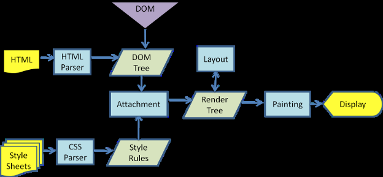

## 对浏览器的理解

浏览器的**主要功能**是将用户选择的 web 资源呈现出来，它需要从服务器请求资源，并将其显示在浏览器窗口中，资源的格式通常是 HTML，也包括 PDF、image 及其他格式。用户用 URI（Uniform Resource Identifier 统一资源标识符）来指定所请求资源的位置。HTML 和 CSS 规范中规定了浏览器解释 html 文档的方式，由 W3C 组织对这些规范进行维护，W3C 是负责制定 web 标准的组织。但是浏览器厂商纷纷开发自己的扩展，对规范的遵循并不完善，这为 web 开发者带来了严重的兼容性问题。**简单来说浏览器可以分为两部分，shell 和 内核**。其中 shell 的种类相对比较多，内核则比较少。shell 是指浏览器的外壳：例如菜单，工具栏等。主要是提供给用户界面操作，参数设置等等。它是调用内核来实现各种功能的。内核才是浏览器的核心内核是基于标记语言显示内容的程序或模块。也有一些浏览器并不区分外壳和内核。从 Mozilla 将 Gecko 独立出来后，才有了外壳和内核的明确划分。

## 对浏览器内核的理解

主要分成两部分：**渲染引擎和 JS 引擎**。

渲染引擎的职责就是渲染，即在浏览器窗口中显示所请求的内容。默认情况下，渲染引擎可以显示 html、xml 文档及图片，它也可以借助插件（一种浏览器扩展）显示其他类型数据，例如使用 PDF 阅读器插件，可以显示 PDF 格式。

JS 引擎：解析和执行 javascript 来实现网页的动态效果。最开始渲染引擎和 JS 引擎并没有区分的很明确，**后来 JS 引擎越来越独立，内核就倾向于只指渲染引擎。**

## 常见的浏览器内核比较

**Trident：这种浏览器内核是 IE 浏览器用的内核**，因为在早期 IE 占有大量的市场份额，所以这种内核比较流行，以前有很多网页也是根据这个内核的标准来编写的，但是实际上这个内核对真正的网页标准支持不是很好。但是由于 IE 的高市场占有率，微软也很长时间没有更新 Trident 内核，就导致了 Trident 内核和 W3C 标准脱节。还有就是 Trident 内核的大量 Bug 等安全问题没有得到解决，加上一些专家学者公开自己认为 IE 浏览器不安全的观点，使很多用户开始转向其他浏览器。

**Gecko：这是 Firefox 和 Flock 所采用的内核**，这个内核的优点就是**功能强大、丰富，可以支持很多复杂网页效果和浏览器扩展接口**，但是代价是也显而易见就是要**消耗很多的资源，比如内存**

**Presto：Opera 曾经采用的就是 Presto 内核**，Presto 内核被称为公认的浏览网页**速度最快的内核**，这得益于它在开发时的天生优势，在处理 JS 脚本等脚本语言时，会**比其他的内核快 3 倍左右**，缺点就是为了达到很快的速度而**丢掉了一部分网页兼容性**

**Webkit：Webkit 是 Safari 采用的内核**，它的优点就是**网页浏览速度较快**，虽然**不及 Presto 但是也胜于 Gecko 和 Trident**，缺点是对于网页代码的容错性不高，也就是说**对网页代码的兼容性较低**，会使一些编写不标准的网页无法正确显示。WebKit 前身是 KDE 小组的 KHTML 引擎，可以说 WebKit 是 **KHTML** 的一个开源的分支

**Blink**：谷歌在 Chromium Blog 上发表博客，称**将与苹果的开源浏览器核心 Webkit 分道扬镳，在 Chromium 项目中研发 Blink 渲染引擎**（即浏览器核心），内置于 Chrome 浏览器之中。其实 **Blink 引擎就是 Webkit 的一个分支，就像 webkit 是 KHTML 的分支一样**。Blink 引擎现在是谷歌公司与 Opera Software 共同研发，上面提到过的，**Opera 弃用了自己的 Presto 内核，加入 Google 阵营，跟随谷歌一起研发 Blink**

### 常见浏览器所用内核

（1） IE 浏览器内核：Trident 内核，也是俗称的 IE 内核；

（2） Chrome 浏览器内核：统称为 Chromium 内核或 Chrome 内核，以前是 Webkit 内核，现在是 Blink 内核；

（3） Firefox 浏览器内核：Gecko 内核，俗称 Firefox 内核；

（4） Safari 浏览器内核：Webkit 内核；

（5） Opera 浏览器内核：最初是自己的 Presto 内核，后来加入谷歌大军，从 Webkit 又到了 Blink 内核；

（6） 360 浏览器、猎豹浏览器内核：IE + Chrome 双内核；

（7） 搜狗、遨游、QQ 浏览器内核：Trident（兼容模式）+ Webkit（高速模式）；

（8） 百度浏览器、世界之窗内核：IE 内核；

（9） 2345 浏览器内核：好像以前是 IE 内核，现在也是 IE + Chrome 双内核了；

（10）UC 浏览器内核：这个众口不一，UC 说是他们自己研发的 U3 内核，但好像还是基于 Webkit 和 Trident ，还有说是基于火狐内核

## 浏览器的渲染原理

（1）首先解析收到的文档，根据文档定义构建一棵 DOM 树，**DOM 树**是由** DOM 元素及属性节点组成的**。

（2）然后对 CSS 进行解析，生成** CSSOM 规则树**。

（3）**根据 DOM 树和 CSSOM 规则树构建渲染树**。渲染树的节点被称为**渲染对象**，渲染对象是一个包含有颜色和大小等属性的矩形，渲染对象和 DOM 元素相对应，但这种对应关系不是一对一的，不可见的 DOM 元素不会被插入渲染树。还有一些 DOM 元素对应几个可见对象，它们一般是一些具有复杂结构的元素，无法用一个矩形来描述。

（4）当渲染对象被创建并添加到树中，它们并没有位置和大小，所以**当浏览器生成渲染树以后，就会根据渲染树来进行布局（也可以叫做回流）**。这一阶段浏览器要做的事情是要**弄清楚各个节点在页面中的确切位置和大小**。通常这一行为也被称为“自动重排”。

（5）**布局阶段结束后是绘制阶段**，遍历渲染树并调用渲染对象的 paint 方法将它们的内容显示在屏幕上，绘制使用 UI 基础组件。值得注意的是，这个过程是**逐步完成的**，为了更好的用户体验，渲染引擎将会尽可能早的将内容呈现到屏幕上，并不会等到所有的 html 都解析完成之后再去构建和布局 render 树。它是解析完一部分内容就显示一部分内容，同时，可能还在通过网络下载其余内容

## 浏览器解析过程

### 渲染过程中遇到 JS 文件怎么处理？

JavaScript 的加载、解析与执行会阻塞文档的解析，也就是说，在构建 DOM 时，**HTML 解析器若遇到了 JavaScript，那么它会暂停文档的解析，将控制权移交给 JavaScript 引擎**，等 JavaScript 引擎运行完毕，浏览器再从中断的地方恢复继续解析文档。也就是说，如果你想首屏渲染的越快，就越不应该在首屏就加载 JS 文件，这也是都建议**将 script 标签放在 body 标签底部的原因**。当然在当下，并不是说 script 标签必须放在底部，因为你可以给 script 标签添加 **defer** 或者 **async** 属性

### async 和 和 defer 的作用是什么？有什么区别？

（1）脚本没有 defer 或 async，浏览器会**立即加载并执行指定的脚本**，也就是说不等待后续载入的文档元素，读到就加载并执行。

（2）defer 属性表示延迟执行引入的 JavaScript，即这段 JavaScript 加载时 HTML 并未停止解析，这两个过程是**并行**的。当整个 document 解析完毕后再执行脚本文件，在 DOMContentLoaded 事件触发之前完成。**多个脚本按顺序执行**。

（3）async 属性表示异步执行引入的 JavaScript，与 defer 的区别在于，如果已经加载好，就会开始执行，也就是说它的执行仍然会阻塞文档的解析，只是它的加载过程不会阻塞。**多个脚本的执行顺序无法保证**。

### 什么是文档的预解析

Webkit 和 Firefox 都做了这个优化，**当执行 JavaScript 脚本时，另一个线程解析剩下的文档**，并加载后面需要通过网络加载的资源。这种方式可以**使资源并行加载从而使整体速度更快**。需要注意的是，**预解析并不改变 DOM 树，它将这个工作留给主解析过程，自己只解析外部资源的引用，比如外部脚本、样式表及图片**

### CSS 如何阻塞文档解析

理论上，既然**样式表不改变 DOM 树**，也就没有必要停下文档的解析等待它们，然而，存在一个问题，**JavaScript 脚本执行时可能在文档的解析过程中请求样式信息，如果样式还没有加载和解析，脚本将得到错误的值**，显然这将会导致很多问题。所以如果浏览器尚未完成 CSSOM 的下载和构建，而我们却想在此时运行脚本，那么**浏览器将延迟 JavaScript 脚本执行和文档的解析**，直至其完成 CSSOM 的下载和构建。也就是说，在这种情况下，**浏览器会先下载和构建 CSSOM，然后再执行 JavaScript，最后再继续文档的解析**。

## 浏览器渲染过程

### 渲染页面时常见哪些不良现象

FOUC：主要指的是**样式闪烁**的问题，由于浏览器渲染机制（比如 firefox），在 CSS 加载之前，先呈现了 HTML，就会导致展示出无样式内容，然后样式突然呈现的现象。会出现这个问题的原因主要是 css 加载时间过长，或者 css 被放在了文档底部。**白屏**：有些浏览器渲染机制（比如 chrome）要**先构建 DOM 树和 CSSOM 树**，构建完成后再进行渲染，如果 CSS 部分放在 HTML 尾部，由于 CSS 未加载完成，浏览器迟迟未渲染，从而导致白屏；也可能是把 **js 文件放在头部**，脚本的加载会阻塞后面文档内容的解析，从而页面迟迟未渲染出来，出现白屏问题

### 如何优化关键渲染路径

为尽快完成**首次渲染**，我们需要最大限度减小以下三种可变因素：

（1）关键**资源的数量**。
（2）关键路径**长度**。
（3）关键**字节的数量**。

**关键资源**是可能阻止网页首次渲染的资源。这些资源越少，浏览器的工作量就越小，对 CPU 以及其他资源的占用也就越少,同样，关**键路径长度**受所有关键资源与其**字节大小**之间依赖关系图的影响：某些资源只能在上一资源处理完毕之后才能开始下载，并且资源越大，下载所需的往返次数就越多。最后，浏览器需要下载的关键字节越少，处理内容并让其出现在屏幕上的速度就越快。要减少字节数，我们可以减少资源数（将它们删除或设为非关键资源），此外还要**压缩和优化各项资源，确保最大限度减小传送大小**

优化关键渲染路径的**常规步骤**如下：

（1）对关键路径**进行分析和特性描述**：资源数、字节数、长度。

（2）最大限度减少关键资源的**数量**：删除它们，延迟它们的下载，将它们标记为异步等。

（3）优化关键字节数以缩短下载时间（**往返次数**）。

（4）优化其余关键资源的**加载顺序**：您需要尽早下载所有关键资产，以缩短关键路径长度。

## 浏览器绘制过程

### 什么是重绘和回流

重绘: **当渲染树中的一些元素需要更新属性，而这些属性只是影响元素的外观、风格，而不会影响布局的操作，比如 background color，我们将这样的操作称为重绘**。

回流：**当渲染树中的一部分（或全部）因为元素的规模尺寸、布局、隐藏等改变而需要重新构建的操作，会影响到布局的操作，这样的操作我们称为回流**。

**区别：**

回流指当前窗口发生改变，发生滚动操作，或者元素的位置大小相关属性被更新时会触发布局过程，发生在 render 树，比如元素的几何尺寸变化，就需要重新验证并计算 Render Tree

重绘指当前视觉样式属性被更新时触发的绘制过程，发生在渲染层 render layer 所以相比之下，回流的成本要比重绘高得多

常见引起回流属性和方法：

**任何会改变元素几何信息（元素的位置和尺寸大小）的操作，都会触发回流。**

（1）添加或者删除可见的 DOM 元素；

（2）元素尺寸改变——边距、填充、边框、宽度和高度

（3）内容变化，比如用户在 input 框中输入文字

（4）浏览器窗口尺寸改变——resize 事件发生时

（5）计算 offsetWidth 和 offsetHeight 属性

（6）设置 style 属性的值

（7）当你修改网页的默认字体时。

**回流必定会发生重绘，重绘不一定会引发回流**。回流所需的成本比重绘高的多，改变父节点里的子节点很可能会导致父节点的一系列回流

### 如何减少回流

+ 使用 transform 替代 top
+ 不要把节点的属性值放在一个循环里当成循环里的变量
+ 不要使用 table 布局，可能很小的一个小改动会造成整个 table 的重新布局
+ 把 DOM 离线后修改。如：使用 documentFragment 对象在内存里操作 DOM
+ 在内存中多次操作节点，完成后在添加到文档中
+ 不要一条一条地修改 DOM 的样式。与其这样，还不如预先定义好 css 的 class，然后修改 DOM 的 className 或者 style.classText。
+ 在需要经常获取那些引起浏览器回流的属性值时，要缓存到变量中
+ 对元素进行一个复杂的操作，可以先隐藏它，操作完成后在显示

### 为什么操作 DOM 慢

一些 DOM 的操作或者属性访问可能会引起页面的回流和重绘，从而引起性能上的消耗。

## 浏览器渲染页面过程概述

大致过程：

**HTML 解析构建 DOM->CSS 解析构建 CSSOM 树->根据 DOM 树和 CSSOM 树构建 render 树->根据 render 树进行布局渲染 render layer->根据计算的布局信息进行绘制**,不同浏览器的内核不同，所以渲染过程其中有部分细节有不一样，以 webkit 主流程为例

浏览器解析渲染页面过程是一个复杂的过程，其中有不少的细节和规则，所以这里只能总结大致过程

较详细过程：

HTML 解析构建 DOM 树：其中 HTML Parser 就起到了将 HTML 标记解析成 DOM Tree 的作用，HTML Parser 将文本的 HTML 文档，提炼出关键信息，嵌套层级的树形结构，便于计算拓展；这其中也有很多的规则和操作，比如容错机制，识别特殊标签 `  `  等

CSS 解析构建 CSSOM 树：CSS Parser 将很多个 CSS 文件中的样式合并解析出具有树形结构 Style Rules，也叫做 CSSOM

其中还有一个细节是浏览器解析文档：当遇到 `<script>`  标签的时候会停止解析文档，立即解析脚本，将脚本中改变 DOM 和 CSS 的地方分别解析出来，追加到 DOM Tree 和 CSSOM 上

根据 DOM 树和 CSSOM 树构建 Render 树：Render Tree 的构建其实就是 DOM Tree 和 CSSOMAttach 的过程，在 webkit 中，解析样式和创建呈现器的过程称为"附加"，每个 DOM 节点都有一个"attach"方法，Render Tree 其实就相当于一个计算好样式，与 HTML 对应的 Tree

根据 Render 树进行布局渲染 render layer：创建渲染树后，Layout 根据根据渲染树中渲染对象的信息，计算好每一个渲染对象的位置和尺寸，将其放在浏览器窗口的正确位置，某些时候会在文档布局完成之后进行 DOM 修改，重新布局的过程就称为**回流**

其中计算（样式计算）是一个复杂的过程，因为 DOM 中的一个元素可以对应样式表中的多个元素，**Firefox 采用了规则树和样式上下文树来简化样式计算**，规则树包含了所有已知规则的匹配路径，样式上下文包含端值，webkit 也有样式对象，但它们不保存在类似上下文树这样的结构中，只是由 DOM 节点指向此类对象的相关样式

根据计算的布局信息进行绘制：绘制阶段则会遍历呈现树，并调用呈现器的 paint 方法，将呈现器的内容显示在屏幕上，绘制的顺序其实就是元进入堆栈样素式上下文的顺序，例如，块呈现器的堆栈顺序如下：1.背景颜色，2.背景图片，3.边框，4.子代，5.轮廓
