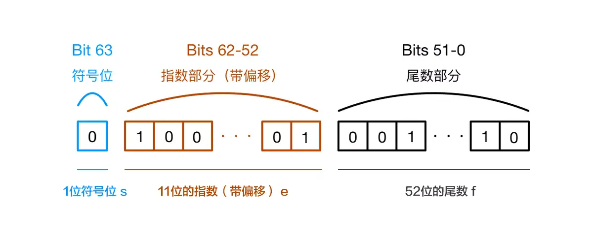

## js 是一门怎样的语言，它有什么特点

1.脚本语言。JavaScript 是一种解释型的脚本语言,C、C++等语言先编译后执行,而 JavaScript 是在程序的运行过程中逐行进行解释。

2.基于对象。JavaScript 是一种基于对象的脚本语言,它不仅可以创建对象,也能使用现有的对象。

3.简单。JavaScript 语言中采用的是弱类型的变量类型,对使用的数据类型未做出严格的要求,是基于 Java 基本语句和控制的脚本语言,其设计简单紧凑。

4.动态性。JavaScript 是一种采用事件驱动的脚本语言,它不需要经过 Web 服务器就可以对用户的输入做出响应。

5.跨平台性。JavaScript 脚本语言不依赖于操作系统,仅需要浏览器的支持。

## js 的基本数据类型

js 一共有六种基本数据类型，分别是 Undefined、Null、Boolean、Number、String，还有在 ES6 中新增的 Symbol 类型，代表创建后独一无二且不可变的数据类型，它的出现我认为主要是为了解决可能出现的全局变量冲突的问题

## avascript 的 typeof 返回哪些数据类型

7 种分别为 string、boolean、number、Object、Function、undefined、symbol(ES6)

## 值类型和引用类型有哪些区别

1. 值类型： 字符串 string  ，数值 number  ，布尔值 boolean  ， null  , undefined
2. 引用类型： 对象 Object  ，数组 Array  ，函数 Function

值类型：

- 占用空间固定，保存在 栈 中：当一个方法执行时，每个方法都会建立自己的内存栈，也就是所谓的函数作用域，基础变量的值是存储在栈中的，而引用类型变量存储在栈中的是指向堆中的数组或者对象的"地址"
- 保存与复制的是值本身
- 可以用 typeof 检测值类型
- 基本数据类型是值类型

引用类型：

- 占用空间不固定，保存在 堆 中：由于对象的创建成本比较大，在程序中创建一个对象时，这个对象将被保存到运行时数据区中，以便反复利用，这个运行时数据区就是堆内存
- 保存与复制的是指向对象的一个指针
- 使用 instanceof（） 检测数据类型
- 使用 new()  方法构造出的对象是引用型

## JavaScript 有几种类型的值，画内存图

涉及知识点：

栈：原始数据类型（Undefined、Null、Boolean、Number、String）

堆：引用数据类型（对象、数组和函数）

两种类型的区别是：存储位置不同。原始数据类型直接存储在栈（stack）中的简单数据段，占据空间小、大小固定，属于被频繁使用数据，所以放入栈中存储。引用数据类型存储在堆（heap）中的对象，占据空间大、大小不固定。如果存储在栈中，将会影响程序运行的性能；引用数据类型在栈中存储了指针，该指针指向堆中该实体的起始地址。当解释器寻找引用值时，会首先检索其在栈中的地址，取得地址后从堆中获得实体。

回答：

js 可以分为两种类型的值，一种是基本数据类型，一种是复杂数据类型。基本数据类型....复杂数据类型指的是 Object 类型，所有其他的如 Array、Date 等数据类型都可以理解为 Object 类型的子类。两种类型间的主要区别是它们的存储位置不同，基本数据类型的值直接保存在栈中，而复杂数据类型的值保存在堆中，通过使用在栈中保存对应的指针来获取堆中的值。

## 什么是堆？什么是栈？它们之间有什么区别和联系

堆和栈的概念存在于数据结构中和操作系统内存中。在数据结构中，栈中数据的存取方式为先进后出。而堆是一个优先队列，是按优先级来进行排序的，优先级可以按照大小来规定。完全二叉树是堆的一种实现方式。在操作系统中，内存被分为栈区和堆区。栈区内存由编译器自动分配释放，存放函数的参数值，局部变量的值等。其操作方式类似于数据结构中的栈。堆区内存一般由程序员分配释放，若程序员不释放，程序结束时可能由垃圾回收机制回收

## 内部属性[[Class]]是什么？是什么

所有 typeof 返回值为 "object" 的对象（如数组）都包含一个内部属性 `[[Class]]`（我们可以把它看作一个内部的分类，而非传统的面向对象意义上的类）。这个属性无法直接访问，一般通过 `Object.prototype.toString(..)` 来查看。例如：

```js
Object.prototype.toString.call([1, 2, 3]);
// "[object Array]"
Object.prototype.toString.call(/regex-literal/i);
// "[object RegExp]"
```

## 介绍 js 有哪些内置对象

涉及知识点：

**全局的对象**（ global objects ）或称标准内置对象，不要和 "**全局对象**（global object）" 混淆。这里说的全局的对象是说在全局作用域里的象。全局作用域中的其他对象可以由用户的脚本创建或由宿主程序提供。标准内置对象的分类

（1）值属性，这些全局属性返回一个简单值，这些值没有自己的属性和方法。例如 Infinity、NaN、undefined、null 字面量

（2）函数属性，全局函数可以直接调用，不需要在调用时指定所属对象，执行结束后会将结果直接返回给调用者。例如 eval()、parseFloat()、parseInt() 等

（3）基本对象，基本对象是定义或使用其他对象的基础。基本对象包括一般对象、函数对象和错误对象。例如 Object、Function、Boolean、Symbol、Error 等

（4）数字和日期对象，用来表示数字、日期和执行数学计算的对象。例如 Number、Math、Date

（5）字符串，用来表示和操作字符串的对象。例如 String、RegExp

（6）可索引的集合对象，这些对象表示按照索引值来排序的数据集合，包括数组和类型数组，以及类数组结构的对象。例如 Array

（7）使用键的集合对象，这些集合对象在存储数据时会使用到键，支持按照插入顺序来迭代元。例如 Map、Set、WeakMap、WeakSet

（8）**矢量集合**，SIMD 矢量集合中的数据会被组织为一个数据序列。例如 SIMD 等

（9）**结构化数据，**这些对象用来表示和操作结构化的缓冲区数据，或使用 JSON 编码的数据。例如 JSON 等

（10）**控制抽象对象例如 Promise、Generator 等**

（11）**反射**，例如 Reflect、Proxy

（12）**国际化**，为了支持多语言处理而加入 ECMAScript 的对象。例如 Intl、Intl.Collator 等

（13）**WebAssembly**

（14）其他例如 **arguments**

回答：

js 中的内置对象主要指的是在程序执行前存在全局作用域里的由 js 定义的一些全局值属性、函数和用来实例化其他对象的构造函数对象。一般我们经常用到的如全局变量值 NaN、undefined，全局函数如 parseInt()、parseFloat() 用来实例化对象的构造函数如 Date、Object 等，还有提供数学计算的单体内置对象如 Math 对象。

## undefined 与 undeclared 的区别

已在作用域中**声明但还没有赋值的变量**，是 undefined 的。相反，还**没有在作用域中声明过的变量**，是 undeclared 的。对于 undeclared 变量的引用，浏览器会报引用错误，如 ReferenceError: b is not defined 。但是我们可以使用 typeof 的安全防范机制来避免报错，因为对于 undeclared（或者 not defined ）变量，typeof 会返回 "undefined"。

## null 和 和 undefined 的区别

首先 Undefined 和 Null 都是基本数据类型，这两个基本数据类型分别都只有一个值，就是 undefined 和 null。undefined 代表的含义是未定义，null 代表的含义是空对象。一般变量声明了但还没有定义的时候会返回 undefined，null 主要用于赋值给一些可能会返回对象的变量，作为初始化。undefined 在 js 中不是一个保留字，这意味着我们可以使用 undefined 来作为一个变量名，这样的做法是非常危险的，它会影响我们对 undefined 值的判断。但是我们可以通过一些方法获得安全的 undefined 值，比如说 void 0。**当我们对两种类型使用 typeof 进行判断的时候，Null 类型化会返回 “object”**，这是一个历史遗留的问题。当我们**使用双等号对两种类型的值进行比较时会返回 true，使用三个等号时会返回 false**。

## 如何获取安全的 undefined 值

因为 undefined 是一个标识符，所以可以被当作变量来使用和赋值，但是这样会影响 undefined 的正常判断。表达式 void \_\_\_ 没有返回值，因此返回结果是 undefined。void 并不改变表达式的结果，只是让表达式不返回值。按惯例我们**用 void 0 来获得 undefined**。

## 说几条写 JavaScript 的基本规范

在平常项目开发中，我们遵守一些这样的基本规范，比如说：

（1）一个函数作用域中所有的变量声明应该尽量提到函数首部，用一个 var 声明，不允许出现两个连续的 var 声明，声明时如果变量没有值，应该给该变量赋值对应类型的初始值，便于他人阅读代码时，能够一目了然的知道变量对应的类型值。

（2）代码中出现地址、时间等字符串时需要使用常量代替。

（3）在进行比较的时候吧，尽量使用'===', '!=='代替'==', '!='。

（4）不要在内置对象的原型上添加方法，如 Array, Date。

（5）switch 语句必须带有 default 分支。

（6）for 循环必须使用大括号。

（7）if 语句必须使用大括号。

## JavaScript 原型，原型链,有什么特点

在 js 中我们是使用构造函数来新建一个对象的，每一个构造函数的内部都有一个 prototype 属性值，这个属性值是一个对象，这个对象包含了可以由该构造函数的所有实例共享的属性和方法。当我们使用构造函数新建一个对象后，在这个对象的内部将包含一个指针，这个指针指向构造函数的 prototype 属性对应的值，在 ES5 中这个指针被称为对象的原型。一般来说我们是不应该能够获取到这个值的，但是现在浏览器中都实现了 `__proto__` 属性来让我们访问这个属性，但是我们最好不要使用这个属性，因为它不是规范中规定的。ES5 中新增了一个**Object.getPrototypeOf**() 方法，我们可以通过这个方法来获取对象的原型。当我们访问一个对象的属性时，如果这个对象内部不存在这个属性，那么它就会去它的原型对象里找这个属性，这个原型对象又会有自己的原型，于是就这样一直找下去，也就是原型链的概念。原型链的尽头一般来说都是 Object.prototype 所以这就是我们新建的对象为什么能够使用 toString()等方法的原因。

特点：

JavaScript 对象是通过引用来传递的，我们创建的每个新对象实体中并没有一份属于自己的原型副本。当我们修改原型时，与之相关的对象也会继承这一改变。

## js 获取原型的方法

- `p.__proto__`
- `p.constructor.prototype`
- `Object.getPrototypeOf(p)`

## 在 js 中不同进制数字的表示方式

- 以 0X、0x 开头的表示为十六进制
- 以 0、0O、0o 开头的表示为八进制
- 以 0B、0b 开头的表示为二进制格式

## js 中整数的安全范围是多少

安全整数指的是，在这个范围内的整数转化为二进制存储的时候不会出现精度丢失，能够被“安全”呈现的最大整数是 2^53 - 1，即 `9007199254740991`，在 ES6 中被定义为`Number.MAX_SAFE_INTEGER`。最小整数是`-9007199254740991`，在 ES6 中被定义为`Number.MIN_SAFE_INTEGER`。如果某次计算的结果得到了一个超过 JavaScript 数值范围的值，那么这个值会被自动转换为特殊的 Infinity 值。如果某次计算返回了正或负的 Infinity 值，那么该值将无法参与下一次的计算。判断一个数是不是有穷的，可以使用 isFinite 函数来判断。

## typeof NaN 的结果是什么

NaN 意指“不是一个数字”（not a number），NaN 是一个“警戒值”（sentinel value，有特殊用途的常规值），用于指出数字类型中的错误情况，即“执行数学运算没有成功，这是失败后返回的结果”。

```
typeof NaN; // "number"
```

NaN 是一个特殊值，它和自身不相等，是唯一一个非自反（自反，reflexive，即 x === x 不成立）的值。而 NaN != NaN 为 true。

## isNaN 和 和 Number.isNaN 函数的区别？

函数 isNaN 接收参数后，会**尝试将这个参数转换为数值**，任何**不能被转换为数值的的值都会返回 true**，因此**非数字值传入也会返回 true** ，会影响 NaN 的判断。函数 Number.isNaN 会首先**判断传入参数是否为数字**，如果是数字再继续判断是否为 NaN ，这种方法对于 NaN 的判断**更为准确**。

## Array 构造函数只有一个参数值时的表现？

Array 构造函数只带一个数字参数的时候，该参数会被作为数组的预设长度（length），而非只充当数组中的一个元素。这样创建出来的只是一个空数组，只不过它的 length 属性被设置成了指定的值。构造函数 Array(..) 不要求必须带 new 关键字。不带时，它会被自动补上。

## JavaScript 中如何检测一个变量是一个 String 类型？

三种方法（typeof、constructor、Object.prototype.toString.call()）

解析：

①typeof

```js
typeof "123" === "string"; // true

typeof "123" === "string"; // true
```

②constructor

```js
'123'.constructor === String // true


③Object.prototype.toString.call()

Object.prototype.toString.call('123') === '[object String]' // true
```

## 列举 3 种强制类型转换和 2 种隐式类型转换

强制（parseInt,parseFloat,Number）、隐式（+ -）

## 其他值到字符串的转换规则

规范的 9.8 节中定义了抽象操作 ToString ，它负责处理非字符串到字符串的强制类型转换。

（1）Null 和 Undefined 类型 ，null 转换为 "null"，undefined 转换为 "undefined"，

（2）Boolean 类型，true 转换为 "true"，false 转换为 "false"。

（3）Number 类型的值直接转换，不过那些极小和极大的数字会使用指数形式。

（4）Symbol 类型的值直接转换，但是只允许显式强制类型转换，使用隐式强制类型转换会产生错误。

（3）对普通对象来说，除非自行定义 `toString()` 方法，否则会调用 `toString()（Object.prototype.toString()）`来返回内部属性 `[[Class]]` 的值，如`"[objectObject]"`。如果对象有自己的 `toString()` 方法，字符串化时就会调用该方法并使用其返回值

## 复杂数据类型如何转变为字符串

- 首先，会调用 valueOf 方法，如果方法的返回值是一个基本数据类型，就返回这个值，
- 如果调用 valueOf 方法之后的返回值仍旧是一个复杂数据类型，就会调用该对象的 toString 方法，
- 如果 toString 方法调用之后的返回值是一个基本数据类型，就返回这个值，
- 如果 toString 方法调用之后的返回值是一个复杂数据类型，就报一个错误。

```js
1;
var obj = {
  valueOf: function() {
    return 1;
  },
};
console.log(obj + ""); //'1'
2;
var obj = {
  valueOf: function() {
    return [1, 2];
  },
};
console.log(obj + ""); //'[object Object]';
3;
var obj = {
  valueOf: function() {
    return [1, 2];
  },
  toString: function() {
    return 1;
  },
};
console.log(obj + ""); //'1';
4;
var obj = {
  valueOf: function() {
    return [1, 2];
  },
  toString: function() {
    return [1, 2, 3];
  },
};
console.log(obj + ""); // 报错 Uncaught TypeError: Cannot convert object to primitive value
```

拓展：

```js
var arr = [new Object(), new Date(), new RegExp(), new String(), new Number(), new Boolean(), new Function(), new Array(), Math] console.log(arr.length) // 9
for (var i = 0; i < arr.length; i++) {
	arr[i].valueOf = function() {
		return [1, 2, 3]
	}
	arr[i].toString = function() {
		return 'toString'
	}
	console.log(arr[i] + '')
}
```

## 其他值到数字值的转换规则？

有时我们需要将非数字值当作数字来使用，比如数学运算。为此 ES5 规范在 9.3 节定义了抽象操作 ToNumber。

（1）Undefined 类型的值转换为 NaN。

（2）Null 类型的值转换为 0。

（3）Boolean 类型的值，true 转换为 1，false 转换为 0。

（4）String 类型的值转换如同使用 Number() 函数进行转换，如果包含非数字值则转换为 NaN，空字符串为 0。

（5）Symbol 类型的值不能转换为数字，会报错。

（6）对象（包括数组）会首先被转换为相应的基本类型值，如果返回的是非数字的基本类型值，则再遵循以上规则将其强制转换为数字。为了将值转换为相应的基本类型值，抽象操作`ToPrimitive` 会首先（通过内部操作 DefaultValue）检查该值是否有 valueOf() 方法。如果有并且返回基本类型值，就使用该值进行强制类型转换。**如果没有就使用 toString() 的返回值（如果存在）来进行强制类型转换**。**如果 valueOf() 和 toString() 均不返回基本类型值，会产生 TypeError 错误**。

## 其他值到布尔类型的值的转换规则

ES5 规范 9.2 节中定义了抽象操作 ToBoolean，列举了布尔强制类型转换所有可能出现的结果。

以下这些是假值：

- undefined
- null
- false
- +0、-0 和 NaN
- ""

假值的布尔强制类型转换结果为 false。从逻辑上说，**假值列表以外的都应该是真值**。

## {} 和 和 [] 的 的 valueOf 和 和 toString 的结果是什么

`{}` 的 `valueOf` 结果为 {} ，`toString` 的结果为 `"[object Object]"`

`[]` 的`valueOf` 结果为 [] ，`toString` 的结果为 `""`

## 什么是假值对象

浏览器在某些特定情况下，**在常规 JavaScript 语法基础上自己创建了一些外来值**，这些就是“假值对象”。假值对象看起来和普通对象并无二致（都有属性，等等），但将**它们强制类型转换为布尔值时结果为 false** 最常见的例子是 document.all，它是一个类数组对象，包含了页面上的所有元素，由 DOM（而不是 JavaScript 引擎）提供给 JavaScript 程序使用

## ~ 操作符的作用

~ 返回 2 的**补码**，并且 ~ 会**将数字转换为 32 位整数**，因此我们可以使用 ~ 来进行取整操作。**~x 大致等同于 -(x+1)**

## 解析字符串中的数字和将字符串强制类型转换为数字的返回结果都是数字，它们之间的区别是什么

解析允许字符串（如 parseInt() ）中含有非数字字符，解析按从左到右的顺序，如果遇到非数字字符就停止。而**转换（如 Number ()）不允许出现非数字字符，否则会失败并返回 NaN**

## + 操作符什么时候用于字符串的拼接？

根据 ES5 规范 11.6.1 节，如果某个操作数是字符串或者能够通过以下步骤转换为字符串的话，+ 将进行拼接操作。如果其中一个操作数是对象（包括数组），则首先对其调用`ToPrimitive` 抽象操作，该抽象操作再调用`[[DefaultValue]]`，以数字作为上下文。如果不能转换为字符串，则会将其转换为数字类型来进行计算。简单来说就是，如果 + 的其中一个操作数是字符串（或者通过以上步骤最终得到字符串），则执行字符串拼接，否则执行数字加法。那么**对于除了加法的运算符来说，只要其中一方是数字，那么另一方就会被转为数字**。

## 什么情况下会发生布尔值的隐式强制类型转换

（1） if (..) 语句中的条件判断表达式。

（2） for ( .. ; .. ; .. ) 语句中的条件判断表达式（第二个）。

（3） while (..) 和 do..while(..) 循环中的条件判断表达式。

（4） ? : 中的条件判断表达式。

（5） 逻辑运算符 ||（逻辑或）和 &&（逻辑与）左边的操作数（作为条件判断表达式）

## || 和 和 && 操作符的返回值

|| 和 && 首先会对第一个操作数执行条件判断，如果其不是布尔值就先进行 ToBoolean 强制类型转换，然后再执行条件判断。对于 || 来说，如果条件判断结果为 true 就返回第一个操作数的值，如果为 false 就返回第二个操作数的值。&& 则相反，如果条件判断结果为 true 就返回第二个操作数的值，如果为 false 就返回第一个操作数的值。**|| 和 && 返回它们其中一个操作数的值，而非条件判断的结果**

## Symbol 值的强制类型转换

ES6 允许**从符号到字符串的显式强制类型转换，然而隐式强制类型转换会产生错误**。Symbol 值**不能够被强制类型转换为数字**（显式和隐式都会产生错误），但可**以被强制类型转换为布尔值（显式和隐式结果都是 true ）**。

## == 操作符的强制类型转换规则

（1）字符串和数字之间的相等比较，将**字符串转换为数字之后**再进行比较。

（2）其他类型和布尔类型之间的相等比较，**先将布尔值转换为数字后**，再应用其他规则进行比较。

（3）null 和 undefined 之间的相等比较，**结果为真**。其他值和它们进行比较都返回假值。

（4）对象和非对象之间的相等比较，**对象先调用 ToPrimitive 抽象操作后**，再进行比较。

（5）**如果一个操作值为 NaN ，则相等比较返回 false（ NaN 本身也不等于 NaN ）**。

（6）如果两个操作值都是对象，则**比较它们是不是指向同一个对象**。如果两个操作数都指向同一个对象，则相等操作符返回 true，否则，返回 false。

## 如何将字符串转化为数字，例如 '12.3b'

（1）使用 Number() 方法，前提是所包含的字符串不包含不合法字符。

（2）使用 parseInt() 方法，parseInt() 函数可解析一个字符串，并返回一个整数。还可以设置要解析的数字的基数。当基数的值为 0，或没有设置该参数时，parseInt() 会根据 string 来判断数字的基数。

（3）使用 parseFloat() 方法，该函数解析一个字符串参数并返回一个浮点数。

（4）使用 + 操作符的隐式转换。

## 如何将浮点数点左边的数每三位添加一个逗号 如何将浮点数点左边的数每三位添加一个逗号，如 12000000.11 转化为 转化为 12,000,000.11

```js
function format(number) {
  return number && number.replace(/(?!^)(?=(\d{3})+\.)/g, ",");
}
```

## 常用正则表达式

```js
// （1）匹配 16 进制颜色值
var regex = /#([0-9a-fA-F]{6}|[0-9a-fA-F]{3})/g;
// （2）匹配日期，如 yyyy-mm-dd 格式
var regex = /^[0-9]{4}-(0[1-9]|1[0-2])-(0[1-9]|[12][0-9]|3[01])$/;
// （3）匹配 qq 号
var regex = /^[1-9][0-9]{4,10}$/g;
// （4）手机号码正则
var regex = /^1[34578]\d{9}$/g;
// （5）用户名正则
var regex = /^[a-zA-Z\$][a-zA-Z0-9_\$]{4,16}$/;
```

## 如何实现数组的随机排序

```javascript
// （1）使用数组 sort 方法对数组元素随机排序，让 Math.random() 出来的数与 0.5 比较，如果大于就返回 1 交换位置，如果小于就返回 -1，不交换位置。
function randomSort(a, b) {
  return Math.random() > 0.5 ? -1 : 1;
}
// 缺点：每个元素被派到新数组的位置不是随机的，原因是 sort() 方法是依次比较的。
// （2）随机从原数组抽取一个元素，加入到新数组
function randomSort(arr) {
  var result = [];
  while (arr.length > 0) {
    var randomIndex = Math.floor(Math.random() * arr.length);
    result.push(arr[randomIndex]);
    arr.splice(randomIndex, 1);
  }
  return result;
}
// （3）随机交换数组内的元素（洗牌算法类似）
function randomSort(arr) {
  var index,
    randomIndex,
    temp,
    len = arr.length;
  for (index = 0; index < len; index++) {
    randomIndex = Math.floor(Math.random() * (len - index)) + index;
    temp = arr[index];
    arr[index] = arr[randomIndex];
    arr[randomIndex] = temp;
  }
  return arr;
}
function randomSort(array) {
  let length = array.length;
  if (!Array.isArray(array) || length <= 1) return;
  for (let index = 0; index < length - 1; index++) {
    let randomIndex = Math.floor(Math.random() * (length - index)) + index;
    [array[index], array[randomIndex]] = [array[randomIndex], array[index]];
  }
  return array;
}
```

## javascript 创建对象的几种方式

Object 构造函数创建

```js
var Person = new Object();
Person.name = "Nike";
Person.age = 29;
```

使用对象字面量表示法

```js
var Person = {}; //相当于 var Person = new Object();
var Person = {
	name: 'Nike';
	age: 29;
}
```

我们一般使用字面量的形式直接创建对象，但是这种创建方式对于创建大量相似对象的时候，会产生大量的重复代码。但 js 和一般的面向对象的语言不同，在 ES6 之前它没有类的概念。但是我们可以使用函数来进行模拟，从而产生出可复用的对象创建方式，我了解到的方式有这么几种：

（1）第一种是**工厂模式**，工厂模式的主要工作原理是用函数来封装创建对象的细节，从而通过调用函数来达到复用的目的。但是它有一个很大的问题就创建出来的对象无法和某个类型联系起来，**它只是简单的封装了复用代码，而没有建立起对象和类型间的关系**。

```js
function createPerson(name, age, job) {
  var o = new Object();
  o.name = name;
  o.age = age;
  o.job = job;
  o.sayName = function() {
    alert(this.name);
  };
  return o;
}
var person1 = createPerson("Nike", 29, "teacher");
var person2 = createPerson("Arvin", 20, "student");
```

（2）第二种是**构造函数模式**。js 中每一个函数都可以作为构造函数，只要一个函数是通过 new 来调用的，那么我们就可以把它称为构造函数。执行构造函数首先会创建一个对象，然后将对象的原型指向构造函数的 prototype 属性，然后将执行上下文中的 this 指向这个对象，最后再执行整个函数，如果返回值不是对象，则返回新建的对象。因为 this 的值指向了新建的对象，因此我们可以使用 this 给对象赋值。构造函数模式相对于工厂模式的优点是，所**创建的对象和构造函数建立起了联系**，因此我们可以通过原型来识别对象的类型。但是构造函数存在一个缺点就是，**造成了不必要的函数对象的创建**，因为在 js 中函数也是一个对象，因此如果对象属性中如果包含函数的话，那么每次我们都会新建一个函数对象，浪费了不必要的内存空间，因为函数是所有的实例都可以通用的

```js
function Person(name, age, job) {
  this.name = name;
  this.age = age;
  this.job = job;
  this.sayName = function() {
    alert(this.name);
  };
}
var person1 = new Person("Nike", 29, "teacher");
var person2 = new Person("Arvin", 20, "student");
```

（3）第三种模式是**原型模式**，因为每一个函数都有一个 prototype 属性，这个属性是一个对象，它包含了通过构造函数创建的所有实例都能共享的属性和方法。因此我们可以使用原型对象来添加公用属性和方法，从而实现代码的复用。这种方式相对于构造函数模式来说，解决了函数对象的复用问题。但是这种模式也存在一些问题，一个是**没有办法通过传入参数来初始化值**，另一个是如果存在一个引用类型如 Array 这样的值，那么**所有的实例将共享一个对象，一个实例对引用类型值的改变会影响所有的实例**。

```js
function Person() {}
Person.prototype.name = "Nike";
Person.prototype.age = 20;
Person.prototype.jbo = "teacher";
Person.prototype.sayName = function() {
  alert(this.name);
};
var person1 = new Person();
person1.sayName();
```

（4）第四种模式是**组合使用构造函数模式和原型模式**，这是创建自定义类型的最常见方式。因为构造函数模式和原型模式分开使用都存在一些问题，因此我们可以组合使用这两种模式，通过构造函数来初始化对象的属性，通过原型对象来实现函数方法的复用。这种方法很好的解决了两种模式单独使用时的缺点，但是有一点不足的就是，因为**使用了两种不同的模式，所以对于代码的封装性不够好**。

```js
function Person(name, age, job) {
	this.name = name;
	this.age = age;
	this.job = job;
}
Person.prototype = {
	constructor: Person,
	sayName: function() {
		alert(this.name);
	};
}
var person1 = new Person('Nike', 20, 'teacher');
```

（5）第五种模式是**动态原型模式**，这一种模式将原型方法赋值的创建过程移动到了构造函数的内部，通过对属性是否存在的判断，可以实现仅在第一次调用函数时对原型对象赋值一次的效果。**这一种方式很好地对上面的混合模式进行了封装**。

（6）第六种模式是**寄生构造函数模式**，这一种模式和工厂模式的实现基本相同，我对这个模式的理解是，它主要是**基于一个已有的类型，在实例化时对实例化的对象进行扩展。这样既不用改原来的构造函数，也达到了扩展对象的目的。它的一个缺点和工厂模式一样，无法实现对象的识别**

## JavaScript 继承的几种实现方式

我了解的 js 中实现继承的几种方式有：

（1）第一种是**以原型链的方式来实现继承**，但是这种实现方式存在的缺点是，在包含有引用型的数据时，会被所有的实例对象所共享，**容易造成修改的混乱**。还有就是**在创建子类型的时不能向超类型传递参数**。

（2）第二种方式是使用**借用构造函数**的方式，这种方式是通过在子类型的函数中调用超类型的构造函数来实现的，这一种方法解决了不能向超类型传递参数的缺点，但是它存在的一个问题就是**无法实现函数方法的复用**，并且**超类型原型定义的方法子类型也没有办法访问到**。

（3）第三种方式是**组合继承**，组合继承是将**原型链和借用构造函数**组合起来使用的一种方式。通过**借用构造函数的方式来实现类型的属性的继承，通过将子类型的原型设置为超类型的实例来实现方法的继承**。这种方式解决了上面的两种模式单独使用时的问题，但是由于我们是以超类型的实例来作为子类型的原型，所以**调用了两次超类的构造函数，造成了子类型的原型中多了很多不必要的属性**。

（4）第四种方式是**原型式继承**，原型式继承的主要思路就是基于已有的对象来创建新的对象，实现的原理是，向函数中传入一个对象，然后返回一个以这个对象为原型的对象。这种继承的思路主要不是为了实现创造一种新的类型，只是对某个对象实现一种简单继承，ES5 中定义的 **Object.create**() 方法就是原型式继承的实现。缺点与原型链方式相同。

（5）第五种方式是**寄生式继承**，寄生式继承的思路是创建一个用于封装继承过程的函数，通过传入一个对象，然后复制一个对象的副本，然后对象进行扩展，最后返回这个对象。这个扩展的过程就可以理解是一种继承。这种继承的优点就是对一个简单对象实现继承，如果这个对象不是我们的自定义类型时。缺点是没有办法实现函数的复用。

（6）第六种方式是**寄生式组合继承**，组合继承的缺点就是使用超类型的实例做为子类型的原型，导致添加了不必要的原型属性。寄生式组合继承的方式是**使用超类型的原型的副本来作为子类型的原型，这样就避免了创建不必要的属性**

---

一、原型链继承

缺点：

1. 引用类型的属性被所有实例共享
2. 在创建 Child 的实例时，不能向 Parent 传参

二、借用构造函数(经典继承)

优点：

1. 避免了引用类型的属性被所有实例共享
2. 可以在 Child 中向 Parent 传参
   缺点：
3. 方法都在构造函数中定义，每次创建实例都会创建一遍方法。

三、组合继承

优点：

1. 融合原型链继承和构造函数的优点，是 JavaScript 中最常用的继承模式。

四、原型式继承

缺点：

1. 包含引用类型的属性值始终都会共享相应的值，这点跟原型链继承一样。

五、寄生式继承

缺点：

1. 跟借用构造函数模式一样，每次创建对象都会创建一遍方法。

六、寄生组合式继承

优点：

1. 这种方式的高效率体现它只调用了一次 Parent 构造函数，并且因此避免了在 Parent.prototype 上面创建不必要的、多余的属性。
2. 与此同时，原型链还能保持不变；
3. 因此，还能够正常使用 instanceof 和 isPrototypeOf。
4. 开发人员普遍认为寄生组合式继承是引用类型最理想的继承范式

## 寄生式组合继承的实现

```js
function Person(name) {
  this.name = name;
}
Person.prototype.sayName = function() {
  console.log("My name is " + this.name + ".");
};
function Student(name, grade) {
  Person.call(this, name);
  this.grade = grade;
}
Student.prototype = Object.create(Person.prototype);
Student.prototype.constructor = Student;
Student.prototype.sayMyGrade = function() {
  console.log("My grade is " + this.grade + ".");
};
```

## Javascript 的作用域链？

作用域链的作用是保证对执行环境有权访问的所有变量和函数的有序访问，通过作用域链，我们可以访问到外层环境的变量和函数。

作用域链的本质上是一个**指向变量对象的指针列表**。变量对象是一个包含了执行环境中所有变量和函数的对象。**作用域链的前端始终都是当前执行上下文的变量对象**。全局执行上下文的变量对象（也就是全局对象）始终是作用域链的最后一个对象。

当我们查找一个变量时，如果当前执行环境中没有找到，我们可以沿着作用域链向后查找。作用域链的创建过程跟执行上下文的建立有关....

## 什么是原型链？

通过一个对象的**proto**可以找到它的原型对象，原型对象也是一个对象，就可以通过原型对象的**proto**，最后找到了我们的 Object.prototype,从实例的原型对象开始一直到 Object.prototype 就是我们的原型链

## 谈谈 This 对象的理解。

this 是执行上下文中的一个属性，它指向最后一次调用这个方法的对象。在实际开发中，this 的指向可以通过四种调用模式来判断

第一种是**函数调用模式**，当一个函数不是一个对象的属性时，直接作为函数来调用时，this 指向全局对象

第二种是方法调用模式，如果一个函数作为一个对象的方法来调用时，this 指向这个对象

第三种是**构造器调用模式**，如果一个函数用 new 调用时，函数执行前会新创建一个对象，this 指向这个新创建的对象

第四种是 **apply 、 call 和 bind 调用模**式，这三个方法都可以显示的指定调用函数的 this 指向。其中 apply 方法接收两个参数：一个是 this 绑定的对象，一个是参数数组。call 方法接收的参数，第一个是 this 绑定的对象，后面的其余参数是传入函数执行的参数。也就是说，在使用 call() 方法时，传递给函数的参数必须逐个列举出来。bind 方法通过传入一个对象，返回一个 this 绑定了传入对象的新函数。这个函数的 this 指向除了使用 new 时会被改变，其他情况下都不会改变

这四种方式，使用构造器调用模式的优先级最高，然后是 apply 、 call 和 bind 调用模式，然后是方法调用模式，然后是函数调用模式。

## 如何正确判断与使用 this，箭头函数有没有自己的 this 指针

:::tip this 的四种绑定
this 有四种绑定规则，默认绑定、隐式绑定、显示绑定、new 绑定，优先级由低到高在 ECMA 内，this 会调用原生方法 ResolveThisBinding()  原生方法，该方法使用正在运行的执行上下文的 LexicalEnvironment  确定关键字 this 的绑定可以简单总结为：谁直接调用产生这个 this 指针的函数，this 就指向谁
:::

- this 在一般模式下指向全局对象；严格模式下 this 默认为 undefined
- **箭头函数没有自己的 this 指针，它的 this 绑定取决于外层（函数或全局）作用域）**
- call，apply，bind 在非箭头函数下修改 this 值（箭头函数下只传递参数），不管 call ,bind, apply 多少次，函数的 this 永远由第一次的决定

## eval 是做什么的

它的功能是把对应的字符串解析成 JS 代码并运行。应该避免使用 eval，不安全，非常耗性能（2 次，一次解析成 js 语句，一次执行）

## 什么是 DOM 和 和 BOM

DOM 指的是文档对象模型，它指的是把文档当做一个对象来对待，这个对象主要定义了**处理网页内容的方法和接口**。BOM 指的是浏览器对象模型，它指的是把浏览器当做一个对象来对待，这个对象主要定义了与浏览器进行交互的法和接口。**BOM 的核心是 window**，而 window 对象具有双重角色，它**既是通过 js 访问浏览器窗口的一个接口，又是一个 Global（全局）对象**。这意味着在网页中定义的任何对象，变量和函数，都作为全局对象的一个属性或者方法存在。**window 对象含有 location 对象、navigator 对象、screen 对象等子对象**，并且 **DOM 的最根本的对象 document 对象也是 BOM 的 window 对象的子对象**。

## 写一个通用的事件侦听器函数。

```js
const EventUtils = {
  // 视能力分别使用 dom0||dom2||IE 方式 来绑定事件
  // 添加事件
  addEvent: function(element, type, handler) {
    if (element.addEventListener) {
      element.addEventListener(type, handler, false);
    } else if (element.attachEvent) {
      element.attachEvent("on" + type, handler);
    } else {
      element["on" + type] = handler;
    }
  },
  // 移除事件
  removeEvent: function(element, type, handler) {
    if (element.removeEventListener) {
      element.removeEventListener(type, handler, false);
    } else if (element.detachEvent) {
      element.detachEvent("on" + type, handler);
    } else {
      element["on" + type] = null;
    }
  },
  // 获取事件目标
  getTarget: function(event) {
    return event.target || event.srcElement;
  },
  // 获取 event 对象的引用，取到事件的所有信息，确保随时能使用 event
  getEvent: function(event) {
    return event || window.event;
  },
  // 阻止事件（主要是事件冒泡，因为 IE 不支持事件捕获）
  stopPropagation: function(event) {
    if (event.stopPropagation) {
      event.stopPropagation();
    } else {
      event.cancelBubble = true;
    }
  },
  // 取消事件的默认行为
  preventDefault: function(event) {
    if (event.preventDefault) {
      event.preventDefault();
    } else {
      event.returnValue = false;
    }
  },
};
```

## 事件是什么？IE 与火狐的事件机制有什么区别？

1.事件是用户操作网页时发生的交互动作，比如 click/move， 事件除了用户触发的动作外，还可以是文档加载，窗口滚动和大小调整。**事件被封装成一个 event 对象，包含了该事件发生时的所有相关信息（ event 的属性）以及可以对事件进行的操作（ event 的方法）**。

2.事件处理机制：IE 支持事件冒泡、Firefox 同时支持两种事件模型，也就是：事件冒泡和事件捕获。

3.event.stopPropagation() 或者 ie 下的方法 event.cancelBubble =true;

## 3 种事件模型是什么？

事件是用户操作网页时发生的交互动作或者网页本身的一些操作，现代浏览器一共有三种事件模型。

第一种事件模型是最早的 **DOM0 级模型**，这种模型不会传播，所以没有事件流的概念，但是现在有的浏览器支持以冒泡的方式实现，它可以在网页中直接定义监听函数，也可以通过 js 属性来指定监听函数。这种方式是所有浏览器都兼容的。

第二种事件模型是 **IE 事件模型**，在该事件模型中，一次事件共有两个过程，**事件处理阶段，和事件冒泡阶段**。事件处理阶段会首先执行目标元素绑定的监听事件。然后是事件冒泡阶段，冒泡指的是事件从目标元素冒泡到 document，依次检查经过的节点是否绑定了事件监听函数，如果有则执行。这种模型通过 attachEvent 来添加监听函数，可以添加多个监听函数，会按顺序依次执行。

第三种是 **DOM2 级事件模型**，在该事件模型中，一次事件共有三个过程，第一个过程是**事件捕获阶段**。捕获指的是事件从 document 一直向下传播到目标元素，依次检查经过的节点是否绑定了事件监听函数，如果有则执行。**后面两个阶段和 IE 事件模型的两个阶段相同**。这种事件模型，事件绑定的函数是 addEventListener，其中第三个参数可以指定事件是否在捕获阶段执行。

## 事件委托是什么

利用事件冒泡的原理，让自己的所触发的事件，让他的父元素代替执行！

1、那什么样的事件可以用事件委托，什么样的事件不可以用呢？

- 适合用事件委托的事件：click，mousedown，mouseup，keydown，keyup，keypress。
- 值得注意的是，mouseover 和 mouseout 虽然也有事件冒泡，但是处理它们的时候需要特别的注意，因为需要经常计算它们的位置，处理起来不太容易。
- 不适合的就有很多了，举个例子，mousemove，每次都要计算它的位置，非常不好把控，在不如说 focus，blur 之类的，本身就没用冒泡的特性，自然就不用事件委托了。

2、为什么要用事件委托

1.提高性能

```js
<ul>
  <li>苹果</li>
  <li>香蕉</li>
  <li>凤梨</li>
</ul>;
// good
document.querySelector("ul").onclick = (event) => {
  let target = event.target;
  if (target.nodeName === "LI") {
    console.log(target.innerHTML);
  }
};

// bad
document.querySelectorAll("li").forEach((e) => {
  e.onclick = function() {
    console.log(this.innerHTML);
  };
});
```

2.新添加的元素还会有之前的事件。

3、事件冒泡与事件委托的对比

- 事件冒泡：box 内部无论是什么元素，点击后都会触发 box 的点击事件
- 事件委托：可以对 box 内部的元素进行筛选
  4、事件委托怎么取索引？

```html
<ul id="ul">
  <li>aaaaaaaa</li>
  <li>事件委托了 点击当前，如何获取 这个点击的下标</li>
  <li>cccccccc</li>
</ul>
<script>
  window.onload = function() {
    var oUl = document.getElementById("ul");
    var aLi = oUl.getElementsByTagName("li");
    oUl.onclick = function(ev) {
      var ev = ev || window.event;
      var target = ev.target || ev.srcElement;
      if (target.nodeName.toLowerCase() == "li") {
        var that = target;
        var index;
        for (var i = 0; i < aLi.length; i++) if (aLi[i] === target) index = i;
        if (index >= 0) alert("我的下标是第" + index + "个");
        target.style.background = "red";
      }
    };
  };
</script>
```

拓展：

键盘事件：keydown keypress keyup
鼠标事件：mousedown mouseup mousemove mouseout mouseover

事件委托本质上是利用了浏览器事件冒泡的机制。因为事件在冒泡过程中会上传到父节点，并且父节点可以通过事件对象获取到目标节点，因此可以把**子节点的监听函数定义在父节点上，由父节点的监听函数统一处理多个子元素的事件，这种方式称为事件代理**。使用事件代理我们可以不**必要为每一个子元素都绑定一个监听事件，这样减少了内存上的消耗**。**并且使用事件代理我们还可以实现事件的动态绑定**，比如说新增了一个子节点，我们并不需要单独地为它添加一个监听事件，它所发生的事件会交给父元素中的监听函数来处理

## ["1", "2", "3"].map(parseInt) 答案是多少

parseInt() 函数能解析一个字符串，并返回一个整数，需要两个参数 (val, radix)，其中 radix 表示要解析的数字的基数。（该值介于 2 ~ 36 之间，并且字符串中的数字不能大于 radix 才能正确返回数字结果值）。此处 map 传了 3 个参数 (element, index, array)，默认第三个参数被忽略掉，因此三次传入的参数分别为 "1-0", "2-1", "3-2"因为字符串的值不能大于基数，**因此后面两次调用均失败，返回 NaN ，第一次基数为 0 ，按十进制解析返回 1**

## 什么是闭包，为什么要用它

闭包是指有权访问另一个函数作用域中变量的函数，创建闭包的最常见的方式就是**在一个函数内创建另一个函数**，创建的函数可以访问到当前函数的局部变量。闭包有两个常用的用途。

闭包的第一个用途是**使我们在函数外部能够访问到函数内部的变量**。通过使用闭包，我们可以通过在外部调用闭包函数，从而在外部访问到函数内部的变量，可以使用这种方法来创建私有变量。

函数的另一个用途是**使已经运行结束的函数上下文中的变量对象继续留在内存中**，因为闭包函数保留了这个变量对象的引用，所以这个变量对象不会被回收。其实**闭包的本质就是作用域链的一个特殊的应用，只要了解了作用域链的创建过程，就能够理解闭包的实现原理**

具体有以下几个应用场景：

```js
//经典案例：斐波那契数列 ：1, 1, 2, 3, 5, 8, 13, … 1
let count = 0;
const fib = (() => {
  let arr = [1, 1];
  return function(n) {
    count++;
    let res = arr[n];
    if (res) {
      return res;
    } else {
      arr[n] = fib(n - 1) + fib(n - 2);
      return arr[n];
    }
  };
})();
```

```js
//通过闭包特性，模拟私有变量
const book = (function() {
  var page = 100;
  return function() {
    this.auther = "okaychen";
    this._page = function() {
      console.log(page);
    };
  };
})();

var a = new book();
a.auther; // "okaychen"
a._page(); // 100
a.page; // undefined
for (var i = 1; i <= 5; i++) {
  setTimeout(function timer() {
    console.log(i);
  }, i * 1000);
}
// 经典老问题，输出结果：6 6 6 6 6
// js执行的时候首先会先执行主线程,异步相关的(setTimeout)会存到异步队列里,
// 当主线程执行完毕开始执行异步队列,主线程执行完毕后,此时 i 的值为 6,
// 所以在执行异步队列的时候,打印出来的都是 6

// 利用闭包来取正确值
for (var i = 1; i <= 5; i++) {
  setTimeout(
    (function(i) {
      return function() {
        console.log(i);
      };
    })(i),
    i * 1000
  );
}

// 方案二：或者使用ES6的let，这里let本质也是形成了一个闭包
for (let i = 1; i <= 5; i++) {
  setTimeout(function timer() {
    console.log(i);
  }, i * 1000);
}
```

## 你对闭包的理解？优缺点？

概念：闭包就是能够读取其他函数内部变量的函数。

三大特性：

- 函数嵌套函数。
- 函数内部可以引用外部的参数和变量。
- 参数和变量不会被垃圾回收机制回收。

优点：

- 希望一个变量长期存储在内存中。
- 避免全局变量的污染。
- 私有成员的存在。

缺点：

- 常驻内存，增加内存使用量。
- 使用不当会很容易造成内存泄露。

示例：

```js
function outer() {
  var name = "jack";
  function inner() {
    console.log(name);
  }
  return inner;
}
outer()(); // jack
function sayHi(name) {
  return () => {
    console.log(`Hi! ${name}`);
  };
}
const test = sayHi("xiaoming");
test(); // Hi! xiaoming
```

虽然 sayHi 函数已经执行完毕，但是其活动对象也不会被销毁，因为 test 函数仍然引用着 sayHi 函数中的变量 name，这就是闭包。
但也因为闭包引用着另一个函数的变量，导致另一个函数已经不使用了也无法销毁，所以闭包使用过多，会占用较多的内存，这也是一个副作用。

解析：

由于在 ECMA2015 中，只有函数才能分割作用域，函数内部可以访问当前作用域的变量，但是外部无法访问函数内部的变量，所以闭包可以理解成“定义在一个函数内部的函数，外部可以通过内部返回的函数访问内部函数的变量“。在本质上，闭包是将函数内部和函数外部连接起来的桥梁。

## javascript 的 代码中的 "use strict";

相关知识点：

use strict 是一种 ECMAscript5 添加的（严格）运行模式，这种模式使得 Javascript 在更严格的条件下运行。设立"严格模式"的目的，主要有以下几个：

- 消除 Javascript 语法的一些不合理、不严谨之处，减少一些怪异行为;
- 消除代码运行的一些不安全之处，保证代码运行的安全；
- 提高编译器效率，增加运行速度；
- 为未来新版本的 Javascript 做好铺垫。
- 区别：

- 禁止使用 with 语句。
- 禁止 this 关键字指向全局对象。
- 对象不能有重名的属性。
- 回答：

use strict 指的是严格运行模式，在这种模式对 js 的使用添加了一些限制。比如说禁止 this 指向全局对象，还有禁止使用 with 语句等。设立严格模式的目的，主要是为了**消除代码使用中的一些不安全的使用方式**，也是为了**消除 js 语法本身的一些不合理的地方，以此来减少一些运行时的怪异的行为**。同时使用严格运行模式也能够提高编译的效率，从而提高代码的运行速度。我认为严格模式代表了 js 一种更合理、更安全、更严谨的发展方向。

## 如何判断一个对象是否属于某个类？

第一种方式是使用 **instanceof** 运算符来判断构造函数的 prototype 属性是否出现在对象的原型链中的任何位置。

第二种方式可以通过对象的 **constructor 属性**来判断，对象的 constructor 属性指向该对象的构造函数，但是这种方式不是很安全，因为 constructor 属性可以被改写。

第三种方式，如果需要判断的是某个内置的引用类型的话，可以使用** Object.prototype.toString()** 方法来打印对象的`[[Class]]` 属性来进行判断。

## instanceof 的作用？

```js
// instanceof 运算符用于判断构造函数的 prototype 属性是否出现在对象的原型链中的任何位置。// 实现：
function myInstanceof(left, right) {
  let proto = Object.getPrototypeOf(left), // 获取对象的原型
    prototype = right.prototype; // 获取构造函数的 prototype 对象
  // 判断构造函数的 prototype 对象是否在对象的原型链上
  while (true) {
    if (!proto) return false;
    if (proto === prototype) return true;
    proto = Object.getPrototypeOf(proto);
  }
}
```

## new 操作符具体干了什么呢？如何实现

```js
// （1）首先创建了一个新的空对象// （2）设置原型，将对象的原型设置为函数的 prototype对象。// （3）让函数的 this 指向这个对象，执行构造函数的代码（为这个新对象添加属性）
// （4）判断函数的返回值类型，如果是值类型，返回创建的对象。如果是引用类型，就返回这个引用类型的对象。
// 实现:
function objectFactory() {
  let newObject = null,
    constructor = Array.prototype.shift.call(arguments),
    result = null;
  // 参数判断
  if (typeof constructor !== "function") {
    console.error("type error");
    return;
  }
  // 新建一个空对象，对象的原型为构造函数的 prototype 对象
  newObject = Object.create(constructor.prototype);
  // 将 this 指向新建对象，并执行函数
  result = constructor.apply(newObject, arguments);
  // 判断返回对象
  let flag =
    result && (typeof result === "object" || typeof result === "function");
  // 判断返回结果
  return flag ? result : newObject;
}
// 使用方法// objectFactory(构造函数, 初始化参数);
```

```js
// new构造函数的模拟实现
const _new = function() {
  let obj = new Object();
  let _constructor = [].shift.call(arguments);

  // 使用中间函数来维护原型关系
  const F = function() {};
  F.prototype = _constructor.prototype;
  obj = new F();

  let res = _constructor.apply(obj, arguments);
  return typeof res === "object" ? res || obj : obj;
};
```

## Javascript 中，有一个函数，执行时对象查找时，永远不会去查找原型

hasOwnProperty 所有继承了 Object 的对象都会继承到 hasOwnProperty 方法。这个方法可以用来检测一个对象是否含有特定的自身属性，和 in 运算符不同，该方法会忽略掉那些从原型链上继承到的属性。

## 对于 JSON 的了解

相关知识点：

JSON 是一种数据交换格式，基于文本，优于轻量，用于交换数据。JSON 可以表示数字、布尔值、字符串、null、数组（值的有序序列），以及由这些值（或数组、对象）所组成的对象（字符串与值的映射）。JSON 使用 JavaScript 语法，但是 JSON 格式仅仅是一个文本。**文本可以被任何编程语言读取及作为数据格式传递**。

回答：

JSON 是一种基于文本的轻量级的数据交换格式。它可以被任何的编程语言读取和作为数据格式来传递。在项目开发中，我们使用 JSON 作为前后端数据交换的方式。在前端我们通过将一个符合 JSON 格式的数据结构序列化为 JSON 字符串，然后将它传递到后端，后端通过 JSON 格式的字符串解析后生成对应的数据结构，以此来实现前后端数据的一个传递。因为 JSON 的语法是基于 js 的，因此很容易将 JSON 和 js 中的对象弄混，但是我们应该注意的是 **JSON 和 js 中的对象不是一回事**，**JSON 中对象格式更加严格**，比如说在 JSON 中属性值不能为函数，不能出现 NaN 这样的属性值等，因此**大多数的 js 对象是不符合 JSON 对象的格式的**。在 js 中提供了两个函数来实现 js 数据结构和 JSON 格式的转换处理，一个是**JSON.stringify 函数**，通过传入一个符合 JSON 格式的数据结构，将其转换为一个 JSON 字符串。如果传入的数据结构不符合 JSON 格式，那么在序列化的时候会对这些值进行对应的特殊处理，使其符合规范。在前端向后端发送数据时，我们可以调用这个函数将数据对象转化为 JSON 格式的字符串。另一个函数 **JSON.parse()** 函数，这个函数用来将 JSON 格式的字符串转换为一个 js 数据结构，如果传入的字符串不是标准的 JSON 格式的字符串的话，将会抛出错误。当我们从后端接收到 JSON 格式的字符串时，我们可以通过这个方法来将其解析为一个 js 数据结构，以此来进行数据的访问

```js
[].forEach.call($$("*"), function(a) {
  a.style.outline =
    "1px solid #" + (~~(Math.random() * (1 << 24))).toString(16);
});
```

能解释一下这段代码的意 能解释一下这段代码的意思吗？

（1）选取页面所有 DOM 元素。在浏览器的控制台中可以**使用\$\$()方法来获取页面中相应的元素**，这是现代浏览器提供的一个命令行 API 相当于 document.querySelectorAll 方法。

（2）循环遍历 DOM 元素

（3）给元素添加 outline 。由于渲染的 outline 是不在 CSS 盒模型中的，所以为元素添加 outline 并不会影响元素的大小和页面的布局。

（4）生成随机颜色函数。Math.random()\*(1<<24) 可以得到 0~2^24 - 1 之间的随机数，因为得到的是一个浮点数，但我们只需要整数部分，使用取反操作符 ~ 连续两次取反获得整数部分，然后再用 toString(16) 的方式，转换为一个十六进制的字符串。

## js 延迟加载的方式有哪些

相关知识点：

js 延迟加载，也就是等页面加载完成之后再加载 JavaScript 文件。 js 延迟加载有助于提高页面加载速度。

一般有以下几种方式：

- defer 属性
- async 属性
- 动态创建 DOM 方式
- 使用 setTimeout 延迟方法
- 让 JS 最后加载

回答：

js 的加载、解析和执行会阻塞页面的渲染过程，因此我们希望 js 脚本能够尽可能的延迟加载，提高页面的渲染速度。我了解到的几种方式是：

第一种方式是我们一般采用的是将 js 脚本放在文档的底部，来使 js 脚本尽可能的在最后来加载执行。

第二种方式是给 js 脚本添加 defer 属性，这个属性会让脚本的加载与文档的解析同步解析，然后在文档解析完成后再执行这个脚本文件，这样的话就能使页面的渲染不被阻塞。多个设置了 defer 属性的脚本按规范来说最后是顺序执行的，但是在一些浏览器中可能不是这样。

第三种方式是给 js 脚本添加 async 属性，这个属性会使脚本异步加载，不会阻塞页面的解析过程，但是当脚本加载完成后立即执行 js 脚本，这个时候如果文档没有解析完成的话同样会阻塞。多个 async 属性的脚本的执行顺序是不可预测的，一般不会按照代码的顺序依次执行。

第四种方式是**动态创建 DOM 标签的方式**，我们可以对文档的加载事件进行监听，当文档加载完成后再动态的创建 script 标签来引入 js 脚本。

## Ajax 是什么? 个 如何创建一个 Ajax？

相关知识点：

2005 年 2 月，AJAX 这个词第一次正式提出，它是 AsynchronousJavaScript and XML 的缩写，指的是通过 JavaScript 的 异步通信，从服务器获取 XML 文档从中提取数据，再更新当前网页的对应部分，而不用刷新整个网页。具体来说，AJAX 包括以下几个步骤。

- 1.创建 XMLHttpRequest 对象，也就是创建一个异步调用对象
- 2.创建一个新的 HTTP 请求，并指定该 HTTP 请求的方法、URL 及验证信息
- 3.设置响应 HTTP 请求状态变化的函数
- 4.发送 HTTP 请求
- 5.获取异步调用返回的数据
- 6.使用 JavaScript 和 DOM 实现局部刷新
- 一般实现：

```js
const SERVER_URL = "/server";
let xhr = new XMLHttpRequest();
// 创建 Http 请求
xhr.open("GET", SERVER_URL, true);
// 设置状态监听函数
xhr.onreadystatechange = function() {
  if (this.readyState !== 4) return;
  // 当请求成功时
  if (this.status === 200) {
    handle(this.response);
  } else {
    console.error(this.statusText);
  }
};
// 设置请求失败时的监听函数
xhr.onerror = function() {
  console.error(this.statusText);
};
// 设置请求头信息
xhr.responseType = "json";
xhr.setRequestHeader("Accept", "application/json");
// 发送 Http 请求 xhr.send(null);
// promise 封装实现：
function getJSON(url) {
  // 创建一个 promise 对象
  let promise = new Promise(function(resolve, reject) {
    let xhr = new XMLHttpRequest();
    // 新建一个 http 请求
    xhr.open("GET", url, true);
    // 设置状态的监听函数
    xhr.onreadystatechange = function() {
      if (this.readyState !== 4) return;
      // 当请求成功或失败时，改变 promise 的状态
      if (this.status === 200) {
        resolve(this.response);
      } else {
        reject(new Error(this.statusText));
      }
    };
    // 设置错误监听函数
    xhr.onerror = function() {
      reject(new Error(this.statusText));
    };
    // 设置响应的数据类型
    xhr.responseType = "json";
    // 设置请求头信息
    xhr.setRequestHeader("Accept", "application/json");
    // 发送 http 请求
    xhr.send(null);
  });
  return promise;
}
```

回答：

我对 ajax 的理解是，它是一种异步通信的方法，通过直接由 js 脚本向服务器发起 http 通信，然后根据服务器返回的数据，更新网页的相应部分，而不用刷新整个页面的一种方法。创建一个 ajax 有这样几个步骤

首先是创建一个 XMLHttpRequest 对象。然后在这个对象上使用 open 方法创建一个 http 请求，open 方法所需要的参数是请求的方法、请求的地址、是否异步和用户的认证信息。在发起请求前，我们可以为这个对象添加一些信息和监听函数。比如说我们可以通过 setRequestHeader 方法来为请求添加头信息。我们还可以为这个对象添加一个状态监听函数。一个 XMLHttpRequest 对象一共有 **5 个状态**，当它的状态变化时会触发 onreadystatechange 事件，我们可以通过设置监听函数，来处理请求成功后的结果。当对象的 readyState 变为 4 的时候，代表服务器返回的数据接收完成，这个时候我们可以通过判断请求的状态，如果状态是 2xx 或者 304 的话则代表返回正常。这个时候我们就可以通过 response 中的数据来对页面进行更新了。当对象的属性和监听函数设置完成后，最后我们调用 sent 方法来向服务器发起请求，可以传入参数作为发送的数据体。

## Ajax 的概念，手写一下原生实现的思路

首先需要知道的是 Ajax 主要是通过 XMLHttpRequest  对象向服务器提出请求并处理响应，进行页面的局部更新，XMLHttpRequest 对象常用的三大属性： onreadystatechange  ，readyState  ， status

| Tables             |                                                                                                                                                                 Are                                                                                                                                                                  |
| ------------------ | :----------------------------------------------------------------------------------------------------------------------------------------------------------------------------------------------------------------------------------------------------------------------------------------------------------------------------------: |
| onreadystatechange |                                                                                                                                     readyState  属性的值发生改变，就会触发 readystatechange 事件                                                                                                                                     |
| readyState         |                                                                                                        存有 XMLHttpRequest 的状态 0：请求未初始化 1：服务器连接已建立 2：请求已接收 3：请求处理中 4：请求已完成，且响应已就绪                                                                                                        |
| status             | status  属性为只读属性，表示本次请求所得到的 HTTP 状态码 200, OK，访问正常 301, Moved Permanently，永久移动 302,Move temporarily，暂时移动 304, Not Modified，未修改 307,Temporary Redirect，暂时重定向 401, Unauthorized，未授权 403, Forbidden，禁止访问 404, Not Found，未发现指定网址 500, Internal Server Error，服务器发生错误 |

```js
//Ajax原生简单实现 1
let xhr = XMLHttpRequest;
xhr.onreadystatechange = () => {
  if (xhr.readyState === 4) {
    if (xhr.status === 200) {
      console.log(xhr.responseText);
    } else {
      console.error(xhr.statusText);
    }
  }
};
xhr.onerror = (e) => {
  console.error(xhr.statusText);
};
xhr.open("GET", "/EndPonint", true);
xhr.send(null);
```

## fetch 和 XMLHttpRequest 的区别在哪

XMLHttpRequest 历史悠久，因为其 API 设计其实并不是很好，输入，输出，状态都在同一个接口管理，容易写出非常非常混乱的代码，Fetch API 采取了一种新规范，用来取代 XMLHttpReques，Fetch 更现代化，更接近于未来，内部使用了 Promise，用起来也更加简洁

```js
fetch('./api/demo.json')
.then((response) => {
  response.json().then((data) => {
  ...
  });
});
.catch((err) => {...});
```

## 谈一谈浏览器的缓存机制

浏览器的缓存机制指的是通过在一段时间内保留已接收到的 web 资源的一个副本，如果在资源的有效时间内，发起了对这个资源的再一次请求，那么浏览器会直接使用缓存的副本，而不是向服务器发起请求。使用 web 缓存可以有效地提高页面的打开速度，减少不必要的网络带宽的消耗。web 资源的缓存策略一般由服务器来指定，可以分为两种，分别是强缓存策略和协商缓存策略。使用强缓存策略时，如果缓存资源有效，则直接使用缓存资源，不必再向服务器发起请求。**强缓存策略可以通过两种方式来设置**，分别是 http 头信息中的 **Expires 属性**和**Cache-Control 属性**。服务器通过在响应头中添加 Expires 属性，来指定资源的过期时间。在过期时间以内，该资源可以被缓存使用，不必再向服务器发送请求。这个时间是一个绝对时间，它是服务器的时间，因此可能存在这样的问题，就是客户端的时间和服务器端的时间不一致，或者用户可以对客户端时间进行修改的情况，这样就可能会影响缓存命中的结果。Expires 是 http1.0 中的方式，因为它的一些缺点，在 http 1.1 中提出了一个新的头部属性就是 Cache-Control 属性，它提供了对资源的缓存的更精确的控制。它有很多不同的值，常用的比如我们可以通过**设置 max-age 来指定资源能够被缓存的时间的大小**，这是一个相对的时间，它会根据这个时间的大小和资源第一次请求时的时间来计算出资源过期的时间，因此相对于 Expires 来说，这种方式更加有效一些。常用的还有比如 **private** ，用来规定资源只能被客户端缓存，不能够代理服务器所缓存。还有如 **no-store** ，用来指定资源不能够被缓存，**no-cache**代表该资源能够被缓存，但是立即失效，每次都需要向服务器发起请求。一般来说只需要设置其中一种方式就可以实现强缓存策略，当两种方式一起使用时，**Cache-Control 的优先级要高于 Expires** 。

使用协商缓存策略时，会先向服务器发送一个请求，如果资源没有发生修改，则返回一个 304 状态，让浏览器使用本地的缓存副本。如果资源发生了修改，则返回修改后的资源。协商缓存也可以通过两种方式来设置，分别是 http 头信息中的 Etag 和 Last-Modified 属性。

服务器通过在响应头中添加 Last-Modified 属性来指出资源最后一次修改的时间**Last-Modified 属性来指出资源最后一次修改的时间**，当浏览器下一次发起请求时，会在请求头中添加一个 **If-Modified-Since 的属性，属性值为上一次资源返回时的 Last-Modified 的值**。当请求发送到服务器后服务器会通过这个属性来和资源的最后一次的修改时间来进行比较，以此来判断资源是否做了修改。如果资源没有修改，那么返回 304 状态，让客户端使用本地的缓存。如果资源已经被修改了，则返回修改后的资源。使用这种方法有一个缺点，就是 **Last-Modified 标注的最后修改时间只能精确到秒级**，如果某些文件在 1 秒钟以内，被修改多次的话，那么文件已将改变了但是 Last-Modified 却没有改变，这样会造成缓存命中的不准确。因为 **Last-Modified 的这种可能发生的不准确性**，http 中提供了另外一种方式，那就是 **Etag 属性**。服务器在返回资源的时候，在头信息中添加了 Etag 属性，这个属性是资源生成的唯一标识符，当资源发生改变的时候，这个值也会发生改变。在下一次资源请求时，浏览器会在请求头中添加一个 **If-None-Match 属性，这个属性的值就是上次返回的资源的 Etag 的值**。服务接收到请求后会根据这个值来和资源当前的 Etag 的值来进行比较，以此来判断资源是否发生改变，是否需要返回资源。通过这种方式，**比 Last-Modified 的方式更加精确**。

当 Last-Modified 和 Etag 属性同时出现的时候，**Etag 的优先级更高**。使用协商缓存的时候，服务器需要考虑负载平衡的问题，因此多个服务器上资源的 Last-Modified 应该保持一致，因为每个服务器上 Etag 的值都不一样，因此**在考虑负载平衡时，最好不要设置 Etag 属性**。**强缓存策略和协商缓存策略在缓存命中时都会直接使用本地的缓存副本，区别只在于协商缓存会向服务器发送一次请求**。它们缓存不命中时，都会向服务器发送请求来获取资源。在实际的缓存机制中，强缓存策略和协商缓存策略是一起合作使用的。浏览器首先会根据请求的信息判断，强缓存是否命中，如果命中则直接使用资源。如果不命中则根据头信息向服务器发起请求，使用协商缓存，如果协商缓存命中的话，则服务器不返回资源，浏览器直接使用本地资源的副本，如果协商缓存不命中，则浏览器返回最新的资源给浏览器。

## Ajax 解决浏览器缓存问题

- 在 ajax 发送请求前加上 `anyAjaxObj.setRequestHeader("If-Modified-Since","0")。`
- 在 ajax 发送请求前加上 `anyAjaxObj.setRequestHeader("Cache-Control","no-cache")`
- 在 URL 后面加上一个随机数：`"fresh=" + Math.random();`
- 在 URL 后面加上时间戳：`"nowtime=" + new Date().getTime()`
- 如果是使用 jQuery，直接这样就可以了`$.ajaxSetup({cache:false})`。这样页面的所有 ajax 都会执行这条语句就是不需要保存缓存记录。

## 同步和异步的区别？

相关知识点：

同步，可以理解为在执行完一个函数或方法之后，一直等待系统返回值或消息，这时程序是处于阻塞的，只有接收到返回的值或消息后才往下执行其他的命令。 异步，执行完函数或方法后，不必阻塞性地等待返回值或消息，只需要向系统委托一个异步过程，那么当系统接收到返回值或消息时，系统会自动触发委托的异步过程，从而完成一个完整的流程。

回答：

同步指的是当一个进程在执行某个请求的时候，如果这个请求需要等待一段时间才能返回，那么这个进程会一直等待下去，直到消息返回为止再继续向下执行。异步指的是当一个进程在执行某个请求的时候，如果这个请求需要等待一段时间才能返回，这个时候进程会继续往下执行，不会阻塞等待消息的返回，当消息返回时系统再通知进程进行处理。

## 什么是浏览器的同源政策

我对浏览器的同源政策的理解是，一个域下的 js 脚本在未经允许的情况下，不能够访问另一个域的内容。这里的同源的指的是两个域的协议、域名、端口号必须相同，否则则不属于同一个域。同源政策主要限制了三个方面:

- 第一个是当前域下的 js 脚本不能够访问其他域下的 cookie、localStorage 和 indexDB。
- 第二个是当前域下的 js 脚本不能够操作访问操作其他域下的 DOM。
- 第三个是当前域下 ajax 无法发送跨域请求。

同源政策的目的主要是为了保证用户的信息安全，它只是对 js 脚本的一种限制，并不是对浏览器的限制，**对于一般的 img、或者 script 脚本请求都不会有跨域的限制，这是因为这些操作都不会通过响应结果来进行可能出现安全问题的操作**。

## 如何解决跨域问题？

相关知识点：

之所以需要跨域，是因为浏览器同源策略的约束，面对不同源的请求，我们无法完成，这时候就需要用到跨域。同源策略拦截的是跨源请求，原因：CORS 缺少`Access-Control-Allow-Origin`  头

- 通过 jsonp 跨域
- document.domain + iframe 跨域
- location.hash + iframe
- window.name + iframe 跨域
- postMessage 跨域
- 跨域资源共享（CORS)
- nginx 代理跨域
- nodejs 中间件代理跨域
- WebSocket 协议跨域

回答：

解决跨域的方法我们可以根据我们想要实现的目的来划分。

首先我们如果只是想要实现**主域名下的不同子域名的跨域操作**，我们可以使用设置 **document.domain** 来解决。

（1）将 document.domain 设置为主域名，来实现相同子域名的跨域操作，这个时候主域名下的 cookie 就能够被子域名所访问。同时如果文档中含有主域名相同，子域名不同的 iframe 的话，我们也可以对这个 iframe 进行操作。

**
如果是想要解决**不同跨域窗口间的通信问题**，比如说一个页面想要和页面的中的不同源的 iframe 进行通信的问题，我们可以使用 **location.hash** 或者 **window.name** 或者 **postMessage\*\* 来解决。

（2）使用 location.hash 的方法，我们可以在主页面动态的修改 iframe 窗口的 hash 值，然后在 iframe 窗口里实现监听函数来实现这样一个单向的通信。因为在 iframe 是没有办法访问到不同源的父级窗口的，所以我们不能直接修改父级窗口的 hash 值来实现通信，我们可以在 iframe 中再加入一个 iframe ，这个 iframe 的内容是和父级页面同源的，所以我们可以 window.parent.parent 来修改最顶级页面的 src，以此来实现双向通信。

（3）使用 window.name 的方法，主要是基于同一个窗口中设置了 window.name 后不同源的页面也可以访问，所以不同源的子页面可以首先在 window.name 中写入数据，然后跳转到一个和父级同源的页面。这个时候级页面就可以访问同源的子页面中 window.name 中的数据了，这种方式的好处是可以传输的数据量大。

（4）使用 postMessage 来解决的方法，这是一个 h5 中新增的一个 api。通过它我们可以实现多窗口间的信息传递，通过获取到指定窗口的引用，然后调用 postMessage 来发送信息，在窗口中我们通过对 message 信息的监听来接收信息，以此来实现不同源间的信息交换。

如果是像**解决 ajax 无法提交跨域请求的问题**，我们可以使用 **jsonp、cors、websocket 协议、服务器代理**来解决问题。

（5）使用 jsonp 来实现跨域请求，它的主要原理是通过动态构建 script 标签来实现跨域请求，因为浏览器对 script 标签的引入没有跨域的访问限制 。通过在请求的 url 后指定一个回调函数，然后服务器在返回数据的时候，构建一个 json 数据的包装，这个包装就是回调函数，然后返回给前端，前端接收到数据后，因为请求的是脚本文件，所以会直接执行，这样我们先前定义好的回调函数就可以被调用，从而实现了跨域请求的处理。这种方式只能用于 get 请求,如果想传给后台一个 json 格式的数据,此时问题就来了,浏览器会报一个 http 状态码 415 错误，请求格式不正确;JSONP 本质是一种代码注入，存在安全问题

（6）使用 CORS 的方式，CORS 是一个 W3C 标准，全称是"跨域资源共享"。CORS 需要浏览器和服务器同时支持。目前，所有浏览器都支持该功能，因此我们只需要在服务器端配置就行。浏览器将 CORS 请求分成两类：简单请求和非简单请求。对于简单请求，浏览器直接发出 CORS 请求。具体来说，就是会在头信息之中，增加一个 Origin 字段。Origin 字段用来说明本次请求来自哪个源。服务器根据这个值，决定是否同意这次请求。对于如果 Origin 指定的源，不在许可范围内，服务器会返回一个正常的 HTTP 回应。浏览器发现，这个回应的头信息没有包含 Access-Control-Allow-Origin 字段，就知道出错了，从而抛出一个错误，ajax 不会收到响应信息。如果成功的话会包含一些以 Access-Control- 开头的字段。非简单请求，浏览器会先发出一次预检请求，来判断该域名是否在服务器的白名单中，如果收到肯定回复后才会发起请求。

（7）使用 websocket 协议，这个协议没有同源限制。

（8）使用服务器来代理跨域的访问请求，就是有跨域的请求操作时发送请求给后端，让后端代为请求，然后最后将获取的结果发返回。

## 有关 JSONP

JSONP 主要是因为 script  标签的 src  属性不被同源策略所约束，同时在没有阻塞的情况下资源加载到页面后会立即执行

缺点：

- JSONP 只支持 get 请求而不支持 post 请求，如果想传给后台一个 json 格式的数据,此时问题就来了,浏览器会报一个 http 状态码 415 错误，请求格式不正确
- JSONP 本质是一种代码注入，存在安全问题

实际项目中 JSONP 通常用来获取 json  格式的数据，这时候前后端通常约定一个参数 callback ，该参数的值，就是处理返回数据的函数名称

```js
var f = function(data){
alert(data.name)
}

var _script = document.createElement('script');
_script.type = 'text/javascript'
_script.src = 'http://localhost:8888/jsonp?callback=f'
document.head.appendCild(_script);
//node处理
var query = _scr.query;
var params = qs.parse(query);
var f = '';

f = params.callback;

res.writeHead(200,{'Content-Type','text/javascript'})
res.write(f + "({name:'hello world'})")
res.end
//php处理(注意输出格式)
$data = array(
'rand' => $_GET['random'],
'msg' => 'Success'
);

echo $_GET['callback'].'('.json_encode($data).')';
```

补充：cors 是一种现代浏览器支持跨域资源请求的一种方式，它允许浏览器向跨源服务器，发出 XMLHttpRequest 请求，从而克服了 AJAX 只能同源使用的限制

```js
'Access-Control-Allow-Origin':'*', // *通配，或者安全考虑替换为指定域名
```

## 简单谈一下 cookie

我的理解是 cookie 是服务器提供的一种用于维护会话状态信息的数据，通过服务器发送到浏览器，浏览器保存在本地，当下一次有同源的请求时，将保存的 cookie 值添加到请求头部，发送给服务端。这可以用来实现记录用户登录状态等功能。cookie 一般可以存储 4k 大小的数据，并且只能够被同源的网页所共享访问。

服务器端可以使用 Set-Cookie 的响应头部来配置 cookie 信息。一条 cookie 包括了 5 个属性值 **expires、domain、path、secure、HttpOnly**。其中 expires 指定了 cookie 失效的时间，domain 是域名、path 是路径，domain 和 path 一起限制了 cookie 能够被哪些 url 访问。**secure 规定了 cookie 只能在确保安全的情况下传输**，**HttpOnly 规定了这个 cookie 只能被服务器访问**，不能使用 js 脚本访问。在发生 xhr 的跨域请求的时候，即使是同源下的 cookie，也不会被自动添加到请求头部，除非显示地规定。

## 为什么要使用模块化？都有哪几种方式可以实现模块化，各有什么特点？

模块化解决了命名冲突问题，可以提高代码的复用率，提高代码的可维护性。

模块化的好处:

- 避免命名冲突(减少命名空间污染)
- 更好的分离, 按需加载
- 更高复用性
- 高可维护性

**方式一：函数**

最起初，实现模块化的方式使用函数进行封装。将不同功能的代码实现封装到不同的函数中。通常一个文件就是一个模块，有自己的作用域，只向外暴露特定的变量和函数。

缺陷：容易发生命名冲突或者数据的不安全性。

**方式二：立即执行函数**

立即执行函数中的匿名函数中有独立的词法作用域，避免了外界访问此作用域的变量。通过函数作用域解决了命名冲突、污染全局作用域的问题

缺陷：不能直接访问到内部的变量

**方式三：CommonJS 规范**

CommonJS 的规范主要用在 Node.js 中，为模块提供了四个接口： module、exports、require、global ， CommonJS 用同步的方式加载模块（服务器端），在浏览器端使用的是异步加载模块

CommonJS 的特点

- CommonJS 模块的加载机制是，输入的是被输出的值的拷贝。也就是说，一旦输出一个值，模块内部的变化就影响不到这个值。
- 所有代码都运行在模块作用域，不会污染全局作用域。
- 模块可以多次加载，但是只会在第一次加载时运行一次，然后运行结果就被缓存了，以后再加载，就直接读取缓存结果。要想让模块再次运行，必须清除缓存。
- 模块加载的顺序，按照其在代码中出现的顺序。

**方式四：AMD 和 CMD**

> 上边有我们的 CommonJS 规范了，为什么还出 AMD 规范，因为 CommonJS 是同步加载代码的，我们在浏览器中会发生堵塞问题，造成页面的无响应。所以浏览器不太适合使用 CommonJS 来加载。

CommonJS 规范对浏览器和服务器端的不同之处。

- 服务器端所有的模块都存放在本地硬盘中，可以同步加载完成，等待时间就是硬盘的读取时间。
- 浏览器，所有的模块都放在服务器端，等待时间取决于网速的快慢，可能要等很长时间，浏览器处于”假死”状态

AMD （ Asynchronous Module Definition ） ，即 "异步模块定义" 。它主要采用异步方式加载模块， 模块的加载不影响它后边语句的运行。所加载的模块，都会定义在回调函数中，加载完成，再执行回调 函数

CMD (Common Module Definition) ，主要是 seajs 的规范。

AMD 和 CMD 最大的区别是对依赖模块的执行时机处理不同，注意不是加载的时机或者方式不同，二者皆为异步加载模块

- AMD 依赖前置， js 很方便的就知道要加载的是哪个模块了，因为已经在 define 的 dependencies 参数中就定义好了，会立即加载它。
- CMD 是就近依赖，需要使用把模块变为字符串解析一遍才知道依赖了那些模块。只有在用到某个模块的时候再去 require 。

**方式五：ES6 Moudle**

ES6 实现的模块非常简单，用于浏览器和服务器端。 import 命令会被 JavaScript 引擎静态分析，在编译时就引入模块代码

**ES6 和 CommonJS 的区别**

- CommonJS 模块输出的是一个值的拷贝，ES6 模块输出的是值的引用。
  - 所谓值的拷贝，原始类型的值被缓存，不随模块内部的改变而改变。
  - ES6 模块是动态引用，不缓存值，模块内外是绑定的，而且是只读引用，不能修改值。ES6 的 js 引擎对脚本静态分析的时候，遇到加载命令模块 import ，就会生成一个只读引用，当真正用到模块里边的值的时候，就会去模块内部去取
- CommonJS 模块是运行时加载， ES6 模块是编译时加载输出接口。
- 运行时加载： CommonJS 模块就是对象；是先加载整个模块，生成一个对象，然后再从这个 对象上面读取方法，这种加载称为“运行时加载”。
- 编译时加载： ES6 模块不是对象，而是通过 export 命令「显式指定输出的代码」。 import 时采用静态命令的形式，即在 import 指定「加载某个输出值」，而「不是加载整个 模块」，这种加载称为“编译时加载”。
- CommonJs 导入的模块路径可以是一个表达式，因为它使用的是 require() 方法；而 ES6Modules 只能是字符串
- CommonJS this 指向当前模块， ES6 Modules this 指向 undefined

## 模块化开发怎么做？

我对模块的理解是，一个模块是实现一个特定功能的一组方法。在最开始的时候，js 只实现一些简单的功能，所以并没有模块的概念，但随着程序越来越复杂，代码的模块化开发变得越来越重要。由于函数具有独立作用域的特点，最原始的写法是使用函数来作为模块，几个函数作为一个模块，但是这种方式容易造成全局变量的污染，并且模块间没有联系。

后面提出了对象写法，通过将函数作为一个对象的方法来实现，这样解决了直接使用函数作为模块的一些缺点，但是这种办法会暴露所有的所有的模块成员，外部代码可以修改内部属性的值。现在最常用的是立即执行函数的写法，通过利用闭包来实现模块私有作用域的建立，同时不会对全局作用域造成污染。

## js 的几种模块规范

js 中现在比较成熟的有四种模块加载方案。

第一种是 **CommonJS** 方案，它通过 require 来引入模块，通过 module.exports 定义模块的输出接口。这种模块加载方案是服务器端的解决方案，它是以同步的方式来引入模块的，因为在服务端文件都存储在本地磁盘，所以读取非常快，所以以同步的方式加载没有问题。但如果是在浏览器端，由于模块的加载是使用网络请求，因此使用异步加载的方式更加合适。

第二种是 **AMD** 方案，这种方案采用**异步加载的方式来加载模块**，模块的加载不影响后面语句的执行，所有依赖这个模块的语句都定义在一个回调函数里，等到加载完成后再执行回调函数。require.js 实现了 AMD 规范。

第三种是 **CMD** 方案，这种方案和 AMD 方案都是为了解决异步模块加载的问题，sea.js 实现了 CMD 规范。**它和 require.js 的区别在于模块定义时对依赖的处理不同和对依赖模块的执行时机的处理不同**。

第四种方案是 **ES6 提出的方案**，使用 import 和 export 的形式来导入导出模块。这种方案和上面三种方案都不同。

## AMD 和 和 CMD 规范的区别

它们之间的主要区别有两个方面。

（1）第一个方面是在模块定义时对依赖的处理不同。AMD 推崇**依赖前置**，在定义模块的时候就要声明其依赖的模块。而 CMD 推崇 **就近依赖**，只有在用到某个模块的时候再去 require。

（2）第二个方面是对依赖模块的执行时机处理不同。首先 AMD 和 CMD 对于模块的加载方式都是异步加载，不过它们的区别在于 模块的执行时机，**AMD 在依赖模块加载完成后就直接执行依赖模块**，依赖模块的执行顺序和我们书写的**顺序不一定一致**。而 **CMD 在依赖模块加载完成后并不执行**，只是下载而已，等**到所有的依赖模块都加载好后，进入回调函数逻辑**，遇到 require 语句 的时候才执行对应的模块，这样模块的执行顺序就和我们书写的**顺序保持一致**了。

```js
// CMDdefine(function(require, exports, module) {
var a = require("./a");
a.doSomething();
// 此处略去 100 行
var b = require("./b"); // 依赖可以就近书写
b.doSomething();
// ...});
// AMD 默认推荐 define(["./a", "./b"], function(a, b) {
// 依赖必须一开始就写好
a.doSomething();
// 此处略去 100 行
b.doSomething();
// ...});
```

## ES6 与 模块与 CommonJS 模块、AMD 、CMD 的差异

CommonJS 模块输出的是一个值的拷贝，ES6 模块输出的是值的引用,CommonJS 模块输出的是值的拷贝，也就是说，一旦输出一个值，模块内部的变化就影响不到这个值。ES6 模块的运行机制与 CommonJS 不一样。JS 引擎对脚本静态分析的时候，遇到模块加载命令 import，就会生成一个只读引用。等到脚本真正执行时，再根据这个只读引用，到被加载的那个模块里面去取值。

CommonJS 模块是运行时加载，ES6 模块是编译时输出接口。CommonJS 模块就是对象，即在输入时是先加载整个模块，生成一个对象，然后再从这个对象上面读取方法，这种加载称为“**运行时加载**”。而 **ES6 模块不是对象，它的对外接口只是一种静态定义**，**在代码静态解析阶段就会生成**。

## requireJS 的核心原理是什么？（如何动态加载的？如何避免多次加载 的核心原理是什么？)

require.js 的核心原理是通过动态创建 script 脚本来异步引入模块，然后对每个脚本的 load 事件进行监听，如果每个脚本都加载完成了，再调用回调函数。

## require 与 import 的区别

两者的加载方式不同、规范不同

第一、两者的加载方式不同，require 是在运行时加载，而 import 是在编译时加载

```
require('./a')(); // a 模块是一个函数，立即执行 a 模块函数

var data = require('./a').data; // a 模块导出的是一个对象

var a = require('./a')[0]; // a 模块导出的是一个数组 ======> 哪都行

import $ from 'jquery';

import * as _ from '_';

import {a,b,c} from './a';

import {default as alias, a as a_a, b, c} from './a'; ======>用在开头
```

第二、规范不同，require 是 CommonJS/AMD 规范，import 是 ESMAScript6+规范

第三、require 特点：社区方案，提供了服务器/浏览器的模块加载方案。非语言层面的标准。只能在运行时确定模块的依赖关系及输入/输出的变量，无法进行静态优化。

import 特点：语言规格层面支持模块功能。支持编译时静态分析，便于 JS 引入宏和类型检验。动态绑定。

## ECMAScript6 怎么写 class 现 ，为什么会出现 class 这种东西

在我看来 ES6 新添加的 class 只是为了补充 js 中缺少的一些面向对象语言的特性，但本质上来说它只是一种语法糖，不是一个新的东西，其背后还是原型继承的思想。通过加入 class 可以有利于我们更好的组织代码。在 class 中添加的方法，其实是添加在类的原型上的。

## documen.write 和 innerHTML 的区别？

document.write 的内容会代替整个文档内容，会重写整个页面。

innerHTML 的内容只是替代指定元素的内容，只会重写页面中的部分内容。

## DOM 操作——怎样添加、移除、移动、复制、创建和查找节点

（1）创建新节点

```js
createDocumentFragment(); //创建一个 DOM 片段
createElement(); //创建一个具体的元素
createTextNode(); //创建一个文本节点
```

（2）添加、移除、替换、插入

```js
appendChild(); //添加
removeChild(); //移除
replaceChild(); //替换
insertBefore(); //插入
```

（3）查找

```js
getElementById();
getElementsByName();
getElementsByTagName();
getElementsByClassName();
querySelector();
querySelectorAll();
```

（4）属性操作

```js
getAttribute(key);
setAttribute(key, value);
hasAttribute(key);
removeAttribute(key);
```

（1）创建新节点

```js
createDocumentFragment(node);
createElement(node);
createTextNode(text);
```

（2）添加、移除、替换、插入

```js
appendChild(node)removeChild(node)replaceChild(new,old)insertBefore(new,old)
```

（3）查找

```js
getElementById();
getElementsByName();
getElementsByTagName();
getElementsByClassName();
querySelector();
querySelectorAll();
```

（4）属性操作

```js
getAttribute(key);
setAttribute(key, value);
hasAttribute(key);
removeAttribute(key);
```

## innerHTML 与 与 outerHTML 的区别？

对于这样一个 HTML 元素：`<div>content<br/></div>`。

innerHTML：内部 HTML，`content<br/>`

outerHTML：外部 HTML，`<div>content<br/></div>`

innerText：内部文本，content

outerText：内部文本，content

## .call() 和.apply() 的区别

它们的作用一模一样，区别仅在于传入参数的形式的不同。

apply 接受两个参数，第一个参数指定了函数体内 this 对象的指向，第二个参数为一个带下标的集合，这个集合可以为数组，也可以为类数组，apply 方法把这个集合中的元素作为参数传递给被调用的函数。call 传入的参数数量不固定，跟 apply 相同的是，第一个参数也是代表函数体内的 this 指向，从第二个参数开始往后，每个参数被依次传入函数

## JavaScript 类数组对象的定义

一个**拥有 length 属性和若干索引属性的对象**就可以被称为类数组对象，类数组对象和数组类似，但是不能调用数组的方法。**常见的类数组对象有 arguments 和 DOM 方法的返回结果**，还有一个**函数也可以被看作是类数组对象，因为它含有 length 属性值，代表可接收的参数个数**。

常见的类数组转换为数组的方法有这样几种：

- 通过 call 调用数组的 slice 方法来实现转换 Array.prototype.slice.call(arrayLike);
- 通过 call 调用数组的 splice 方法来实现转换 Array.prototype.splice.call(arrayLike, 0);
- 通过 apply 调用数组的 concat 方法来实现转换 Array.prototype.concat.apply([], arrayLike);
- 通过 Array.from 方法来实现转换 Array.from(arrayLike);

## 数组有哪些原生方法，列举一下

数组和字符串的转换方法：toString()、toLocalString()、join() 其中 join() 方法可以指定转换为字符串时的分隔符。数组尾部操作的方法 pop() 和 push()，push 方法可以传入多个参数。数组首部操作的方法 shift() 和 unshift() 重排序的方法 reverse() 和 sort()，sort() 方法可以传入一个函数来进行比较，传入前后两个值，如果返回值为正数，则交换两个参数的位置。

- 数组连接的方法 concat() ，返回的是拼接好的数组，不影响原数组。
- 数组截取办法 slice()，用于截取数组中的一部分返回，不影响原数组。
- 数组插入方法 splice()，影响原数组查找特定项的索引的方法，indexOf() 和 lastIndexOf() 迭代方法 every()、some()、filter()、map() 和 forEach() 方法
- 数组归并方法 reduce() 和 reduceRight() 方法

## 数组中常用的方法

```js
// 改变原数组的方法：
pop(); // 删除数组中的最后一个元素，把数组长度减 1，并且返回它删除的元素的值
push(); // 该方法可把它的参数顺序添加到数组的尾部。它直接修改数组，返回后修改数组的长
reverse(); // 将数组元素倒序，改变原数组
unshift(); // 可以向数组开头增加一个或多个元素，并返回新的长度
shift(); // 数组的第一个元素从其中删除，并返回第一个元素的值，减少数组的长度
sort(); // 在原数组上进行排序，不生成副本
splice(start, 删除的个数, 插入的元素); //可删除从index处开始的零个或多个元素，并且用参
// 不改变原数组：
concat(); // 用于连接两个或多个数组，不改变原数组，返回一个新的数组
join(); // 将数组中的所有元素都转化为字符串并拼接在一起，默认使用逗号，返回最终生成的
map(); // 对数组的每一项运行给定函数，返回每次函数调用的结果组成的数组，不改变原数组
indexof(); // 返回指定位置的元素值或字符串，通过搜索值与下标寻找
every(); // 如果每一项都为true，则返回true
some(); // 某一项返回true，则返回true
forEach(); // 对数组的每一项运行给定函数，没有返回值
```

## 对数组方法 map 和 reduce 方法的理解，区别在哪里

map 方法的调用者一般是数组，参数是一个 callback 函数，返回值是一个由原数组中每个元素执行 callback 函数得到的返回值组成的新数组

```js
// 接口数据映射
let arr = res.map((item) => {
  return {
    name: item.name,
    age: item.age,
    sex: item.sex === 1 ? "男" : item.sex === 0 ? "女" : "保密",
    avatar: item.img,
  };
});
```

reduce 方法调用者也一般为数组，参数是 callback 和一个可选的 initialValue，为数组中每个元素执行 callback 函数，返回一个具体的结果，如果给定 initialValue 可以作为第一次调用 callback 的第一个参数，可以控制返回值的格式

```js
// 求一个字符串中每个字母出现的次数
let str = "abcabdaac";
str.split("").reduce((res, cur) => {
  res[cur] ? res[cur]++ : (res[cur] = 1);
  return res;
}, {});
// {a: 4, b: 2, c: 2, d: 1}
```

## 对 map 和 reduce 实现的理解，能手写一下嘛

数组方法 map 模拟实现：

```js
Array.prototype._map = (fn) => {
  let newArr = [];
  let me = this;
  for (let i = 0; i < me.length; i++) {
    newArr.push(fn(me[i]));
  }
  return newArr;
};
```

数组方法 reduce 模拟实现：方法类似核心是数组的遍历，因为 reduce 有第二个可选参数 initialValue 做起始值，所以要判断是否有可选参数作为遍历的起始值，并将得到的参数传入回调函数中执行

```js
Array.prototype._reduce = (callback, initialValue) => {
  let arr = this;
  let base = typeof initialValue == "undefined" ? arr[0] : initialValue;
  let startPoint = typeof initialValue === "undefined" ? 1 : 0;
  arr.slice(startPoint).forEach((val, index) => {
    base = callback(base, val, index + startPoint, arr);
  });
  return base;
};
```

## 数组的 fill 方法？

fill() 方法用一个固定值填充一个数组中从起始索引到终止索引内的全部元素。不包括终止索引。

fill 方法接受三个参数 value，start 以及 end，start 和 end 参数是可选的，其默认值分别为 0 和 this 对象的 length 属性值。

## [,,,] 的长度？

尾后逗号 （有时叫做“终止逗号”）在向 JavaScript 代码添加元素、参数、属性时十分有用。如果你想要添加新的属性，并且上一行已经使用了尾后逗号，你可以仅仅添加新的一行，而不需要修改上一行。这使得版本控制更加清晰，以及代码维护麻烦更少。

JavaScript 一开始就支持数组字面值中的尾后逗号，随后向对象字面值（ECMAScript 5）中添加了尾后逗号。最近（ECMAScript 2017），又将其添加到函数参数中。但是 JSON 不支持尾后逗号。如果使用了多于一个尾后逗号，会产生间隙。 带有间隙的数组叫做稀疏数组（密致数组没有间隙）。**稀疏数组的长度为逗号的数量**。

## 如何编写高性能的 Javascript

- 使用位运算代替一些简单的四则运算。
- 避免使用过深的嵌套循环。
- 不要使用未定义的变量。
- 当需要多次访问数组长度时，可以用变量保存起来，避免每次都会去进行属性查找。

## 简单介绍一下 V8 引擎的垃圾回收机制

v8 的垃圾回收机制**基于分代回收机制**，这个机制又基于世代假说，这个假说有两个特点，一是新生的对象容易早死，另一个是不死的对象会活得更久。基于这个假说，**v8 引擎将内存分为了新生代和老生代**。新创建的对象或者只经历过一次的垃圾回收的对象被称为新生代。经历过多次垃圾回收的对象被称为老生代。

**新生代被分为 From 和 To 两个空间**，To 一般是闲置的。当 From 空间满了的时候会执行 Scavenge 算法进行垃圾回收。**当我们执行垃圾回收算法的时候应用逻辑将会停止，等垃圾回收结束后再继续执行**。这个算法分为三步：

（1）首先检查 From 空间的存活对象，如果对象存活则判断对象是否满足晋升到老生代的条件，如果满足条件则晋升到老生代。如果不满足条件则移动 To 空间。
（2）如果对象不存活，则释放对象的空间。
（3）最后将 From 空间和 To 空间角色进行交换。

新生代对象晋升到老生代有两个条件：

（1）第一个是判断是对象否**已经经过一次 Scavenge 回收**。若经历过，则将对象从 From 空间复制到老生代中；若没有经历，则复制到 To 空间。
（2）第二个是 **To 空间的内存使用占比是否超过限制**。当对象从 From 空间复制到 To 空间时，若 **To 空间使用超过 25%**，则对象直接晋升到老生代中。设置 25% 的原因主要是因为算法结束后，两个空间结束后会交换位置，如果 To 空间的内存太小，会影响后续的内存分配。

老生代采用了**标记清除法**和**标记压缩法**。标记清除法首先会对内存中存活的对象进行标记，标记结束后清除掉那些没有标记的对象。由于**标记清除后会造成很多的内存碎片，不便于后面的内存分配**。所以了解决内存碎片的问题引入了标记压缩法。由于在进行垃圾回收的时候会暂停应用的逻辑，对于新生代方法由于内存小，每次停顿的时间不会太长，但**对于老生代来说每次垃圾回收的时间长，停顿会造成很大的影响**。 为了解决这个问题 V8 引入了**增量标记的方法**，将一次停顿进行的过程分为了多步，每次执行完一小步就让运行逻辑执行一会，就这样交替运行。

## js 的垃圾回收机制

JavaScript 内存管理有一个主要概念是可达性，“可达性” 值是那些以某种方式可访问或可用的值，它们被保证存储在内存中。有一组基本的固有可达值，由于显而易见的原因无法删除，比如：本地函数的局部变量和参数，全局变量，当前嵌套调用链上的其他函数的变量和参数，这些值被称为"根"，如果引用或引用链可以从根访问任何其他值，则认为该值是可访问的

JavaScript 在创建变量时自动进行了内存分配，并且在它们不使用时"自动"释放，释放的过程就被称为垃圾回收

现在各大浏览器通常采用的垃圾回收有两种方法：标记清除、引用计数

- 引用计数垃圾收集：把“对象是否不再需要”简化定义为“对象有没有其他对象引用到它”。如果没有引用指向该对象（零引用），对象将被垃圾回收机制回收。但是有一个限制是"无法处理循环引用问题

```js
let element = document.getElementById("some_element");
let myObj = new Object();
myObj.element = element;
element.someObject = myObj;
// 变量myObj有一个element属性执行element，而变量element有一个名为someObject属性指

// 我们需要手动切断它们的循环引用，防止内存泄露
myObj.element = null;
element.someObject = null;
```

- 标记清除：是 js 中最常用的垃圾回收方式，把“对象是否不再需要”简化定义为“对象是否可以获得”，定期会执行以下的"垃圾回收"步骤（这正是标记清除算法垃圾收集的工作原理）
  - 首先垃圾回收器获取根并“标记”它们
  - 然后它访问并“标记”所有来自它们的引用
  - 接着它访问标记的对象并标记它们的引用(子孙代的引用)
  - 以此类推，直至有未访问的引用，此时进程中不能访问的对象将被认为是不可访问的
  - 除标记的对象外，其余对象将被删除

## 哪些操作会造成内存泄漏

相关知识点：

- 意外的全局变量
- 被遗忘的计时器或回调函数
- 脱离 DOM 的引用
- 闭包

回答：

第一种情况是我们由于使用**未声明的变量**，而意外的创建了一个全局变量，而使这个变量一直留在内存中无法被回收。

第二种情况是我们设置了 **setInterval 定时器**，而忘记取消它，如果循环函数有对外部变量的引用的话，那么这个变量会被一直留在内存中，而无法被回收。

第三种情况是我们获取一个 **DOM 元素的引用**，而后面这个元素被删除，由于我们一直保留了对这个元素的引用，所以它也无法被回收。

第四种情况是不合理的使用**闭包**，从而导致某些变量一直被留在内存当中。

## 实现一个页面操作不会整页刷新的网站 ， 并且能在浏览器前进 、 后退时正确响应

通过使用 pushState + ajax 实现浏览器无刷新前进后退，当一次 ajax 调用成功后我们将一条 state 记录加入到 history

对象中。**一条 state 记录包含了 url、title 和 content 属性**，在 popstate 事件中可以获取到这个 state 对象，我们可以使用 content 来传递数据。最后我们通过对 **window.onpopstate 事件监听来响应浏览器的前进后退操作**。

使用 pushState 来实现有两个问题，一个是打开首页时没有记录，我们可以使用 replaceState 来将首页的记录替换，另一个问题是当一个页面刷新的时候，仍然会向服务器端请求数据，因此如果请求的 url 需要后端的配合将其重定向到一个页面

## 如何判断当前脚本运行在浏览器还是 node 环境中

`this === window ? 'browser' : 'node';`

通过判断 Global 对象是否为 window，如果不为 window，当前脚本没有运行在浏览器中。

## 为什么不把 Script 标签放在 body 结束标签之后 html 结束标签之前

第一，这是不合标准的行为，而且从有 HTML 标准以来都是不合标准的，因此浏览器实现不一致或者在这种情况下有 bug 的风险显然更大。

第二，虽然将`<script>写在</body>`之后，但最终的 DOM 树里，`<script>`元素还是会成为 body 的子节点，这一点很容易在 firebug 等调试器里验证。既然如此，如果将`<script>`写在`</body>`之前会有问题，你又如何保证写在之后（并在 DOM 里又变成了和写在之前一样的结构）就没有问题？

## 移动端的点击事件的有延迟，时间是多久，为什么会有？ 移动端的点击事件的有延迟，时间是多久，为什么会有？ 怎么解决这个延时

移动端点击有 300ms 的延迟是因为移动端会有双击缩放的这个操作，因此浏览器在 click 之后要等待 300ms，看用户有没有下一次点击，来判断这次操作是不是双击。

有三种办法来解决这个问题：

- 通过 meta 标签**禁用网页的缩放**。
- 通过 meta 标签将网页的 viewport 设置为 **ideal viewport**。
- 调用一些 js 库，比如 **FastClick**

click 延时问题还可能引起**点击穿透**的问题，就是如果我们在一个元素上注册了 touchStart 的监听事件，这个事件会将这个元素隐藏掉，我们发现当这个元素隐藏后，触发了这个元素下的一个元素的点击事件，这就是点击穿透。

## 移动端点透现象

首先需要了解的是，移动端在 touch 上一共有 4 个事件，执行顺序为 touchstart -> touchmove -> touchend -> touchcancel

当用户点击屏幕时，会触发 touch 和 click 事件，touch 事件会优先处理，touch 事件经过捕获，目标，冒泡一系列流程处理完成之后，才会触发 click，所有我们经常会谈到移动端点击事件 300ms 延迟的问题,动端点击事件 300ms 问题，常见的解决方案：

- 阻止用户双击缩放，并限制视口大小`
- 设置 css touch-action  用于指定某个给定的区域是否允许用户操作，以及如何相应用户操作
- fastclick.js 来解决，其原理是在检测到 touchend 事件的时候，会通过自定义事件立即触发模拟一个 click 事件，并在 300ms 之后把真正的 click 事件阻止掉

**点透现象：**

发生条件：1.按钮 A 和按钮 B 不是后代继承关系，2.A 发生 touch，A touch 后立即消失，B 绑定 click，3.A z-index 大于 B，即 A 显示在 B 浮层之上

发生原因：当点击屏幕时，系统生成 touch 和 click 两个事件，touch 先执行，touch 执行完之后 A 消失，然后要执行 click 的时候，就会发现用户点击的是 B，所以就执行了 B 的 click

解决方法：1.阻止默认事件，在 touch 的某个时间段执行 event.preventDefault，去取消系统生成的 click 事件，一半在 touchend 中执行。2.要消失的元素延迟 300ms 后在消失

## 什么是“ 前端路由” ？什么时候适合使用“ 前端路由” ？“ 前端路由有哪些优点和缺点

（1）什么是前端路由？

前端路由就是把不同路由对应不同的内容或页面的任务交给前端来做，之前是通过服务端根据 url 的不同返回不同的页面实现的。

（2）什么时候使用前端路由？

在单页面应用，大部分页面结构不变，只改变部分内容的使用

（3）前端路由有什么优点和缺点？

优点：用户体验好，不需要每次都从服务器全部获取，快速展现给用户

缺点：单页面无法记住之前滚动的位置，无法在前进，后退的时候记住滚动的位置前端路由一共有两种实现方式，一种是通过 hash 的方式，一种是通过使用 pushState 的方式。

## 如何测试前端代码 BDD, TDD, Unit Test 怎么测试你的前端工程(mocha, sinon, jasmin, qUnit..)

[浅谈前端单元测试](https://juejin.cn/post/6844903624301084680)

## 检测浏览器版本版本有哪些方式

检测浏览器版本一共有两种方式：

一种是检测 window.navigator.userAgent 的值，但这种方式很不可靠，因为 userAgent 可以被改写，并且早期的浏览器如 ie，会通过伪装自己的 userAgent 的值为 Mozilla 来躲过服务器的检测。

第二种方式是功能检测，根据每个浏览器独有的特性来进行判断，如 ie 下独有的 ActiveXObject。

## 什么是 Polyfil

Polyfill 指的是用于**实现浏览器并不支持的原生 API 的代码**。比如说 querySelectorAll 是很多现代浏览器都支持的原生 Web API，但是有些古老的浏览器并不支持，那么假设有人写了一段代码来实现这个功能使这些浏览器也支持了这个功能，那么这就可以成为一个 Polyfill。

一个 shim 是一个库，有自己的 API，而不是单纯实现原生不支持的 API。

## 使用 JS 实现获取文件扩展名？

`String.lastIndexOf()`方法返回指定值（本例中的'.'）在调用该方法的字符串中最后出现的位置，如果没找到则返回 -1。
对于 'filename' 和 '.hiddenfile' ，lastIndexOf 的返回值分别为 0 和 -1

无符号右移操作符(>>>) 将 -1 转换为 4294967295 ，将 -2 转换为 4294967294 ，这个方法可以保证边缘情况时文件名不变。

`String.prototype.slice()` 从上面计算的索引处提取文件的扩展名。如果索引比文件名的长度大，结果为""。

```js
function getFileExtension(filename) {
  return filename.slice(((filename.lastIndexOf(".") - 1) >>> 0) + 2);
}
```

## 介绍一下 js 的节流与防抖

**高频率触发事件解决方案**

相关知识点：

函数防抖： 在**事件被触发 n 秒后再执行回调**，如果在这 n 秒内事件又被触发，则重新计时。

函数节流： 规定一个单位时间，**在这个单位时间内，只能有一次触发事件的回调函数执行**，如果在同一个单位时间内某事件被触发多次，只有一次能生效。

函数防抖的实现

```js
function debounce(fn, wait) {
  var timer = null;
  return function() {
    var context = this,
      args = arguments;
    // 如果此时存在定时器的话，则取消之前的定时器重新记时
    if (timer) {
      clearTimeout(timer);
      timer = null;
    }
    // 设置定时器，使事件间隔指定事件后执行
    timer = setTimeout(() => {
      fn.apply(context, args);
    }, wait);
  };
}
```

使用场景：

- 搜索框请求资源。
- window 触发 resize 的时候，不断的调整浏览器的窗口大小。

函数节流的实现;

```js
function throttle(fn, delay) {
  var preTime = Date.now();
  return function() {
    var context = this,
      args = arguments,
      nowTime = Date.now();
    // 如果两次时间间隔超过了指定时间，则执行函数。
    if (nowTime - preTime >= delay) {
      preTime = Date.now();
      return fn.apply(context, args);
    }
  };
}
```

使用场景：

- 鼠标不停的点击按钮触发事件。
- 监听滚动事件。

回答：

函数防抖是指在事件被触发 n 秒后再执行回调，如果在这 n 秒内事件又被触发，则重新计时。这可以使用在一些点击请求的事件上，**避免因为用户的多次点击向后端发送多次请求**。函数节流是指规定一个单位时间，在这个单位时间内，只能有一次触发事件的回调函数执行，如果在同一个单位时间内某事件被触发多次，只有一次能生效。**节流可以使用在 scroll 函数的事件监听上，通过事件节流来降低事件调用的频率**。

## Object.is() 符 与原来的比较操作符 “===” 、“==” 的区别

相关知识点：

两等号判等，会在比较时进行类型转换。

三等号判等（判断严格），比较时不进行隐式类型转换，（类型不同则会返回 false）。

Object.is 在三等号判等的基础上特别处理了 NaN 、-0 和 +0 ，**保证 -0 和 +0 不再相同**，但 **Object.is(NaN, NaN) 会返回 true**.**Object.is 应被认为有其特殊的用途，而不能用它认为它比其它的相等对比更宽松或严格。**

回答：

使用双等号进行相等判断时，如果两边的类型不一致，则会进行强制类型转化后再进行比较。

使用三等号进行相等判断时，如果两边的类型不一致时，不会做强制类型准换，直接返回 false。

使用 Object.is 来进行相等判断时，一般情况下和三等号的判断相同，它**处理了一些特殊的情况**，比如 -0 和 +0 不再相等，两个 NaN 认定为是相等的。

## escape,encodeURI,encodeURIComponent 有什么区别？

相关知识点：

escape 和 encodeURI 都属于 Percent-encoding，基本功能都是把 URI 非法字符转化成合法字符，转化后形式类似「%\*」。

它们的根本区别在于，**escape 在处理 0xff 之外字符的时候，是直接使用字符的 unicode 在前面加上一个「%u」**，而 **encode URI 则是先进行 UTF-8，再在 UTF-8 的每个字节码前加上一个「%」**；在处理 0xff 以内字符时，编码方式是一样的（都是「%XX」，XX 为字符的 16 进制 unicode，同时也是字符的 UTF-8），只是范围（即哪些字符编码哪些字符不编码）不一样。

回答：

encodeURI 是对整个 URI 进行转义，将 URI 中的非法字符转换为合法字符，所以对于一些在 URI 中有特殊意义的字符不会进行转义。

encodeURIComponent 是对 URI 的组成部分进行转义，所以一些特殊字符也会得到转义。

escape 和 encodeURI 的作用相同，不过它们对于 unicode 编码为 0xff 之外字符的时候会有区别，**escape 是直接在字符的 unicode 编码前加上 %u，而 encodeURI 首先会将字符转换为 UTF-8 的格式，再在每个字节前加上 %**。

## Unicode 和 和 UTF-8 之间的关系

Unicode 是一种字符集合，现在可容纳 100 多万个字符。每个字符对应一个不同的 Unicode 编码，它只规定了符号的二进制代码，却没有规定这个二进制代码在计算机中如何编码传输。UTF-8 是一种对 Unicode 的编码方式，它是一种变长的编码方式，可以用 1~4 个字节来表示一个字符。

## 执行上下文与执行栈

执行上下文是一个抽象的概念，可以理解为是代码执行的一个环境。JS 的执行上下文分为三种，全局执行上下文、函数(局部)执行上下文、Eval 执行上下文。

- 全局执行上下文：全局执行上下文指的是全局 this 指向的 window ，可以是外部加载的 JS 文件或者本地 `<scripe></script>` 标签中的代码。
- 函数执行上下文：函数上下文也称为局部上下文，每个函数被调用的时候，都会创建一个新的局部上下文。
- Eval 执行上下文： 这个不经常用，所以不多讨论

执行栈，就是我们数据结构中的“栈”，它具有“先进后出”的特点，正是因为这种特点，在我们代码进行执行的时候，遇到一个执行上下文就将其依次压入执行栈中。

当代码执行的时候，先执行位于栈顶的执行上下文中的代码，当栈顶的执行上下文代码执行完毕就会出栈，继续执行下一个位于栈顶的执行上下文

## js 的事件循环是什么？

相关知识点：
事件队列是一个存储着待执行任务的队列，其中的任务严格按照时间先后顺序执行，排在队头的任务将会率先执行，而排在队尾的任务会最后执行。事件队列每次仅执行一个任务，在该任务执行完毕之后，再执行下一个任务。执行栈则是一个类似于函数调用栈的运行容器，当执行栈为空时，JS 引擎便检查事件队列，如果不为空的话，事件队列便将第一个任务压入执行栈中运行。

回答：

因为 js 是**单线程**运行的，在代码执行的时候，通过**将不同函数的执行上下文压入执行栈中来保证代码的有序执**行。在执行同步代码的时候，如果遇到了**异步事件**，js 引擎并不会一直等待其返回结果，而是会将这个事件挂起，继续执行执行栈中的其他任务。当异步事件执行完毕后，再将异步事件对应的回调加入到与当前执行栈中不同的另一个任务队列中等待执行。**任务队列**可以分为宏任务对列和微任务对列，当当前执行栈中的事件执行完毕后，js 引擎首先会判断微任务对列中是否有任务可以执行，如果有就将微任务队首的事件压入栈中执行。当微任务对列中的任务都执行完成后再去判断宏任务对列中的任务。

微任务包括了 promise 的回调、node 中的 process.nextTick 、对 Dom 变化监听的 MutationObserver。

宏任务包括了 script 脚本的执行、setTimeout ，setInterval ，setImmediate 一类的定时事件，还有如 I/O 操作、UI 渲染等。

## 对 eventloop 事件循环机制的了解

首先，JavaScript 一大特点就是单线程，这样的设计让它在同一时间只做一件事；作为浏览器脚本语言，JavaScript 的主要用途是与用户互动，以及操作 DOM，避免了复杂性，比如假设 JavaScript 有两个线程，那么在同一时间进行添加删除节点操作，为浏览器分辨以哪个线程为准带来困难，所以单线程是它作为浏览器脚本语言的优势，也是它的核心特征。

::: tip 注
虽然为了利用多核 CPU 的计算能力，HTML5 提出了 web worker 标准，允许 JavaScript 创建多个线程，但是子线程完全受主线程控制，且不得操作 DOM，所以也并没有改变 JavaScript 单线程的本质
:::

那么，单线程就意味着，所有任务需要排队，前一个任务结束才会执行后一个任务，所以为了提高 CPU 的利用效率，就把所有任务分成了同步任务（synchronous）和异步任务（asynchronous），同步任务在主线程顺序执行，异步任务则不进入主线程而是进入到任务队列（task queue）中。在主线程上会形成一个执行栈，等执行栈中所有任务执行完毕之后，会去任务队列中查看有哪些事件，此时异步任务结束等待状态，进入执行栈中，开始执行。

主线程从任务队列中读取事件，这个过程是循环不断的，所以整个的这种运行机制又称为 Event Loop（事件循环）


## 对宏任务和微任务的理解，微任务有哪些

| #                     | 浏览器 | Node |
| --------------------- | :----: | ---- |
| I/O                   |   ✅   | ✅   |
| setTimeout            |   ✅   | ✅   |
| setInterval           |   ✅   | ✅   |
| setImmediate          |   ❌   | ✅   |
| requestAnimationFrame |   ✅   | ❌   |

微任务包括：

| #                          | 浏览器 | Node |
| -------------------------- | :----: | ---- |
| process.nextTick           |   ❌   | ✅   |
| MutationObserver           |   ✅   | ❌   |
| Promise.then catch finally |   ✅   | ✅   |

## js 中的深浅拷贝实现

浅拷贝的实现

```js
function shallowCopy(object) {
  // 只拷贝对象
  if (!object || typeof object !== "object") return;
  // 根据 object 的类型判断是新建一个数组还是对象
  let newObject = Array.isArray(object) ? [] : {};
  // 遍历 object，并且判断是 object 的属性才拷贝
  for (let key in object) {
    if (object.hasOwnProperty(key)) {
      newObject[key] = object[key];
    }
  }
  return newObject;
}
```

## 深拷贝的实现

```js
function deepCopy(object) {
  if (!object || typeof object !== "object") return;
  let newObject = Array.isArray(object) ? [] : {};
  for (let key in object) {
    if (object.hasOwnProperty(key)) {
      newObject[key] =
        typeof object[key] === "object" ? deepCopy(object[key]) : object[key];
    }
  }
  return newObject;
}
```

浅拷贝指的是将一个对象的属性值复制到另一个对象，如果有的属性的值为引用类型的话，那么会将这个引用的地址复制给对象，因此两个对象会有同一个引用类型的引用。浅拷贝可以使用 Object.assign 和展开运算符来实现。

深拷贝相对浅拷贝而言，如果遇到属性值为引用类型的时候，它新建一个引用类型并将对应的值复制给它，因此对象获得的一个新的引用类型而不是一个原有类型的引用。**深拷贝对于一些对象可以使用 JSON 的两个函数来实现**，**但是由于 JSON 的对象格式比 js 的对象格式更加严格，所以如果属性值里边出现函数或者 Symbol 类型的值时，会转换失败**。

## 手写 call 、apply 及 bind 函数

call 函数实现

```js
Function.prototype.myCall = function(context) {
  // 判断调用对象
  if (typeof this !== "function") {
    console.error("type error");
  }
  // 获取参数
  let args = [...arguments].slice(1),
    result = null;
  // 判断 context 是否传入，如果未传入则设置为 window
  context = context || window;
  // 将调用函数设为对象的方法
  context.fn = this;
  // 调用函数
  result = context.fn(...args);
  // 将属性删除
  delete context.fn;
  return result;
};
```

call 函数的实现步骤：

- 判断调用对象是否为函数，即使我们是定义在函数的原型上的，但是可能出现使用 call 等方式调用的情况。
- 判断传入上下文对象是否存在，如果不存在，则设置为 window 。
- 处理传入的参数，截取第一个参数后的所有参数。
- 将函数作为上下文对象的一个属性。
- 使用上下文对象来调用这个方法，并保存返回结果。
- 删除刚才新增的属性。
- 返回结果

apply 函数实现

```js
Function.prototype.myApply = function(context) {
  // 判断调用对象是否为函数
  if (typeof this !== "function") {
    throw new TypeError("Error");
  }
  let result = null;
  // 判断 context 是否存在，如果未传入则为 window
  context = context || window;
  // 将函数设为对象的方法
  context.fn = this;
  // 调用方法
  if (arguments[1]) {
    result = context.fn(...arguments[1]);
  } else {
    result = context.fn();
  }
  // 将属性删除
  delete context.fn;
  return result;
};
```

apply 函数的实现步骤：

- 判断调用对象是否为函数，即使我们是定义在函数的原型上的，但是可能出现使用 call 等方式调用的情况。
- 判断传入上下文对象是否存在，如果不存在，则设置为 window 。
- 将函数作为上下文对象的一个属性。
- 判断参数值是否传入
- 使用上下文对象来调用这个方法，并保存返回结果。
- 删除刚才新增的属性
- 返回结果

bind 函数实现

```js
Function.prototype.myBind = function(context) {
  // 判断调用对象是否为函数
  if (typeof this !== "function") {
    throw new TypeError("Error");
  }
  // 获取参数
  var args = [...arguments].slice(1),
    fn = this;
  return function Fn() {
    // 根据调用方式，传入不同绑定值
    return fn.apply(
      this instanceof Fn ? this : context,
      args.concat(...arguments)
    );
  };
};
```

bind 函数的实现步骤：

- 判断调用对象是否为函数，即使我们是定义在函数的原型上的，但是可能出现使用 call 等方式调用的情况。
- 保存当前函数的引用，获取其余传入参数值。
- 创建一个函数返回
- 函数内部使用 apply 来绑定函数调用，需要判断函数作为构造函数的情况，这个时候需要传入当前函数的 this 给 apply 调用，其余情况都传入指定的上下文对象。

## 函数柯里化的实现

函数柯里化指的是一种将使用多个参数的一个函数转换成一系列使用一个参数的函数的技术。

```js
function curry(fn, args) {
  // 获取函数需要的参数长度
  let length = fn.length;
  args = args || [];
  return function() {
    let subArgs = args.slice(0);
    // 拼接得到现有的所有参数
    for (let i = 0; i < arguments.length; i++) {
      subArgs.push(arguments[i]);
    }
    // 判断参数的长度是否已经满足函数所需参数的长度
    if (subArgs.length >= length) {
      // 如果满足，执行函数
      return fn.apply(this, subArgs);
    } else {
      // 如果不满足，递归返回科里化的函数，等待参数的传入
      return curry.call(this, fn, subArgs);
    }
  };
}
```

es6

```js
function curry(fn, ...args) {
  return fn.length <= args.length ? fn(...args) : curry.bind(null, fn, ...args);
}
```

主要有三个作用：1. 参数复用；2. 提前返回；3. 延迟计算/运行

- 参数复用

```js
// 举个栗子：正则验证字符串

// 函数封装后
function check(reg, txt) {
  return reg.test(txt);
}

check(/\d+/g, "test"); //false
check(/[a-z]+/g, "test"); //true

// 需要复用第一个reg参数，Currying后，将两个参数分开，可以直接调用hasNumber，hasL
function curryingCheck(reg) {
  return function(txt) {
    return reg.test(txt);
  };
}

let hasNumber = curryingCheck(/\d+/g);
let hasLetter = curryingCheck(/[a-z]+/g);

hasNumber("test1"); // true
hasLetter("21212"); // false
```

- 提前返回

```js
// 比如：解决原生方法在现代浏览器和IE之间的兼容问题

// 提前返回: 使用函数立即调用进行了一次兼容判断（部分求值），返回兼容的事件绑定方法
// 延迟执行：返回新函数，在新函数调用兼容的事件方法。等待addEvent新函数调用，延迟执行
const addEvent = (function() {
  if (window.addEventListener) {
    return function(ele, type, fn, isCapture) {
      ele.addEventListener(type, fn, isCapture);
    };
  } else if (window.attachEvent) {
    return function(ele, type, fn) {
      ele.attachEvent("on" + type, fn);
    };
  }
})();
```

- 延迟计算/运行

```js
// js中bind实现机制正是Currying
Function.prototype.bind = function(context) {
  var _this = this;
  var args = Array.prototype.slice.call(arguments, 1);

  return function() {
    return _this.apply(context, args);
  };
};
```

## 为什么 0.1 + 0.2 != 0.3？如何解决这个问题

当计算机计算 0.1+0.2 的时候，实际上计算的是这两个数字在计算机里所存储的二进制，**0.1 和 0.2 在转换为二进制表示的时候会出现位数无限循环的情况**。**js 中是以 64 位双精度格式来存储数字的，只有 53 位的有效数字**，超过这个长度的位数会被截取掉这样就造成了精度丢失的问题。这是第一个会造成精度丢失的地方。在对两个以 64 位双精度格式的数据进行计算的时候，首先会进行**对阶的处理**，对阶指的是将阶码对齐，也就是将小数点的位置对齐后，再进行计算，一般是小阶向大阶对齐，因此小阶的数在**对齐的过程中，有效数字会向右移动**，**移动后超过有效位数的位会被截取掉**，这是第二个可能会出现精度丢失的地方。当两个数据阶码对齐后，进行**相加运算后，得到的结果可能会超过 53 位有效数字**，因此超过的位数也会被截取掉，这是可能发生精度丢失的第三个地方。

**解决：**

对于这样的情况，我们可以将其转换为整数后再进行运算，运算后再转换为对应的小数，以这种方式来解决这个问题。

我们还可以将两个数相加的结果和右边相减，如果相减的结果小于一个极小数，那么我们就可以认定结果是相等的，这个极小数可以使用 es6 的 Number.EPSILON

**另一种解释：**

主要是因为 JavaScript 同样采用 IEEE754 标准，在 64 位中存储一个数字的有效数字形式



第 0 位表示符号位，0 表示整数 1 表示负数，第 1~11 位存储指数部分，第 12~63 位存小数部分

由于二进制的有效数字总是表示为 1.xxx...  这样的形式，尾数部分在规约形式下的第一位默认为 1，故存储时第一位省略不写，尾数部分存储有效数字小数点后的 xxx...，最长 52 位，因此，JavaScript 提供的有效数字最长为 53 个二进制位（尾数部分 52 位+被省略的 1 位）

由于需要对求和结果规格化(用有效数字表示)，右规导致低位丢失，此时需对丢失的低位进行舍入操作，遵循 IEEE754 舍入规则，会有精度损失

## 原码、反码和补码的介绍

原码是计算机中对数字的二进制的定点表示方法，最高位表示符号位，其余位表示数值位。优点是易于分辨，缺点是不能够直接参与运算。

**正数的反码和其原码一样；负数的反码，符号位为 1，数值部分按原码取反**。

如`[+7]`原 = 00000111，`[+7]`反 = 00000111； `[-7]`原 = 10000111，`[-7]`反 = 11111000。
正数的补码和其原码一样；负数的补码为其反码加 1。

例如 `[+7]`原 = 00000111，`[+7]`反 = 00000111，`[+7]`补 = 00000111；`[-7]`原 = 10000111，`[-7]`反 = 11111000，`[-7]`补 = 11111001

之所以在计算机中使用补码来表示负数的原因是，这样可以将加法运算扩展到所有的数值计算上，因此在数字电路中我们只需要考虑加法器的设计就行了，而不用再为减法设置新的数字电路。

## toPrecision 和 和 toFixed 和 和 Math.round 的区别

toPrecision 用于处理精度，精度是从左至右第一个不为 0 的数开始数起。

toFixed 是对小数点后指定位数取整，从小数点开始数起。

Math.round 是将一个数字四舍五入到一个整数。

## `offsetWidth/offsetHeight`,`clientWidth/clientHeight`与`scrollWidth/scrollHeight`的区别

- clientWidth/clientHeight 返回的是**元素的内部宽度**，它的值只包含 content + padding，如果有滚动条，**不包含滚动条**。
- clientTop 返回的是**上边框的宽度**。
- clientLeft 返回的**左边框的宽度**。
- offsetWidth/offsetHeight 返回的是**元素的布局宽度**，它的值包含 **content + padding +border 包含了滚动条**。
- offsetTop 返回的是**当前元素相对于其 offsetParent 元素的顶部的距离**。
- offsetLeft 返回的是**当前元素相对于其 offsetParent 元素的左部的距离**。
- scrollWidth/scrollHeight 返回值包含 **content + padding + 溢出内容的尺寸**。
- scrollTop 属性返回的是**一个元素的内容垂直滚动的像素数**。
- scrollLeft 属性返回的是**元素滚动条到元素左边的距离**。

## 函数式编程

简单说，**"函数式编程"是一种"编程范式"（programming paradigm），也就是如何编写程序的方法论**。

它具有以下特性：**闭包和高阶函数、惰性计算、递归、函数是"第一等公民"、只用"表达式"**。

## 异步编程的实现方式

相关资料：

回调函数

- 优点：简单、容易理解
- 缺点：不利于维护，代码耦合高

事件监听（采用时间驱动模式，取决于某个事件是否发生）：

- 优点：容易理解，可以绑定多个事件，每个事件可以指定多个回调函数
- 缺点：事件驱动型，流程不够清晰

发布/订阅（观察者模式）

- 类似于事件监听，但是可以通过‘消息中心’，了解现在有多少发布者，多少订阅者

Promise 对象

- 优点：可以利用 then 方法，进行链式写法；可以书写错误时的回调函数；
- 缺点：编写和理解，相对比较难

Generator 函数

- 优点：函数体内外的数据交换、错误处理机制
- 缺点：流程管理不方便

async 函数

- 优点：内置执行器、更好的语义、更广的适用性、返回的是 Promise、结构清晰。
- 缺点：错误处理机制

回答：

js 中的异步机制可以分为以下几种：

第一种最常见的是使用回调函数的方式，使用回调函数的方式有一个缺点是，**多个回调函数嵌套的时候会造成回调函数地狱**，上下两层的回调函数间的代码耦合度太高，不利于代码的可维护。

第二种是 Promise 的方式，使用 Promise 的方式可以**将嵌套的回调函数作为链式调用**。但是使用这种方法，有时会**造成多个 then 的链式调用，可能会造成代码的语义不够明确**。

第三种是使用 generator 的方式，它可以在函数的执行过程中，**将函数的执行权转移出去**，**在函数外部我们还可以将执行权转移回**来。当我们遇到异步函数执行的时候，将函数执行权转移出去，当异步函数执行完毕的时候我们再将执行权给转移回来。因此我**们在 generator 内部对于异步操作的方式，可以以同步的顺序来书写**。**使用这种方式我们需要考虑的问题是何时将函数的控制权转移回来，因此我们需要有一个自动执行 generator 的机制，比如说 co 模块等方式来实现 generator 的自动执行**。

第四种是使用 async 函数的形式，**async 函数是 generator 和 promise 实现的一个自动执行的语法糖**，它**内部自带执行器**，当函数内部执行到一个 await 语句的时候，如果语句返回一个 promise 对象，那么函数将会等待 promise 对象的状态变为 resolve 后再继续向下执行。因此我们**可以将异步逻辑，转化为同步的顺序来书写，并且这个函数可以自动执行**。

## Js 与 动画与 CSS 动画区别及相应实现

- CSS3 的动画的优点:在性能上会稍微好一些，浏览器会对 CSS3 的动画做一些优化代码相对简单
- 缺点:在动画控制上不够灵活兼容性不好

JavaScript 的动画正好弥补了这两个缺点，控制能力很强，可以单帧的控制、变换，同时写得好完全可以兼容 IE6，并且功能强大。**对于一些复杂控制的动画，使用 javascript 会比较靠谱**。而在实现一些小的交互动效的时候，就多考虑考虑 CSS 吧

## mouseover 和 和 mouseenter 的区别

当**鼠标移动到元素上时就会触发 mouseenter 事件**，类似 mouseover，它们两者之间的差别是**mouseenter 不会冒泡**。

由于 **mouseenter 不支持事件冒泡**，导致在一个元素的子元素上进入或离开的时候**会触发其 mouseover 和 mouseout 事件，但是却不会触发 mouseenter 和 mouseleave 事件**

## js 拖拽功能的实现

相关知识点：

首先是三个事件，分别是 mousedown，mousemove，mouseup 当鼠标点击按下的时候，需要一个 tag 标识此时已经按下，可以执行 mousemove 里面的具体方法。

**clientX，clientY 标识的是鼠标的坐标**，分别标识横坐标和纵坐标，并且我们**用 offsetX 和 offsetY 来表示元素的元素的初始坐标**，移动的举例应该是：鼠标移动时候的坐标-鼠标按下去时候的坐标。也就是说**定位信息为：鼠标移动时候的坐标-鼠标按下去时候的坐标+元素初始情况下的 offetLeft**.

回答：

一个元素的拖拽过程，我们可以分为三个步骤，第一步是鼠标按下目标元素，第二步是鼠标保持按下的状态移动鼠标，第三步是鼠标抬起，拖拽过程结束。

这三步分别对应了三个事件，**mousedown 事件，mousemove 事件和 mouseup 事件**。只有在鼠标按下的状态移动鼠标我们才会执行拖拽事件，因此我们需要**在 mousedown 事件中设置一个状态来标识鼠标已经按下，然后在 mouseup 事件中再取消这个状态**。在 mousedown 事件中我们首先应该判断，目标元素是否为拖拽元素，如果是拖拽元素，我们就设置状态并且保存这个时候鼠标的位置。然后**在 mousemove 事件中，我们通过判断鼠标现在的位置和以前位置的相对移动，来确定拖拽元素在移动中的坐标**。最后 mouseup 事件触发后，清除状态，结束拖拽事件。

## 为什么使用 setTimeout 实现 setInterval？怎么模拟？

相关知识点：

```js
// 思路是使用递归函数，不断地去执行 setTimeout 从而达到 setInterval 的效果
function mySetInterval(fn, timeout) {
  // 控制器，控制定时器是否继续执行
  var timer = {
    flag: true,
  };
  // 设置递归函数，模拟定时器执行。
  function interval() {
    if (timer.flag) {
      fn();
      setTimeout(interval, timeout);
    }
  }
  // 启动定时器
  setTimeout(interval, timeout);
  // 返回控制器
  return timer;
}
```

回答：

setInterval 的作用是每隔一段指定时间执行一个函数，但是这个执行不是真的到了时间立即执行，它真正的作用是**每隔一段时间将事件加入事件队列中去**，**只有当当前的执行栈为空的时候，才能去从事件队列中取出事件执行**。所以可能会出现这样的情况，就是当前执行栈执行的时间很长，导致事件队列里边积累多个定时器加入的事件，当执行栈结束的时候，这些事件会依次执行，因此就不能到间隔一段时间执行的效果。

针对 setInterval 的这个缺点，我们可以**使用 setTimeout 递归调用来模拟 setInterval，这样我们就确保了只有一个事件结束了，我们才会触发下一个定时器事件，这样解决了 setInterval 的问题**。

## setTimeout 用作倒计时为什么会产生误差

因为 setTimeout 属于宏任务，那么如果当前 执行栈 所花费的时间大于 定时器 时间，那么定时器的回调在 宏任务 里，来不及去调用，所有这个时间会有误差

## 介绍 es6 的一些新特性

- let，const 声明变量
- 解构赋值
- 箭头函数
- 扩展运算符
- 数组的新方法 -- map，reduce，filter
- promise
- Proxy，Reflect
- 生成器

## var let const 的区别

首先 var 相对 let/const  ，后者可以使用块级作用域，var 声明变量则存在函数作用域内（该域内存在变量提升）。 let/const  有一个暂时性死区的概念，即进入作用域创建变量到变量可以开始访问的一段时间。其次 let，const 主要的区别在于：const 一旦被赋值就不再"改变"

但需要理解的是：这并不意味着声明的变量本身不可变，只是说它不可再次被赋值了（const 定义引用类型时，只要它的引用地址不发生改变，仍然可以改变它的属性）

## JavaScript 中的作用域与变量声明提升

变量提升的表现是，无论我们在函数中何处位置声明的变量，好像都被提升到了函数的首部，我们可以在变量声明前访问到而不会报错。造成变量声明提升的本质原因是 **js 引擎在代码执行前有一个解析的过程**，创建了**执行上下文**，初始化了一些代码执行时需要用到的对象。当我们访问一个变量时，我们会到当前执行上下文中的作用域链中去查找，而作用域链的首端指向的是当前执行上下文的变量对象，这个变量对象是执行上下文的一个属性，它包含了函数的形参、所有的函数和变量声明，这个对象是在代码解析的时候创建的。这就是会出现变量声明提升的根本原因。

## let 和 和 const 的注意点

- 声明的变量只在声明时的**代码块内有效**
- **不存在声明提升**
- 存在**暂时性死区**，如果在变量声明前使用，会报错
- 不允许重复声明，**重复声明会报错**

## 什么是 rest 参数

rest 参数（形式为...变量名），用于获取函数的多余参数

## 什么是尾调用，使用尾调用有什么好处

尾调用指的是函数的最后一步调用另一个函数。我们代码执行是基于执行栈的，所以当我们在一个函数里调用另一个函数时，我们会**保留当前的执行上下文**，然后再新建另外一个执行上下文加入栈中。**使用尾调用的话，因为已经是函数的最后一步，所以这个时候我们可以不必再保留当前的执行上下文，从而节省了内存，这就是尾调用优化**。但是 ES6 的尾调用优化只在**严格模式下开启，正常模式是无效的**

## Symbol 类型的注意点

- Symbol 函数前**不能使用 new 命令**，否则会报错。
- Symbol 函数**可以接受一个字符串作为参数**，表示对 Symbol 实例的描述，主要是为了在控制台显示，或者转为字符串时，比较容易区分。
- Symbol **作为属性名，该属性不会出现在 for...in、for...of 循环中，也不会被 Object.keys()、Object.getOwnPropertyNames()、JSON.stringify() 返回**。
- **Object.getOwnPropertySymbols 方法返回一个数组，成员是当前对象的所有用作属性名的 Symbol 值**。
- **Symbol.for** 接受一个字符串作为参数，然后搜索有没有以该参数作为名称的 Symbol 值。**如果有，就返回这个 Symbol 值，否则就新建并返回一个以该字符串为名称的 Symbol 值**。
- **Symbol.keyFor** 方法返回一个已登记的 Symbol 类型值的 key。

## Set 和 WeakSet 结构？

- ES6 提供了新的数据结构 Set。它类似于数组，但是成员的值都是唯一的，没有重复的值。
- WeakSet 结构与 Set 类似，也是不重复的值的集合。但是 WeakSet 的成员只能是对象，而不能是其他类型的值。WeakSet 中的对象都是**弱引用**，**即垃圾回收机制不考虑 WeakSet 对该对象的引用**

## Map 和 WeakMap 结构？

- Map 数据结构。它类似于对象，也是键值对的集合，但是“键”的范围不限于字符串，各种类型的值（包括对象）都可以当作键。
- WeakMap 结构与 Map 结构类似，也是用于生成键值对的集合。但是 WeakMap 只接受对象作为键名（ null 除外），不接受其他类型的值作为键名。而且 **WeakMap 的键名所指向的对象，不计入垃圾回收机制**。

## 什么是 Proxy ？

Proxy 用于修改某些操作的默认行为，等同于**在语言层面做出修改**，所以属于一种“**元编程**”，即对编程语言进行编程。

Proxy 可以理解成，在目标对象之前架设一层“**拦截**”，外界对该对象的访问，都必须先通过这层拦截，因此提供了一种机制，可以对外界的访问进行过滤和改写。Proxy 这个词的原意是代理，用在这里表示由它来“代理”某些操作，可以译为“**代理器**”。

## Reflect 对象创建目的

- **将 Object 对象的一些明显属于语言内部的方法（ 比 如 Object.defineProperty，放到 Reflect 对象上**。
- **修改某些 Object 方法的返回结果，让其变得更合理**。
- **让 Object 操作都变成函数行为**。
- **Reflect 对象的方法与 Proxy 对象的方法一一对应**，只要是 Proxy 对象的方法，就能在 Reflect 对象上找到对应的方法。这就让 Proxy 对象可以方便地调用对应的 Reflect 方法，完成默认行为，作为修改行为的基础。也就是说，**不管 Proxy 怎么修改默认行为，你总可以在 Reflect 上获取默认行为**。

## require 模块引入的查找方式

当 Node 遇到 require(X) 时，按下面的顺序处理。

（1）如果 X 是内置模块（比如 require('http')）

- 返回该模块。
- 不再继续执行。

（2）如果 X 以 "./" 或者 "/" 或者 "../" 开头

- 根据 X 所在的父模块，确定 X 的绝对路径。
- 将 X 当成文件，依次查找下面文件，只要其中有一个存在，就返回该文件，不再继续执行。

```
X
X.js
X.json
X.node
```

- 将 X 当成目录，依次查找下面文件，只要其中有一个存在，就返回该文件，不再继续执行。

```
X/package.json（main 字段）
X/index.js
X/index.json
X/index.node
```

（3）如果 X 不带路径

- 根据 X 所在的父模块，确定 X 可能的安装目录。
- 依次在每个目录中，将 X 当成文件名或目录名加载。

（4）抛出 "not found"

## Generator 如何使用的？以及各个阶段的状态是如何变化的？

使用生成器函数可以生成一组值的序列，每个值的生成是基于每次请求的，并不同于标准函数立即生成

调用生成器不会直接执行，而是通过叫做迭代器的对象控制生成器执行

```js
function* WeaponGenerator() {
  yield "1";
  yield "2";
  yield "3";
}
for (let item of WeaponGenerator()) {
  console.log(item);
}
//1
//2
//3
```

**使用迭代器控制生成器**

- 通过调用生成器返回一个迭代器对象，用来控制生成器的执行。
- 调用迭代器的 next 方法向生成器请求一个值。
- 请求的结果返回一个对象，对象中包含一个 value 值和 done 布尔值，告诉我们生成器是否还会生成值。
- 如果没有可执行的代码，生成器就会返回一个 undefined 值，表示整个生成器已经完成

```js
function* WeaponGenerator() {
  yield "1";
  yield "2";
  yield "3";
}
let weapon = WeaponGenerator();
console.log(weapon.next());
console.log(weapon.next());
console.log(weapon.next());
```

状态变化如下：

- 每当代码执行到 yield 属性，就会生成一个中间值，返回一个对象。
- 每当生成一个值后，生成器就会非阻塞的挂起执行，等待下一次值的请求。
- 再次调用 next 方法，将生成器从挂起状态唤醒，中断执行的生成器从上次离开的位置继续执行。
- 直到遇到下一个 yield ，生成器挂起。
- 当执行到没有可执行代码了，就会返回一个结果对象， value 的值为 undefined , done 的值为 true ，生成器执行完成

**Generator 内部结构实现**

生成器更像是一个状态运动的状态机。

- 挂起开始状态——创建一个生成器处于未执行状态。
- 执行状态——生成器的执行状态。
- 挂起让渡状态——生成器执行遇到第一个 yield 表达式。
- 完成状态——代码执行到 return 全部代码就会进入全部状态。

```js
function* WeaponGenerator(action) {
  yield "1" + action;
  yield "2";
  yield "3";
}
let Iterator = WeaponGenerator("xiaolu");
let result1 = Iterator.next();
let result2 = Iterator.next();
let result3 = Iterator.next();
```

- 在调用生成器之前的状态——只有全局执行上下文，全局环境中除了生成器变量的引用，其他的变量都为 undefined 。
- 调用生成器并没有执行函数，而是返回一个 Iterator 迭代器对象并指向当前生成器的上下文。
- 一般函数调用完成上下文弹出栈，然后被摧毁。当生成器的函数调用完成之后，**当前生成器的上下文出栈，但是在全局的迭代器对象还与保持着与生成器执行上下文引用，且生成器的词法环境还存在**。
- 执行 next 方法，一般的函数会重新创建执行上下文。而生成器会重新激活对应的上下文并推入栈中（这也是为什么标准函数重复调用时，重新从头执行的原因所在。**与标准函数相比较，生成器暂时会挂起并将来恢复**）。
- 当**遇到 yield 关键字的时候，生成器上下文出栈，但是迭代器还是保持引用，处于非阻塞暂时挂起的状态**。
- 如果遇到 next 指向方法继续在原位置继续 执行，直到遇到 return 语句，并返回值结束生成器的执行，生成器进入结束状态。

## 什么是 Promise 对象，什么是 Promises/A+ 规范

Promise 对象是异步编程的一种解决方案，最早由社区提出。**Promises/A+ 规范是 JavaScript Promise 的标准**，规定了一个 Promise 所必须具有的特性。

Promise 是一个构造函数，接收一个函数作为参数，返回一个 Promise 实例。一个 Promise 实例有三种状态，分别是 pending、resolved 和 rejected，分别代表了进行中、已成功和已失败。实例的状态只能由 pending 转变 resolved 或者 rejected 状态，并且状态一经改变，就凝固了，无法再被改变了。状态的改变是通过 resolve() 和 reject() 函数来实现的，我们可以在异步操作结束后调用这两个函数改变 Promise 实例的状态，它的原型上定义了一个 then 方法，使用这个 then 方法可以为两个状态的改变注册回调函数。这个回调函数属于**微任务**，会在**本轮事件循环的末尾执行**。

## 手写一个 Promise

```js
const PENDING = "pending";
const RESOLVED = "resolved";
const REJECTED = "rejected";
function MyPromise(fn) {
  // 保存初始化状态
  var self = this;
  // 初始化状态
  this.state = PENDING;
  // 用于保存 resolve 或者 rejected 传入的值
  this.value = null;
  // 用于保存 resolve 的回调函数
  this.resolvedCallbacks = [];
  // 用于保存 reject 的回调函数
  this.rejectedCallbacks = [];
  // 状态转变为 resolved 方法
  function resolve(value) {
    // 判断传入元素是否为 Promise 值，如果是，则状态改变必须等待前一个状态改变后再
    进行改变;
    if (value instanceof MyPromise) {
      return value.then(resolve, reject);
    }
    // 保证代码的执行顺序为本轮事件循环的末尾
    setTimeout(() => {
      // 只有状态为 pending 时才能转变，
      if (self.state === PENDING) {
        // 修改状态
        self.state = RESOLVED;
        // 设置传入的值
        self.value = value;
        // 执行回调函数
        self.resolvedCallbacks.forEach((callback) => {
          callback(value);
        });
      }
    }, 0);
  }
  // 状态转变为 rejected 方法
  function reject(value) {
    // 保证代码的执行顺序为本轮事件循环的末尾
    setTimeout(() => {
      // 只有状态为 pending 时才能转变
      if (self.state === PENDING) {
        // 修改状态
        self.state = REJECTED;
        // 设置传入的值
        self.value = value;
        // 执行回调函数
        self.rejectedCallbacks.forEach((callback) => {
          callback(value);
        });
      }
    }, 0);
  }
  // 将两个方法传入函数执行
  try {
    fn(resolve, reject);
  } catch (e) {
    // 遇到错误时，捕获错误，执行 reject 函数
    reject(e);
  }
}
MyPromise.prototype.then = function(onResolved, onRejected) {
  // 首先判断两个参数是否为函数类型，因为这两个参数是可选参数
  onResolved =
    typeof onResolved === "function"
      ? onResolved
      : function(value) {
          return value;
        };
  onRejected =
    typeof onRejected === "function"
      ? onRejected
      : function(error) {
          throw error;
        };
  // 如果是等待状态，则将函数加入对应列表中
  if (this.state === PENDING) {
    this.resolvedCallbacks.push(onResolved);
    this.rejectedCallbacks.push(onRejected);
  }
  // 如果状态已经凝固，则直接执行对应状态的函数
  if (this.state === RESOLVED) {
    onResolved(this.value);
  }
  if (this.state === REJECTED) {
    onRejected(this.value);
  }
};
```

## 手撕 Promise(Promise.all 或者 Promise.race)

Promise 是一种异步编程的解决方法，相比容易陷入回调地狱的回调函数，采用链式调用的方式更合理也更方便，Promise 有三种状态： pending  （进行中）、 fulfilled  （已成功）和 rejected  （已失败），接受一个作为函数作为参数，该函数有两个参数，分别是 resolve  和 reject  两个函数

```js
// Promise的模拟实现
class _Promise {
  constructor(fn) {
    let _this = this;
    this._queue = [];
    this._success = null;
    this._error = null;
    this.status = "";
    fn(
      (...arg) => {
        // resolve
        if (_this.status != "error") {
          _this.status = "success";
          _this._success = arg;
          _this._queue.forEach((json) => {
            json.fn1(...arg);
          });
        }
      },
      (...arg) => {
        // reject 19
        if (_this.status != "success") {
          _this.status = "error";
          _this._error = arg;
          _this._queue.forEach((json) => {
            json.fn2(...arg);
          });
        }
      }
    );
  }

  then(fn1, fn2) {
    let _this = this;
    return new _Promise((resolve, reject) => {
      if (_this.status == "success") {
        resolve(fn1(..._this._success));
      } else if (_this.status == "error") {
        fn2(..._this._error);
      } else {
        _this._queue.push({ fn1, fn2 });
      }
    });
  }
}
```

`Promise.al`l 和`Promise.race`在实际应用中的比较，比如从接口中获取数据，等待所有数据到达后执行某些操作可以用前者，如果从几个接口中获取相同的数据哪个接口先到就用哪个可以使用后者

```js
//Promise.all的模拟实现(race的实现类似)
Promise.prototype._all = (interable) => {
  let results = [];
  let promiseCount = 0;
  return new Promise(function(resolve, reject) {
    for (let val of iterable) {
      Promise.resolve(val).then(
        (res) => {
          promiseCount++;
          results[i] = res;
          if (promiseCount === interable.length) {
            return resolve(results);
          }
        },
        (err) => {
          return reject(err);
        }
      );
    }
  });
};
```

## async 及 await

ES7 中的 async 及 await 就是 Generator 以及 Promise 的语法糖，内部的实现原理还是原来的，只不过是在写法上有所改变，这些实现一些异步任务写起来更像是执行同步任务

**带 async 关键字的函数，它使得你的函数的返回值必定是 promise 对象**

- 如果 async 关键字函数返回的不是 promise ，会自动用 Promise.resolve() 包装
- 如果 async 关键字函数显式地返回 promise ，那就以你返回的 promise 为准

```js
async function fn1() {
  return 123;
}
function fn2() {
  return 123;
}
console.log(fn1()); // Promise {<resolved>: 123}
console.log(fn2()); // 123
```

**await 等的是右侧「表达式」的结果**

- 右侧如果是函数，那么函数的 return 值就是「表达式的结果」。
- 右侧如果是一个 '123' 或者什么值，那表达式的结果就是 '123'。

```js
async function async1() {
  console.log("async1 start");
  await async2();
  console.log("async1 end");
}
async function async2() {
  console.log("async2");
}
async1();
console.log("script start");
```

结果：先打印 async2 ，后打印的 script start

- 如果不是 promise , await 会阻塞后面的代码，先执行 async 外面的同步代码，同步代码执行完，再回到 async 内部，把这个非 promise 的东西，作为 await 表达式的结果
- 如果它等到的是一个 promise 对象， await 也会暂停 async 后面的代码，先执行 async 外面的同步代码，等着 Promise 对象 fulfilled ，然后把 resolve 的参数作为 await 表达式的运算结果。

```js
async function async1() {
  console.log("async1 start");
  1;
  await async2();
  console.log("async1 end");
  6;
}
async function async2() {
  console.log("async2");
  2;
}
console.log("script start");
0;
setTimeout(function() {
  console.log("settimeout");
  7;
}, 0);
async1();
new Promise(function(resolve) {
  console.log("promise1");
  3;
  resolve();
}).then(function() {
  console.log("promise2");
  5;
});
console.log("script end");
4;
// script start
// async1 start
// async2
// promise1
// script end
// promise2
// async1 end
// settimeout
```

## 如何检测浏览器所支持的最小字体大小？

用 JS 设置 DOM 的字体为某一个值，然后再取出来，如果值设置成功，就说明支持。

## 怎么做 JS 码 代码 Error 统计

error 统计使用浏览器的 window.error 事件。

## 如何封装一个 javascript 的类型判断函数

```js
function getType(value) {
  // 判断数据是 null 的情况
  if (value === null) {
    return value + "";
  }
  // 判断数据是引用类型的情况
  if (typeof value === "object") {
    let valueClass = Object.prototype.toString.call(value),
      type = valueClass.split(" ")[1].split("");
    type.pop();
    return type.join("").toLowerCase();
  } else {
    // 判断数据是基本数据类型的情况和函数的情况
    return typeof value;
  }
}
```

## 如何判断一个对象是否为空对象？

```js
function checkNullObj(obj) {
  return Object.keys(obj).length === 0;
}
```

## 使用闭包实现每隔一秒打印 1,2,3,4

```js
// 使用闭包实现
for (var i = 0; i < 5; i++) {
  (function(i) {
    setTimeout(function() {
      console.log(i);
    }, i * 1000);
  })(i);
}
// 使用 let 块级作用域
for (let i = 0; i < 5; i++) {
  setTimeout(function() {
    console.log(i);
  }, i * 1000);
}
```

## 手写一个 jsonp

```js
function jsonp(url, params, callback) {
  // 判断是否含有参数
  let queryString = url.indexOf("?") === "-1" ? "?" : "&";
  // 添加参数
  for (var k in params) {
    if (params.hasOwnProperty(k)) {
      queryString += k + "=" + params[k] + "&";
    }
  }
  // 处理回调函数名
  let random = Math.random()
      .toString()
      .replace(".", ""),
    callbackName = "myJsonp" + random;
  // 添加回调函数
  queryString += "callback=" + callbackName;
  // 构建请求
  let scriptNode = document.createElement("script");
  scriptNode.src = url + queryString;
  window[callbackName] = function() {
    // 调用回调函数
    callback(...arguments);
    // 删除这个引入的脚本
    document.getElementsByTagName("head")[0].removeChild(scriptNode);
  };
  // 发起请求
  document.getElementsByTagName("head")[0].appendChild(scriptNode);
}
```

## 手写一个观察者模式

```js
var events = (function() {
  var topics = {};
  return {
    // 注册监听函数
    subscribe: function(topic, handler) {
      if (!topics.hasOwnProperty(topic)) {
        topics[topic] = [];
      }
      topics[topic].push(handler);
    },
    // 发布事件，触发观察者回调事件
    publish: function(topic, info) {
      if (topics.hasOwnProperty(topic)) {
        topics[topic].forEach(function(handler) {
          handler(info);
        });
      }
    },
    // 移除主题的一个观察者的回调事件
    remove: function(topic, handler) {
      if (!topics.hasOwnProperty(topic)) return;
      var handlerIndex = -1;
      topics[topic].forEach(function(item, index) {
        if (item === handler) {
          handlerIndex = index;
        }
      });
      if (handlerIndex >= 0) {
        topics[topic].splice(handlerIndex, 1);
      }
    },
    // 移除主题的所有观察者的回调事件
    removeAll: function(topic) {
      if (topics.hasOwnProperty(topic)) {
        topics[topic] = [];
      }
    },
  };
})();
```

## EventEmitter 实现

```js
class EventEmitter {
  constructor() {
    this.events = {};
  }
  on(event, callback) {
    let callbacks = this.events[event] || [];
    callbacks.push(callback);
    this.events[event] = callbacks;
    return this;
  }
  off(event, callback) {
    let callbacks = this.events[event];
    this.events[event] = callbacks && callbacks.filter((fn) => fn !== callback);
    return this;
  }
  emit(event, ...args) {
    let callbacks = this.events[event];
    callbacks.forEach((fn) => {
      fn(...args);
    });
    return this;
  }
  once(event, callback) {
    let wrapFun = function(...args) {
      callback(...args);
      this.off(event, wrapFun);
    };
    this.on(event, wrapFun);
    return this;
  }
}
```

## 一道常被人轻视的前端 JS 面试题

```js
function Foo() {
  getName = function() {
    alert(1);
  };
  return this;
}
Foo.getName = function() {
  alert(2);
};
Foo.prototype.getName = function() {
  alert(3);
};
var getName = function() {
  alert(4);
};
function getName() {
  alert(5);
}
//请写出以下输出结果：
Foo.getName(); // 2
getName(); // 4
Foo().getName(); //1
getName(); // 1
new Foo.getName(); // 2
new Foo().getName(); // 3
new new Foo().getName(); // 3
```

## 如何确定页面的可用性时间，什么是 `Performance API`

Performance API 用于**精确度量、控制、增强浏览器的性能表现**。这个 API 为测量网站性能，提供以前没有办法做到的精度。

使用 getTime 来计算脚本耗时的缺点，首先，**getTime 方法（以及 Date 对象的其他方法）都只能精确到毫秒级别（一秒的千分之一）**，想要得到更小的时间差别就无能为力了。其次，**这种写法只能获取代码运行过程中的时间进度，无法知道一些后台事件的时间进度**，比如浏览器用了多少时间从服务器加载网页。

为了解决这两个不足之处，ECMAScript 5 引入“**高精度时间戳**”这个 API，部署在 performance 对象上。它的**精度可以达到 1 毫秒的千分之一（1 秒的百万分之一）**。

navigationStart：**当前浏览器窗口的前一个网页关闭，发生 unload 事件时的 Unix 毫秒时间戳**。如果没有前一个网页，则等于 fetchStart 属性。

loadEventEnd：**返回当前网页 load 事件的回调函数运行结束时的 Unix 毫秒时间戳**。如果该事件还没有发生，返回 0。

根据上面这些属性，可以计算出网页加载各个阶段的耗时。比如，网页加载整个过程的耗时的计算方法如下：

`var t = performance.timing;var pageLoadTime = t.loadEventEnd -t.navigationStart;`

## js 中的命名规则

（1）第一个字符必须是字母、下划线（`_`）或美元符号（`$`）

（2）余下的字符可以是下划线、美元符号或任何字母或数字字符一般我们推荐使用**驼峰法**来对变量名进行命名，因为这样可以**与 ECMAScript 内置的函数和对象命名格式保持一致**。

## js 语句末尾分号是否可以省略？

在 ECMAScript 规范中，语句结尾的分号并不是必需的。但是我们一般最好不要省略分号，因为**加上分号一方面有利于我们代码的可维护性，另一方面也可以避免我们在对代码进行压缩时出现错误**。

## `Object.assign()`

`Object.assign()` 方法用于**将所有可枚举属性的值从一个或多个源对象复制到目标对象。它将返回目标对象**。

## Math.ceil 和 Math.floor

Math.ceil() === 向上取整，函数返回一个大于或等于给定数字的最小整数。

Math.floor() === 向下取整，函数返回一个小于或等于给定数字的最大整数。

## js for 循环注意点

```js
for (var i = 0, j = 0; i < 5, j < 9; i++, j++) {
  console.log(i, j);
}
// 当判断语句含有多个语句时，以最后一个判断语句的值为准，因此上面的代码会执行 10 次。
// 当判断语句为空时，循环会一直进行。
```

## for in 和 for of

1、for in

1. 一般用于**遍历对象的可枚举属性**。以及对象从构造函数原型中继承的属性。对于每个不同的属性，语句都会被执行。
2. 不建议使用 for in 遍历数组，因为输出的顺序是不固定的。
3. 如**果迭代的对象的变量值是 null 或者 undefined, for in 不执行循环体，建议在使用 for in 循环之前，先检查该对象的值是不是 null 或者 undefined**

2、for of

1. for…of 语句**在可迭代对象（包括 Array，Map，Set，String，TypedArray，arguments 对象等等）上创建一个迭代循环**，调用自定义迭代钩子，并为每个不同属性的值执行语句

```js
var s = {
  a: 1,
  b: 2,
  c: 3,
};
var s1 = Object.create(s);
for (var prop in s1) {
  console.log(prop); //a b c
  console.log(s1[prop]); //1 2 3
}
for (let prop of s1) {
  console.log(prop); //报错如下 Uncaught TypeError: s1 is not iterable
}
for (let prop of Object.keys(s1)) {
  console.log(prop); // a b c
  console.log(s1[prop]); //1 2 3
}
```

## 一个列表，假设有 100000 个数据，这个该怎么办

我们需要思考的问题：该处理**是否必须同步**完成？数据**是否必须按顺序**完成？

解决办法：

（1）将**数据分页**，利用分页的原理，每次服务器端只返回一定数目的数据，浏览器每次只对一部分进行加载。

（2）使用**懒加载的方法**，每次加载一部分数据，其余数据当需要使用时再去加载。

（3）使用**数组分块技术**，基本思路是为要处理的项目创建一个队列，然后设置定时器每过一段时间取出一部分数据，然后再使用定时器取出下一个要处理的项目进行处理，接着再设置另一个定时器。

## 列表无限滚动曾经有遇到过嘛

简单列表滚动加载是监听滚动条在满足条件的时候触发回调，然后通过把新的元素加入到页面页尾的方法完成，但是如果用户加载过多列表数据(比如我这一个列表页有一万条数据需要展示)，那么用户不断加载，页面不断增加新的元素，很容易就导致页面元素过多而造成卡顿，所以就提出的列表的无限滚动加载，主要是在删除原有元素并且维持高度的基础上，生成并加载新的数据

## js 中倒计时的纠偏实现

在前端实现中我们一般通过 setTimeout 和 setInterval 方法来实现一个倒计时效果。但是使用这些方法会**存在时间偏差的问题**，这是由于 **js 的程序执行机制造成**的，setTimeout 和 setInterval 的作用是隔一段时间将回调事件加入到事件队列中，因此事件并不是立即执行的，它会等到当前执行栈为空的时候再取出事件执行，因此事件等待执行的时间就是造成误差的原因。

一般解决倒计时中的误差的有这样两种办法：

（1）第一种是通过前端定时向服务器发送请求获取最新的时间差，以此来**校准倒计时时间**。

（2）第二种方法是前端**根据偏差时间来自动调整间隔时间的方式来实现的**。这一种方式首先是以 setTimeout 递归的方式来实现倒计时，然后通过一个变量来记录已经倒计时的秒数。每一次函数调用的时候，首先将变量加一，然后根据这个变量和每次的间隔时间，我们就可以计算出此时无偏差时应该显示的时间。然后将当前的真实时间与这个时间相减，这样我们就可以得到时间的偏差大小，因此我们在设置下一个定时器的间隔大小的时候，我们就从间隔时间中减去这个偏差大小，以此来实现由于程序执行所造成的时间误差的纠正。

## 进程间通信的方式？

- 1.**管道**通信
- 2.**消息队列**通信
- 3.**信号量**通信
- 4.**信号**通信
- 5.**共享内存**通信
- 6.**套接字**通信

## 如何查找一篇英文文章中出现频率最高的单词

```js
function findMostWord(article) {
  // 合法性判断
  if (!article) return;
  // 参数处理
  article = article.trim().toLowerCase();
  let wordList = article.match(/[a-z]+/g),
    visited = [],
    maxNum = 0,
    maxWord = "";
  article = " " + wordList.join(" ") + " ";
  // 遍历判断单词出现次数
  wordList.forEach(function(item) {
    if (visited.indexOf(item) < 0) {
      // 加入 visited
      visited.push(item);
      let word = new RegExp(" " + item + " ", "g"),
        num = article.match(word).length;
      if (num > maxNum) {
        maxNum = num;
        maxWord = item;
      }
    }
  });
  return maxWord + " " + maxNum;
}
```

## document load 和 document ready 的区别

页面加载完成有两种事件

1. load 是当页面所有资源全部加载完成后（包括 DOM 文档树，css 文件，js 文件，图片资源等），执行一个函数
   问题：如果图片资源较多，加载时间较长，onload 后等待执行的函数需要等待较长时间，所以一些效果可能受到影响

2. `$(document).ready()`是当 DOM 文档树加载完成后执行一个函数 （不包含图片，css 等）所以会比 load 较快执行
   在原生的 js 中不包括`ready()`这个方法，只有 load 方法也就是 onload 事件
