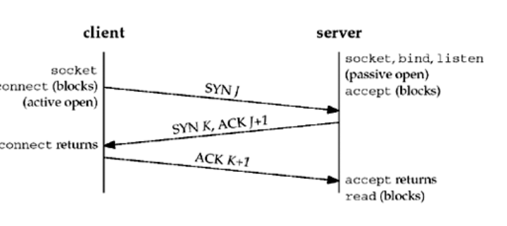
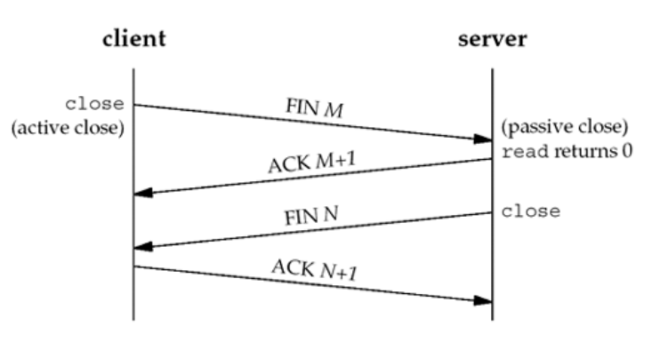
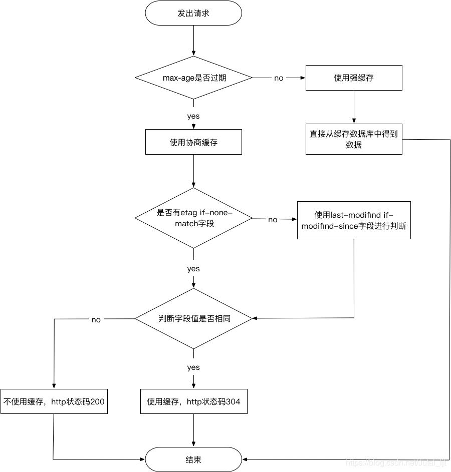

## URL 和 URI 的区别

URI: Uniform Resource Identifier 指的是**统一资源标识符**

URL: Uniform Resource Location 指的是**统一资源定位符**

URN: Universal Resource Name 指的是**统一资源名称**

URI 指的是统一资源标识符，用**唯一的标识来确定一个资源，它是一种抽象的定义，也就是说，不管使用什么方法来定义，只要能唯一的标识一个资源，就可以称为 URI**。

URL 指的是统一资源定位符，URN 指的是统一资源名称。URL 和 URN 是 URI 的子集，URL 可以理解为**使用地址来标识资**源，URN 可以理解为**使用名称来标识资源**

## 开发中常用的几种 Content-Type

（1）`application/x-www-form-urlencoded`

浏览器的原生 form 表单，**如果不设置 enctype 属性，那么最终就会以`application/x-www-form-urlencoded` 方式提交数据**。该种方式提交的数据放在 body 里面，数据按照 `key1=val1&key2=val2` 的方式进行编码，**key 和 val 都进行了 URL 转码**。

（2）`multipart/form-data`

该种方式也是一个常见的 POST 提交方式，通常表单上传文件时使用该种方式。

（3）`application/json`

告诉服务器消息主体是序列化后的 JSON 字符串。

（4）`text/xml`

该种方式主要用来提交 XML 格式的数据。

## 应用层

应用层协议定义了应用进程间的交互和通信规则，不同主机的应用进程间如何相互传递报文，比如传递的报文的类型、格式、 有哪些字段等等

### HTTP 协议

**(1)概况**

HTTP 是超文本传输协议，它定义了客户端和服务器之间交换报文的格式和方式，默认使用 80 端口。它使用 TCP 作为传 输层协议，保证了数据传输的可靠性。HTTP 是一个**无状态**的协议，HTTP 服务器不会保存关于客户的任何信息。

HTTP 有两种连接模式，一种是**持续连接**，一种**非持续连接**。非持续连接指的是服务器必须为每一个请求的对象建立和维护 一个全新的连接。持续连接下，TCP 连接默认不关闭，可以被多个请求复用。采用持续连接的好处是可以避免每次建立 TCP 连接三次握手时所花费的时间。在 HTTP1.0 以前使用的非持续的连接，但是可以在请求时，加上 **Connection: keep-a live 来要求服务器不要关闭 TCP 连接**。**HTTP1.1 以后默认采用的是持续的连接**。目前对于同一个域，大多数浏览器支持 同时建立 6 个持久连接。

**(2)HTTP 请求报文**

HTTP 报文有两种，一种是请求报文，一种是响应报文。

HTTP 请求报文的格式如下：

`GET / HTTP/1.1 User-Agent: Mozilla/5.0 (Macintosh; Intel Mac OS X 10_10_5) Accept:*/*`

HTTP 请求报文的**第一行叫做请求行**，**后面的行叫做首部行**，首部行后还可以跟一个实体主体。**请求首部之后有一个空行，这 个空行不能省略，它用来划分首部与实体**。

**请求行**包含三个字段：**方法字段、URL 字段和 HTTP 版本字段**。

方法字段可以取几种不同的值，一般有 GET、POST、HEAD、PUT 和 DELETE。一般 GET 方法只被用于向服务器获取数据。POST 方法用于将实体提交到指定的资源，通常会造成服务器资源的修改。HEAD 方法与 GET 方法类似，但是在返回的响应 中，不包含请求对象。PUT 方法用于上传文件到服务器，DELETE 方法用于删除服务器上的对象。虽然请求的方法很多，但 更多表达的是一种语义上的区别，并不是说 POST 能做的事情，GET 就不能做了，主要看我们如何选择。

**(3)HTTP 响应报文**

HTTP 报文有两种，一种是请求报文，一种是响应报文。

HTTP 响应报文的格式如下：

```
HTTP/1.0 200 OK
Content-Type: text/plain
Content-Length: 137582
Expires: Thu, 05 Dec 1997 16:00:00 GMT
Last-Modified: Wed, 5 August 1996 15:55:28 GMT
Server: Apache 0.84
<html>
<body>Hello World</body>
</html>
```

HTTP 响应报文的**第一行叫做状态行**，**后面的行是首部行**，**最后是实体主体**。状态行包含了三个字段：协议版本字段、状态码和相应的状态信息。实体部分是报文的主要部分，它包含了所请求的对象。

常见的状态有

200-请求成功、202-服务器端已经收到请求消息，但是尚未进行处理 301-永久移动、302-临时移动、304-所请求的资源未修改、 400-客户端请求的语法错误、404-请求的资源不存在 500-服务器内部错误。一般 1XX 代表服务器接收到请求、2XX 代表成功、3XX 代表重定向、4XX 代表客户端错误、5XX 代表服务器端错误。

**（4）首部行**

首部可以分为四种首部，**请求首部、响应首部、通用首部和实体首部**。通用首部和实体首部在请求报文和响应报文中都可以设 置，区别在于请求首部和响应首部。

常见的请求首部有 **Accept** 可接收媒体资源的类型、Accept-Charset 可接收的字符集、Host 请求的主机名。

常见的响应首部有 **ETag** 资源的匹配信息，Location 客户端重定向的 URI。

常见的通用首部有 **Cache-Control** 控制缓存策略、Connection 管理持久连接。

常见的实体首部有 **Content-Length** 实体主体的大小、Expires 实体主体的过期时间、Last-Modified 资源的最后修 改时间

**（5 ）HTTP/1.1 协议缺点**

HTTP/1.1 默认使用了持久连接，多个请求可以复用同一个 TCP 连接，但是在同一个 TCP 连接里面，数据请求的通信次序 是固定的。服务器只有处理完一个请求的响应后，才会进行下一个请求的处理，如果前面请求的响应特别慢的话，就会造成许 多请求排队等待的情况，这种情况被称为“**队头堵塞**”。队头阻塞会导致持久连接在达到最大数量时，剩余的资源需要等待其他 资源请求完成后才能发起请求。

**为了避免这个问题，一个是减少请求数，一个是同时打开多个持久连接。这就是我们对网站优化时，使用雪碧图、合并脚本的 原因**。

### HTTP/2 协议

2009 年，谷歌公开了自行研发的 SPDY 协议，主要**解决 HTTP/1.1 效率不高的问题**。这个协议在 Chrome 浏览器上证明 可行以后，就被当作 HTTP/2 的基础，主要特性都在 HTTP/2 之中得到继承。2015 年，HTTP/2 发布。HTTP/2 主要有以下新的特性:

（1）二进制协议 HTTP/2 是一个**二进制协议**。在 HTTP/1.1 版中，报文的头信息必须是文本（ASCII 编码），数据体可以是文本，也可以是 二进制。HTTP/2 则是一个**彻底的二进制协议，头信息和数据体都是二进制**，并且**统称为"帧"，可以分为头信息帧和数据帧**。 **帧的概念是它实现多路复用的基础**。

（2） 多路复用
HTTP/2 **实现了多路复用**，HTTP/2 仍然复用 TCP 连接，但是**在一个连接里，客户端和服务器都可以同时发送多个请求或回 应**，而且不用按照顺序一一发送，这样就**避免了"队头堵塞"的问题**

（3） 数据流
HTTP/2 使用了**数据流的概念**，因为 HTTP/2 的数据包是不按顺序发送的，同一个连接里面连续的数据包，可能属于不同的 请求。因此，必须要对数据包做标记，指出它属于哪个请求。**HTTP/2 将每个请求或回应的所有数据包，称为一个数据流**。每 个数据流都有一个独一无二的编号。**数据包发送的时候，都必须标记数据流 ID ，用来区分它属于哪个数据流**。

（4） 头信息压缩
HTTP/2 **实现了头信息压缩**，由于 HTTP 1.1 协议不带有状态，每次请求都必须附上所有信息。所以，请求的很多字段都是 重复的，比如 Cookie 和 UserAgent ，一模一样的内容，每次请求都必须附带，这会浪费很多带宽，也影响速度。

HTTP/2 对这一点做了优化，引入了头信息压缩机制。一方面，头信息使用 gzip 或 compress 压缩后再发送；另一方面， 客户端和服务器同时维护一张头信息表，所有字段都会存入这个表，生成一个索引号，以后就不发送同样字段了，只发送索引 号，这样就能提高速度了。

（5） 服务器推送
HTTP/2 **允许服务器未经请求，主动向客户端发送资源，这叫做服务器推送**。使用服务器推送，提前给客户端推送必要的资源 ，这样就可以相对减少一些延迟时间。这里需要注意的是 **http2 下服务器主动推送的是静态资源，和 WebSocket 以及使用 SSE 等方式向客户端发送即时数据的推送是不同的**

（6 ）HTTP/2 协议缺点

因为 HTTP/2 使用了多路复用，一般来说同一域名下只需要使用一个 TCP 连接。由于多个数据流使用同一个 TCP 连接，遵 守同一个流量状态控制和拥塞控制。**只要一个数据流遭遇到拥塞，剩下的数据流就没法发出去，这样就导致了后面的所有数据都 会被阻塞**。HTTP/2 出现的这个问题是由于其使用 TCP 协议的问题，与它本身的实现其实并没有多大关系

（7 ）HTTP/3 协议 协议

由于 TCP 本身存在的一些限制，Google 就开发了一个**基于 UDP 协议的 QUIC 协议**，并且使用在了 HTTP/3 上。 QUIC 协议在 UDP 协议上实现了多路复用、有序交付、重传等等功能

### HTTPS 协议

（1 ）HTTP 存在的问题

- HTTP 报文使用**明文方式发送**，可能被第三方窃听。
- HTTP 报文可能**被第三方截取后修改通信内容，接收方没有办法发现报文内容的修改**
- HTTP 还存在**认证**的问题，第三方可以冒充他人参与通信

（2 ）HTTPS 简介

HTTPS 指的是超文本传输安全协议，HTTPS 是基于 HTTP 协议的，不过它会使用 TLS/SSL 来对数据加密。使用 TLS/ SSL 协议，所有的信息都是加密的，第三方没有办法窃听。并且它提供了一种校验机制，信息一旦被篡改，通信的双方会立 刻发现。它还配备了身份证书，防止身份被冒充的情况出现

（3 ）TLS 握手过程

第一步，客户端向服务器发起请求，请求中包含使用的协议版本号、**生成的一个随机数**、以及客户端支持的加密方法

第二步，服务器端接收到请求后，确认双方使用的加密方法、并给出服务器的证书、以及**一个服务器生成的随机数**

第三步，客户端确认服务器证书有效后，**生成一个新的随机数**，并使用数字证书中的公钥，加密这个随机数，然后发给服 务器。并且还会**提供一个前面所有内容的 hash 的值**，用来供服务器检验。

第四步，服务器使用自己的私钥，来解密客户端发送过来的随机数。并提供前面所有内容的 hash 值来供客户端检验

第五步，客户端和服务器端根据约定的加密方法使用前面的三个随机数，生成对话秘钥，以后的对话过程都使用这个秘钥 来加密信息

（4） 实现原理

TLS 的握手过程主要用到了三个方法来保证传输的安全。

首先是**对称加密**的方法，对称加密的方法是，双方使用同一个秘钥对数据进行加密和解密。但是对称加密的存在一个问题，就 是如何保证秘钥传输的安全性，因为秘钥还是会通过网络传输的，一旦秘钥被其他人获取到，那么整个加密过程就毫无作用了。 这就要用到非对称加密的方法。

**非对称加密**的方法是，我们拥有两个秘钥，一个是公钥，一个是私钥。公钥是公开的，私钥是保密的。用私钥加密的数据，只 有对应的公钥才能解密，用公钥加密的数据，只有对应的私钥才能解密。我们可以将公钥公布出去，任何想和我们通信的客户， 都可以使用我们提供的公钥对数据进行加密，这样我们就可以使用私钥进行解密，这样就能保证数据的安全了。但是**非对称加 密有一个缺点就是加密的过程很慢**，因此如果每次通信都使用非对称加密的方式的话，反而会造成等待时间过长的问题。

因此我们可以**使用对称加密和非对称加密结合的方式**，因为对称加密的方式的缺点是无法保证秘钥的安全传输，因此我们可以 非对称加密的方式来对对称加密的秘钥进行传输，然后以后的通信使用对称加密的方式来加密，这样就解决了两个方法各自存 在的问题。

但是现在的方法也不一定是安全的，因为我们没有办法确定我们得到的公钥就一定是安全的公钥。**可能存在一个中间人，截取 了对方发给我们的公钥，然后将他自己的公钥发送给我们，当我们使用他的公钥加密后发送的信息，就可以被他用自己的私钥 解密**。然后他伪装成我们以同样的方法向对方发送信息，这样我们的信息就被窃取了，然而我们自己还不知道。

为了解决这样的问题，我们可以使用**数字证书**的方式，首先我们使用一种 Hash 算法来对我们的公钥和其他信息进行加密生成 一个信息摘要，然后让有公信力的认证中心（简称 CA ）用它的私钥对消息摘要加密，形成签名。最后将原始的信息和签名合 在一起，称为数字证书。当接收方收到数字证书的时候，先根据原始信息使用同样的 Hash 算法生成一个摘要，然后使用公证 处的公钥来对数字证书中的摘要进行解密，最后将解密的摘要和我们生成的摘要进行对比，就能发现我们得到的信息是否被更改 了。这个方法最要的是认证中心的可靠性，一般浏览器里会内置一些顶层的认证中心的证书，相当于我们自动信任了他们，只有 这样我们才能保证数据的安全。

### DNS 协议

（1）概况

DNS 协议提供的是一种**主机名到 IP 地址的转换服务**，就是我们常说的域名系统。它是一个由**分层的 DNS 服务器组成的分 布式数据库**，是定义了主机如何查询这个分布式数据库的方式的应用层协议。**DNS 协议运行在 UDP 协议之上**，使用 **53 号 端口**。

（2） 域名的层级结构

域名的层级结构可以如下

```
主机名.次级域名.顶级域名.根域名
# 即
host.sld.tld.root
```

根据域名的层级结构，管理不同层级域名的服务器，可以分为**根域名服务器、顶级域名服务器和权威域名服务器**。

（3）查询过程

DNS 的查询过程一般为，我们首先将 DNS 请求发送到本地 DNS 服务器，由本地 DNS 服务器来代为请求。

1. 从"根域名服务器"查到"顶级域名服务器"的 NS 记录和 A 记录（ IP 地址）。
2. 从"顶级域名服务器"查到"次级域名服务器"的 NS 记录和 A 记录（ IP 地址）。
3. 从"次级域名服务器"查出"主机名"的 IP 地址。

比如我们如果想要查询 www.baidu.com 的 IP 地址，我们首先会将请求发送到本地的 DNS 服务器中，本地 DNS 服务 器会判断是否存在该域名的缓存，如果不存在，则向根域名服务器发送一个请求，根域名服务器返回负责 .com 的顶级域名 服务器的 IP 地址的列表。然后本地 DNS 服务器再向其中一个负责 .com 的顶级域名服务器发送一个请求，负责 .com 的顶级域名服务器返回负责 .baidu 的权威域名服务器的 IP 地址列表。然后本地 DNS 服务器再向其中一个权威域名服 务器发送一个请求，最后权威域名服务器返回一个对应的主机名的 IP 地址列表。

（4 ）DNS 记录和报文 记录和报文

DNS 服务器中以**资源记录**的形式存储信息，**每一个 DNS 响应报文一般包含多条资源记录**。一条资源记录的具体的格式为

`（Name，Value，Type，TTL）`

其中 **TTL 是资源记录的生存时间**，它定义了资源记录能够被其他的 DNS 服务器缓存多长时间。

常用的一共有四种 Type 的值，分别是 **A、NS、CNAME 和 MX**，不同 Type 的值，对应资源记录代表的意义不同

- 如果 Type = A，则 Name 是主机名，Value 是主机名对应的 IP 地址。因此一条记录为 A 的资源记录，提供了标 准的主机名到 IP 地址的映射。
- 如果 Type = NS，则 Name 是个域名，Value 是负责该域名的 DNS 服务器的主机名。这个记录主要用于 DNS 链式 查询时，返回下一级需要查询的 DNS 服务器的信息
- 如果 Type = CNAME，则 Name 为别名，Value 为该主机的规范主机名。该条记录用于向查询的主机返回一个主机名 对应的规范主机名，从而告诉查询主机去查询这个主机名的 IP 地址。主机别名主要是为了通过给一些复杂的主机名提供 一个便于记忆的简单的别名
- 如果 Type = MX，则 Name 为一个邮件服务器的别名，Value 为邮件服务器的规范主机名。它的作用和 CNAME 是一 样的，都是为了解决规范主机名不利于记忆的缺点

（5） 递归查询和迭代查询

递归查询指的是查询请求发出后，**域名服务器代为向下一级域名服务器发出请求**，最后向用户返回查询的最终结果。**使用递归 查询，用户只需要发出一次查询请求**。

迭代查询指的是查询请求后，**域名服务器返回单次查询的结果**。下一级的查询由用户自己请求。使用迭代查询，用户需要发出 多次的查询请求。

**一般我们向本地 DNS 服务器发送请求的方式就是递归查询，因为我们只需要发出一次请求**，然后**本地 DNS 服务器返回给我 们最终的请求结果。而本地 DNS 服务器向其他域名服务器请求的过程是迭代查询的过程，因为每一次域名服务器只返回单次 查询的结果，下一级的查询由本地 DNS 服务器自己进行**。

（6 ）DNS 缓存

DNS 缓存的原理非常简单，在一个请求链中，当某个 DNS 服务器接收到一个 DNS 回答后，它能够将回答中的信息缓存在本 地存储器中。返回的资源记录中的 TTL 代表了该条记录的缓存的时间

（7 ）DNS 实现负载平衡

**DNS 可以用于在冗余的服务器上实现负载平衡**。务因为现在一般的大型网站使用多台服务器提供服，**因此一个域名可能会对应 多个服务器地址**。当用户发起网站域名的 DNS 请求的时候，DNS 服务器返回这个域名所对应的服务器 IP 地址的集合，但在 每个回答中，会循环这些 IP 地址的顺序，用户一般会选择排在前面的地址发送请求。以此将用户的请求均衡的分配到各个不 同的服务器上，这样来实现负载均衡。

## 传输层

传输层协议主要是为不同主机上的不同进程间提供了逻辑通信的功能。传输层只工作在端系统中

### 多路复用与多路分解

**将传输层报文段中的数据交付到正确的套接字的工作被称为多路分解。**

**在源主机上从不同的套接字中收集数据，封装头信息生成报文段后，将报文段传递到网络层，这个过程被称为多路复用**。

**无连接的多路复用和多路分解**指的是 UDP 套接字的分配过程，一个 UDP 套接字由一个二元组来标识，这个二元组包含了一 个目的地址和一个目的端口号。因此不同源地址和端口号的 UDP 报文段到达主机后，如果它们拥有相同的目的地址和目的端 口号，那么不同的报文段将会转交到同一个 UDP 套接字中。**面向连接的多路复用和多路分解**指的是 TCP 套接字的分配过程，一个 TCP 套接字由一个四元组来标识，这个四元组包含了 源 IP 地址、源端口号、目的地址和目的端口号。因此，一个 TCP 报文段从网络中到达一台主机上时，该主机使用全部 4 个 值来将报文段定向到相应的套接字。

### UDP 协议

UDP 是一种**无连接的，不可靠的传输层协议**。它只提供了传输层需要实现的最低限度的功能，除了复用/分解功能和少量的差 错检测外，它几乎没有对 IP 增加其他的东西。UDP 协议适用于对实时性要求高的应用场景

- 使用 UDP 时，在发送报文段之前，通信双方没有握手的过程，因此 UDP 被称为是无连接的传输层协议。因为没有握手 过程，相对于 TCP 来说，没有建立连接的时延。**因为没有连接，所以不需要在端系统中保存连接的状态**
- UDP 提供**尽力而为的交付服务**，也就是说 UDP 协议不保证数据的可靠交付
- UDP 没有拥塞控制和流量控制的机制，所以 UDP 报文段的发送速率没有限制
- 因为一个 UDP 套接字**只使用目的地址和目的端口来标识**，所以 **UDP 可以支持一对一、一对多、多对一和多对多的交互 通信**
- UDP 首部小，只有 8 个字节

### UDP 报文段结构

UDP 报文段由**首部和应用数据**组成。报文段首部包含四个字段，分别是源端口号、目的端口号、长度和检验和，每个字段的长度为两个字节。长度字段指的是整个报文段的长度，包含了首部和应用数据的大小。校验和是 UDP 提供的一种差错校验机制。 虽然提供了差错校验的机制，但是 UDP 对于差错的恢复无能为力

### TCP 协议

TCP 协议是面向连接的，提供可靠数据传输服务的传输层协议。

- TCP 协议是**面向连接的**，在通信双方进行通信前，需要通过三次握手建立连接。它需要在端系统中维护双方连接的状态信息
- TCP 协议**通过序号、确认号、定时重传、检验和等机制，来提供可靠的数据传输服务**
- TCP 协议提供的是**点对点的服务**，即它是在单个发送方和单个接收方之间的连接
- TCP 协议提供的是**全双工的服务**，也就是说连接的双方的能够向对方发送和接收数据
- TCP 提供了**拥塞控制机制**，在网络拥塞的时候会控制发送数据的速率，有助于减少数据包的丢失和减轻网络中的拥塞程度
- TCP 提供了**流量控制机制**，保证了通信双方的发送和接收速率相同。如果接收方可接收的缓存很小时，发送方会降低发送 速率，避免因为缓存填满而造成的数据包的丢失

（1 ）TCP 报文段结构

TCP 报文段由首部和数据组成，它的首部一般为 20 个字节。

源端口和目的端口号用于报文段的多路复用和分解。

32 比特的序号和 32 比特的确认号，用与实现可靠数据运输服务。

16 比特的接收窗口字段用于实现流量控制，该字段表示接收方愿意接收的字节的数量。

4 比特的首部长度字段，该字段指示了以 32 比特的字为单位的 TCP 首部的长度。

6 比特的标志字段，ACK 字段用于指示确认序号的值是有效的，RST、SYN 和 FIN 比特用于连接建立和拆除。设置 PSH 字 段指示接收方应该立即将数据交给上层，URG 字段用来指示报文段里存在紧急的数据。

校验和提供了对数据的差错检测。

（2 ）TCP 三次握手的过程

第一次握手，客户端向服务器发送一个 SYN 连接请求报文段，报文段的首部中 SYN 标志位置为 1，序号字段是一个任选的 随机数。它代表的是客户端数据的初始序号。

第二次握手，服务器端接收到客户端发送的 SYN 连接请求报文段后，服务器首先会为该连接分配 TCP 缓存和变量，然后向 客户端发送 SYN ACK 报文段，报文段的首部中 SYN 和 ACK 标志位都被置为 1，代表这是一个对 SYN 连接请求的确认， 同时序号字段是服务器端产生的一个任选的随机数，它代表的是服务器端数据的初始序号。确认号字段为客户端发送的序号加 一。

第三次握手，客户端接收到服务器的肯定应答后，它也会为这次 TCP 连接分配缓存和变量，同时向服务器端发送一个对服务 器端的报文段的确认。第三次握手可以在报文段中携带数据。

在我看来，TCP 三次握手的建立连接的过程就是**相互确认初始序号的过程**，告诉对方，什么样序号的报文段能够被正确接收。 第三次握手的作用是客户端对服务器端的初始序号的确认。如果只使用两次握手，那么服务器就没有办法知道自己的序号是否 已被确认。同时这样也是为了防止失效的请求报文段被服务器接收，而出现错误的情况。

（3 ）TCP 四次挥手的过程

因为 TCP 连接是全双工的，也就是说通信的双方都可以向对方发送和接收消息，所以断开连接需要双方的确认。

第一次挥手，客户端认为没有数据要再发送给服务器端，它就向服务器发送一个 FIN 报文段，申请断开客户端到服务器端的 连接。发送后客户端进入 FIN_WAIT_1 状态。

第二次挥手，服务器端接收到客户端释放连接的请求后，向客户端发送一个确认报文段，表示已经接收到了客户端释放连接的 请求，以后不再接收客户端发送过来的数据。但是因为连接是全双工的，所以此时，服务器端还可以向客户端发送数据。服务 器端进入 CLOSE_WAIT 状态。客户端收到确认后，进入 FIN_WAIT_2 状态。

第三次挥手，服务器端发送完所有数据后，向客户端发送 FIN 报文段，申请断开服务器端到客户端的连接。发送后进入 LAS T_ACK 状态。

第四次挥手，客户端接收到 FIN 请求后，向服务器端发送一个确认应答，并进入 TIME_WAIT 阶段。该阶段会持续一段时间， 这个时间为报文段在网络中的最大生存时间，如果该时间内服务端没有重发请求的话，客户端进入 CLOSED 的状态。如果收到 服务器的重发请求就重新发送确认报文段。服务器端收到客户端的确认报文段后就进入 CLOSED 状态，这样全双工的连接就被 释放了。

TCP 使用四次挥手的原因是因为 TCP 的连接是全双工的，所以需要双方分别释放到对方的连接，单独一方的连接释放，只代 表不能再向对方发送数据，连接处于的是半释放的状态。

最后一次挥手中，客户端会等待一段时间再关闭的原因，是为了防止发送给服务器的确认报文段丢失或者出错，从而导致服务器 端不能正常关闭。

（4 ）ARQ 协议 协议

ARQ 协议指的是**自动重传请求**，它**通过超时和重传来保证数据的可靠交付**，它是 TCP 协议实现可靠数据传输的一个很重要的 机制。它分为停止等待 ARQ 协议和连续 ARQ 协议。

一、停止等待 ARQ 协议

停止等待 ARQ 协议的基本原理是，**对于发送方来说发送方每发送一个分组，就为这个分组设置一个定时器。当发送分组的确认 回答返回了，则清除定时器，发送下一个分组。如果在规定的时间内没有收到已发送分组的肯定回答，则重新发送上一个分组**。

对于接受方来说，每次接受到一个分组，就返回对这个分组的肯定应答，当收到冗余的分组时，就直接丢弃，并返回一个对冗余 分组的确认。当收到分组损坏的情况的时候，直接丢弃。

使用停止等待 ARQ 协议的**缺点是每次发送分组必须等到分组确认后才能发送下一个分组，这样会造成信道的利用率过低**。

二、连续 ARQ 协议

连续 ARQ 协议是为了**解决停止等待 ARQ 协议对于信道的利用率过低的问题**。它通过连续发送一组分组，然后再等待对分组的 确认回答，对于如何处理分组中可能出现的差错恢复情况，**一般可以使用滑动窗口协议和选择重传协议来实现**。

**滑动窗口协议**

使用滑动窗口协议，在发送方维持了一个发送窗口，发送窗口以前的分组是已经发送并确认了的分组，发送窗口中包含了已经发 送但未确认的分组和允许发送但还未发送的分组，发送窗口以后的分组是缓存中还不允许发送的分组。当发送方向接收方发送分 组时，会依次发送窗口内的所有分组，并且设置一个定时器，这个定时器可以理解为是最早发送但未收到确认的分组。如果在定 时器的时间内收到某一个分组的确认回答，则滑动窗口，将窗口的首部移动到确认分组的后一个位置，此时如果还有已发送但没 有确认的分组，则重新设置定时器，如果没有了则关闭定时器。如果定时器超时，则重新发送所有已经发送但还未收到确认的分 组。接收方使用的是累计确认的机制，对于所有按序到达的分组，接收方返回一个分组的肯定回答。如果收到了一个乱序的分组，那 么接方会直接丢弃，并返回一个最近的按序到达的分组的肯定回答。使用累计确认保证了确认号以前的分组都已经按序到达了， 所以发送窗口可以移动到已确认分组的后面。滑动窗口协议的缺点是因为使用了累计确认的机制，如果出现了只是窗口中的第一个分组丢失，而后面的分组都按序到达的情况 的话，那么滑动窗口协议会重新发送所有的分组，这样就造成了大量不必要分组的丢弃和重传。

**选择重传协议**

因为滑动窗口使用累计确认的方式，所以会造成很多不必要分组的重传。使用选择重传协议可以解决这个问题

选择重传协议在发送方维护了一个发送窗口。发送窗口的以前是已经发送并确认的分组，窗口内包含了已发送但未被确认的分组， 已确认的乱序分组，和允许发送但还未发送的分组，发送窗口以后的是缓存中还不允许发送的分组。选择重传协议与滑动窗口协 议最大的不同是，发送方发送分组时，为一个分组都创建了一个定时器。当发送方接受到一个分组的确认应答后，取消该分组的 定时器，并判断接受该分组后，是否存在由窗口首部为首的连续的确认分组，如果有则向后移动窗口的位置，如果没有则将该分 组标识为已接收的乱序分组。当某一个分组定时器到时后，则重新传递这个分组。在接收方，它会确认每一个正确接收的分组，不管这个分组是按序的还是乱序的，乱序的分组将被缓存下来，直到所有的乱序分 组都到达形成一个有序序列后，再将这一段分组交付给上层。对于不能被正确接收的分组，接收方直接忽略该分组。

（5 ）TCP 的可靠运输机制

TCP 的可靠运输机制是**基于连续 ARQ 协议和滑动窗口协议的**。

TCP 协议**在发送方维持了一个发送窗口**，发送窗口以前的报文段是已经发送并确认了的报文段，发送窗口中包含了已经发送但 未确认的报文段和允许发送但还未发送的报文段，发送窗口以后的报文段是缓存中还不允许发送的报文段。当发送方向接收方发 送报文时，会依次发送窗口内的所有报文段，并且设置一个定时器，这个定时器可以理解为是最早发送但未收到确认的报文段。 如果在定时器的时间内收到某一个报文段的确认回答，则滑动窗口，将窗口的首部向后滑动到确认报文段的后一个位置，此时如 果还有已发送但没有确认的报文段，则重新设置定时器，如果没有了则关闭定时器。如果定时器超时，则重新发送所有已经发送 但还未收到确认的报文段，并将超时的间隔设置为以前的两倍。当发送方收到接收方的三个冗余的确认应答后，这是一种指示， 说明该报文段以后的报文段很有可能发生丢失了，那么发送方会启用快速重传的机制，就是当前定时器结束前，发送所有的已发 送但确认的报文段。

接收方**使用的是累计确认的机制**，对于所有按序到达的报文段，接收方返回一个报文段的肯定回答。如果收到了一个乱序的报文 段，那么接方会直接丢弃，并返回一个最近的按序到达的报文段的肯定回答。使用累计确认保证了返回的确认号之前的报文段都 已经按序到达了，所以发送窗口可以移动到已确认报文段的后面。

发送窗口的大小是变化的，它是由接收窗口剩余大小和网络中拥塞程度来决定的，TCP 就是通过控制发送窗口的长度来控制报文 段的发送速率。但是 TCP 协议并不完全和滑动窗口协议相同，因为许多的 TCP 实现会将失序的报文段给缓存起来，并且发生重传时，只会重 传一个报文段，因此 TCP 协议的可靠传输机制更像是窗口滑动协议和选择重传协议的一个混合体

（6 ）TCP 的流量控制机制 的流量控制机制

TCP 提供了**流量控制的服务**，这个服务的主要目的是控制发送方的发送速率，保证接收方来得及接收。因为一旦发送的速率大 于接收方所能接收的速率，就会造成报文段的丢失。接收方主要是通过接收窗口来告诉发送方自己所能接收的大小，发送方根据 接收方的接收窗口的大小来调整发送窗口的大小，以此来达到控制发送速率的目的。

（7 ）TCP 的拥塞控制机制 的拥塞控制机制

TCP 的拥塞控制主要是根据网络中的拥塞情况来控制发送方数据的发送速率，如果网络处于拥塞的状态，发送方就减小发送的 速率，这样一方面是为了避免继续增加网络中的拥塞程度，另一方面也是为了避免网络拥塞可能造成的报文段丢失。

TCP 的拥塞控制主要使用了四个机制，分别是**慢启动、拥塞避免、快速重传和快速恢复**。

**慢启动**的基本思想是，因为在发送方刚开始发送数据的时候，并不知道网络中的拥塞程度，所以先以较低的速率发送，进行试探 ，每次收到一个确认报文，就将发动窗口的长度加一，这样每个 RTT 时间后，发送窗口的长度就会加倍。当发送窗口的大小达 到一个阈值的时候就进入拥塞避免算法。

**拥塞避免**算法是为了避免可能发生的拥塞，将发送窗口的大小由每过一个 RTT 增长一倍，变为每过一个 RTT ，长度只加一。 这样将窗口的增长速率由指数增长，变为加法线性增长。

**快速重传**指的是，当发送方收到三个冗余的确认应答时，因为 TCP 使用的是累计确认的机制，所以很有可能是发生了报文段的 丢失，因此采用立即重传的机制，在定时器结束前发送所有已发送但还未接收到确认应答的报文段。

**快速恢复**是对快速重传的后续处理，因为网络中可能已经出现了拥塞情况，所以会将慢启动的阀值减小为原来的一半，然后将拥 塞窗口的值置为减半后的阀值，然后开始执行拥塞避免算法，使得拥塞窗口缓慢地加性增大。简单来理解就是，乘性减，加性增。

**TCP 认为网络拥塞的主要依据是报文段的重传次数，它会根据网络中的拥塞程度，通过调整慢启动的阀值，然后交替使用上面四 种机制来达到拥塞控制的目的**。

## 网络层

网络层协议主要实现了不同主机间的逻辑通信功能。网络层协议一共包含两个主要的组件，一个 IP 网际协议，一个是路由选 择协议。

IP 网际协议规定了网络层的编址和转发方式，比如说我们接入网络的主机都会被分配一个 IP 地址，常用的比如 IPV4 使用 32 位来分配地址，还有 IPv6 使用 128 位来分配地址。

路由选择协议决定了数据报从源到目的地所流经的路径，常见的比如距离向量路由选择算法等。

## 数据链路层

数据链路层提供的服务是如何将数据报通过单一通信链路从一个结点移动到相邻节点。每一台主机都有一个唯一的 MAC 地址， 这是由网络适配器决定的，在全世界都是独一无二的。

## 物理层

物理层提供的服务是尽可能的屏蔽掉组成网络的物理设备和传输介质间的差异，使数据链路层不需要考虑网络的具体传输介质是什么

## Post 和 Get 的区别

Post 和 Get 是 HTTP 请求的两种方法。

（1）从应用场景上来说，GET 请求是一个**幂等的请求**，一般 Get 请求用于对服务器资源不会产生影响的场景，比如说请求一个网页。而 Post 不是一个幂等的请求，一般用于对服务器资源会产生影响的情景。比如注册用户这一类的操作。

（2）因为不同的应用场景，所以浏览器一般会对 Get 请求缓存，但很少对 Post 请求缓存。

（3）从发送的报文格式来说，Get 请求的报文中实体部分为空，Post 请求的报文中实体部分一般为向服务器发送的数据。

（4）但是 Get 请求也可以将请求的参数放入 url 中向服务器发送，这样的做法相对于 Post 请求来说，一个方面是不太安全，因为**请求的 url 会被保留在历史记录中**。并且浏览器由于对 url 有一个长度上的限制，所以会影响 get 请求发送数据时的长度。这个限制是浏览器规定的，并不是 RFC 规定的。还有就是 post 的参数传递支持更多的数据类型。

## HTTP 方法知道哪些，GET 和 POST 区别有哪些

HTTP1.0 定义了三种请求方法，GET，POST 和 HEAD 方法 HTTP1.1 新增六种请求方法：

OPTIONS，PUT，PATCH，DELETE，TRACH 和 CONNECT

GET 和 POST 区别主要从三方面讲即可：**表现形式，传输数据大小，安全性**

首先**表现形式**上：GET 请求的数据会附加在 URL 后面，以?分割多参数用&连接，由于 URL 采用 ASCII 编码，所以非 ASCII 字符会先编码在传输，可缓存；POST 请求会把请求的数据放在请求体中，不可缓存

**传输数据大小**：对于 GET 请求，HTTP 规范没有对 URL 长度进行限制，但是不同浏览器对 URL 长度加以限制，所以 GET 请求时，传输数据会受到 URL 长度的限制；POST 不是 URL 传值，理论上无限制，但各个服务器一般会对 POST 传输数据大小进行限制

**安全性**：相比 URL 传值，POST 利用请求体传值安全性更高

::: tip
还有一种 GET 产生一个数据包，POST 产生两个数据包的说法可答可不答，并不是所有浏览器如此，铺展开解释来说就是：对 GET 请求，浏览器会把请求头和 data 一起发送，服务器响应 200（返回数据），对于 POST 请求，浏览器会先发送 header，服务器响应 100 后继续，浏览器再发送 data，服务器响应 200
:::

## get 和 post 请求在缓存方面的区别

相关知识点：

get 请求类似于查找的过程，用户**获取数据**，可以不用每次都与数据库连接，所以可以使用缓存

post 不同，post 做的一般是**修改和删除**的工作，所以必**须与数据库交互，所以不能使用缓存**。

因此 get 请求适合于请求缓存。

回答：

**缓存一般只适用于那些不会更新服务端数据的请求**。一般 get 请求都是查找请求，不会对服务器资源数据造成修改，而 post 请求一般都会对服务器数据造成修改，所以，一般会对 get 请求进行缓存，很少会对 post 请求进行缓存。

## get 请求传参长度的误区

误区：我们经常说 get 请求参数的大小存在限制，而 post 请求的参数大小是无限制的。

实际上 HTTP 协议从未规定 GET/POST 的请求长度限制是多少。对 get 请求参数的限制是来源与浏览器或 web 服务器，浏览器或 web 服务器限制了 url 的长度。为了明确这个概念，我们必须再次强调下面几点:

- HTTP 协议**未规定** GET 和 POST 的长度限制
- GET 的最大长度显示是因为**浏览器和 web 服务器限制了 URI 的长度**
- 不同的浏览器和 WEB 服务器，**限制的最大长度不一样**
- 要支持 IE，则最大长度为 2083byte，若只支持 Chrome，则最大长度 8182byte

## http 请求方法 options 方法有什么用？

**OPTIONS 请求与 HEAD 类似，一般也是用于客户端查看服务器的性能**。这个方法会请求服务器返回该资源所支持的所有 HTTP 请求方法，该方法会用'\*'来代替资源名称，向服务器发送 OPTIONS 请求，可以测试服务器功能是否正常。**JS 的 XMLHttpRequest 对象进行 CORS 跨域资源共享时，对于复杂请求，就是使用 OPTIONS 方法发送嗅探请求，以判断是否有对指定资源的访问权限**。

## http1.1 和 和 http1.0 之间有哪些区别

http1.1 相对于 http1.0 有这样几个区别：

（1）**连接方面**的区别，http1.1 默认使用持久连接，而 http1.0 默认使用非持久连接。http1.1 通过使用持久连接来使多个 http 请求复用同一个 TCP 连接，以此来避免使用非持久连接时每次需要建立连接的时延。PS：在持久连接的基础上可选的是管道化的连接

（2）**资源请求方面**的区别，在 http1.0 中，存在一些浪费带宽的现象，在断连后不得不下载完整的包，例如客户端只是需要某个对象的一部分，而服务器却将整个对象送过来了，并且不支持断点续传功能，http1.1 则在请求头引入了 range 头域，在响应消息中 Content-Range 头域中声明了返回这部分对象的偏移值和长度，它允许只请求资源的某个部分，即返回码是 206（PartialContent），这样就方便了开发者自由的选择以便于充分利用带宽和连接。

（3）**缓存方面**的区别，在 http1.0 中主要使用 header 里的 If-Modified-Since,Expires 来做为缓存判断的标准，http1.1 则引入了更多的缓存控制策略例如 Etag、If-Unmodified-Since、If-Match、If-None-Match 等更多可供选择的缓存头来控制缓存策略。

（4）http1.1 中还**新增了 host 字段**，用来指定服务器的域名。http1.0 中认为每台服务器都绑定一个唯一的 IP 地址，因此，请求消息中的 URL 并没有传递主机名（hostname）。但随着虚拟主机技术的发展，在一台物理服务器上可以存在多个虚拟主机，并且它们共享一个 IP 地址。因此有了 host 字段，就可以将请求发往同一台服务器上的不同网站。

（5）http1.1 相对于 http1.0 还**新增了很多方法**，如 PUT、HEAD、OPTIONS 等。

（6）错误提示：HTTP1.1 新增 24 个状态响应码，比如 409（请求的资源与资源当前状态冲突），410（服务器上某个资源被永久性删除）；相比 HTTP1.0 只定义了 16 个状态响应码

## HTTP2 相比 HTTP1 的优势和特点

HTTP2 相比 HTTP1.x 有 4 大特点，二进制分帧，头部压缩，服务端推送和多路复用

- 二进制分帧：HTTP2 使用二进制格式传输数据，而 HTTP1.x 使用文本格式，二进制协议解析更高效
- 头部压缩：HTTP1.x 每次请求和发送都携带不常改变的，冗杂的头部数据，给网络带来额外负担；而 HTTP2 在客户端和服务器使用"部首表"来追踪和存储之前发送的键值对，对于相同的数据，不再每次通过每次请求和响应发送可以简单理解为只发送差异数据，而不是发送全部头部，从而减少头部信息量）
- 服务端推送：服务端可以在发送页面 HTML 时主动推送其他资源，而不用等到浏览器解析到相应位置时，发起请求再响应 +多路复用：在 HTTP1.x 中如果想并发多个请求，需要多个 TCP 连接，并且浏览器为了控制资源，一般对单个域名有 6-8 个 TCP 连接数量的限制；而在 HTTP2 中同个域名所有通信都在单个连接下进行单个连接可以承载任意数量的双向数据流数据流以消息的形式发送，而消息又由一个或多个帧组成，多个帧之间可以乱序发送

[http2 详情](/mian/base/network.html#http-2-%E5%8D%8F%E8%AE%AE)

## HTTPS 相比 HTTP 的区别，讲一下 HTTPS 的实现过程

https 相比之下是安全版的 http，其实就是 HTTP over TSL，因为 http 都是使用明文传输的，对于敏感信息的传输就很不安全，https 正是为了解决 http 存在的安全隐患而出现的

https 的实现也是一个较复杂的过程，将对称加密的密钥使⽤⾮对称加密的公钥进⾏加密，在保证了通信效率的同时防止窃听，同时结合 CA 证书以及数字签名来最大程度保证安全性：

- 对称加密：通信双方都使用用一个密钥进行加密解密，比如特工接头的暗号，就属于对称加密；这种方式虽然简单性能好，但是无法解决首次把密钥发给对方的问题，容易被黑客拦截密钥

- 非对称加密：由私钥＋公钥组成的密钥对
  - 即用私钥加密的数据，只要公钥才能解密；用公钥加密的数据，只有私钥才能解密
  - 通信双方都有自己的一套密钥对，通信前将自己的公钥发给对方
  - 然后拿着这个公钥来加密数据响应给对方，等对方收到之后，再用自己的私钥进行解密

非对称加密虽然安全性更高，但是带来的问题就是速度较慢，影响性能

结合两种方式，将对称加密的密钥使用非对称加密的公钥进行加密，然后再发送出去，然后接收方使用自己的私钥进行解密得到对称加密的密钥

:::tip 但是又带来一个问题，即中间人问题：

如果此时在客户端和服务端之间存在一个中间人，这个中间人只需要把原本双方通信互发的公钥，换成自己的公钥，这样中间人就可以轻松解密通信双方所发送的数据
:::

这时候就需要一个安全的第三方的颁布证书，来证明身份，防止中间攻击：所以就有了 CA 证书，仔细观察浏览器地址栏，会有一个"小锁"的标志，点开里面有证明身份的 CA 证书信息


:::tip &nbsp;
但是仍然存在的一个问题是，如果中间人篡改了 CA 证书，那么这个证书不就无效了？所以就添加了新的保护方案：**数字签名**
:::

数字签名就是用证书自带的 HASH 算法对证书内容进行一个 HASH 得到一个摘要，再用 CA 的私钥进行加密，最终组成数字签名

:::tip &nbsp;
当别人把他的证书发过来时，用同样的 HASH 算法得到信息摘要，然后再用 CA 的公钥对数字签名进行解密，得到 CA 创建的消息摘要，两者一对比就知道中间有没有被篡改了
:::

通过这样的方式，https 最大化保证了通信的安全性

[https 详情](/mian/base/network.html#https-%E5%8D%8F%E8%AE%AE)

## 对 Websocket 的了解，应用场景，对比 HTTP

Websocket 和 HTTP 都是基于 TCP 协议两个不同的协议

首先 Websocket 是一种在单个 TCP 连接上进行**全双工**通信的协议，**允许服务端主动向客户端推送数据**（只需要一次握手，两者之间创建持久化连接，可进行双向数据传输）；而 HTTP 则需要**定时轮询**向服务器请求，然后服务器再向客户端发送数据

其次，HTTP 是一个无状态协议，缺少状态意味着后续处理需要先前数据必须重传；而 Websocket 需要先创建连接，这就使得其成为一种有状态的协议，之后通信时可以省略部分状态信息

应用场景：如果应用是多个用户相互交流，或者展示服务端经常变动的数据都可以考虑 websocket；所以体育实况，多媒体聊天等这些都是 Websocket 不错的应用场景


## 对 HTTP 报文结构的了解

HTTP 报文结构由报文首部，空行，报文主体三部分组成
| |
|-----|
|报文首部|
|空行|
|报文主体|

而 HTTP 报文首部则是由首部字段名和字段值键值对形式构成，如 Content-Type:text/html

HTTP 首部字段通常分为 4 种类型：通用首部，请求首部，响应首部，实体首部

HTTP 请求报文，一个 HTTP 请求报文由请求行（request line）、请求头部（requestheader）、空行和请求数据 4 个部分构成。请求行数据格式由三个部分组成：请求方法、URI、HTTP 协议版本，他们之间用空格分隔

[更详细的关于 http 报文结构](/mian/base/network.html#http-%E5%8D%8F%E8%AE%AE)

## HTTP 的状态码，301 和 302 的区别

状态码告知从服务器返回请求的状态，一般由以 1~5 开头的三位整数组成，

1xx：请求正在处理

2xx：成功

3xx：重定向

- 301 moved permanently，永久性重定向，表示资源已被分配了新的 URL
- 302 found，临时性重定向，表示资源临时被分配了新的 URL
- 303 see other，表示资源存在着另⼀个 URL，应使⽤ GET ⽅法定向获取资源
- 304 not modified，表示服务器允许访问资源，但因发生请求未满足条件的情况
- 307 temporary redirect，临时重定向，和 302 含义相同

4xx：客户端错误

- 400 bad request，请求报文存在语法错误
- 401 unauthorized，表示发送的请求需要有通过 HTTP 认证的认证信息
- 403 forbidden，表示对请求资源的访问被服务器拒绝
- 404 not found，表示服务器上没找到请求的资源
- 408 Request timeout，客户端请求超市
- 409 confict，请求的资源可能引起冲突

5xx：服务器错误

- 500 internal server error，表示服务器端在执行请求时发生了错误
- 501 Not Implemented，请求超出服务器能力范围
- 503 service unavailable，表示服务器暂时处于超负载或正在停机维护，无法处理
- 505 http version not supported，服务器不支持，或者拒绝支持在请求中的使用的 HTTP 版本

同样是重定向，302 是 HTTP1.0 的状态码，在 HTTP1.1 版本的时候为了细化 302 又分出来了 303 和 307，303 则明确表示客户端应采用 get 方法获取资源，他会把 post 请求变成 get 请求进行重定向；307 则会遵照浏览器标准，不会改变 post

## HTTP 建立持久连接的意义

HTTP 持久连接也称作**HTTP keep-alive**，使用同一个 TCP 连接发送和接收多个 HTTP 请求，是 HTTP1.1 的新特，HTTP1.1 默认性所有连接都是持久连接。在 HTTP1.0，使用非持久连接，每个 TCP 连接只用于传输一个请求和响应，没有官方的 keep-alive 操作，如果浏览器支持通常在请求和响应头中加上 **Connection: Keep-Alive**

那么由于同时打开的 TCP 连接减少，可以**减少内存和 CPU 的占用**；其次之后也无需再次握手，也减少了后续请求的延迟

## 建立和释放 TCP 连接的过程(三次握手，四次挥手)

三次握手：（SYN （同步序列编号）ACK（确认字符））

第一次握手：Client 将标志位 SYN 置为 1，随机产生一个值 seq=J，并将该数据包发送给 Server，Client 进入 SYN_SENT 状态，等 待 Server 确认。

第二次握手：Server 收到数据包后由标志位 SYN=1 知道 Client 请求建立连接，Server 将标志位 SYN 和 ACK 都置为 1，ack=J+1，随机产生一个值 seq=K，并将该数据包发送给 Client 以确认连接请求，Server 进入 SYN_RCVD 状态

第三次握手：Client 收到确认后，检查 ack 是否为 J+1，ACK 是否为 1，如果正确则将标志位 ACK 置为 1，ack=K+1，并将该数据包发送给 Server，Server 检查 ack 是否为 K+1，ACK 是否为 1，如果正确则连接建立成功，Client 和 Server 进入 ESTABLISHED 状态，完成三次握手，随后 Client 与 Server 之间可以开始传输数据了。



四次挥手：

第一次挥手：Client 发送一个 FIN=M(释放一个连接)，用来关闭 Client 到 Server 的数据传送，Client 进入 FIN_WAIT_1 状态。

第二次挥手：Server 收到 FIN 后，发送一个 ack=M+1 给 Client，确认序号为收到序号+1(与 SYN 相同，一个 FIN 占用一个序号)，Server 进入 CLOSE_WAIT 状态。

第三次挥手：Server 发送一个 FIN = N，用来关闭 Server 到 Client 的数据传送，Server 进入 LAST_ACK 状态。

第四次挥手：Client 收到 FIN 后，Client 进入 TIME_WAIT 状态，接着发送一个 ACK 给 Server，确认序号为收到序号 ack=N+1，Server 进入 CLOSED 状态，完成四次挥手



## TCP 和 UDP 区别有哪些

|            |   TCP    |     UDP      |
| ---------- | :------: | :----------: |
| 是否连接   | 面向连接 |  面向非连接  |
| 传输可靠性 |   可靠   |    不可靠    |
| 应用场景   | 少量数据 | 传输大量数据 |
| 速度       |    慢    |      快      |

- TCP 是面向连接的；UDP 则是无连接的，即发送数据之前不需要建立连接
- TCP 提供的可靠的服务，即 TCP 连接传送的数据，无差错，不丢失，不重复，且按序到达；而 UDP 尽最大努力，不保证可靠交付
- TCP 面向字节流，TCP 把数据看成一连串无结构的字节流；UDP 是面向报文的每一条, TCP 连接只能是点到点的；UDP 支持一对一，一对多，多对一和多对多的交互通信
- TCP 首部开销较大，20 字节；UDP 只有 8 字节
- **TCP 的逻辑通信信道是全双工的可靠信道**；而 UDP 则是不可靠信道

## TLS/SSL 中什么一定要用三个随机数，来生成" 会话密钥"

客户端和服务器都需要生成随机数，以此来保证每次生成的秘钥都不相同。使用三个随机数，是因为 SSL 的协议默认不信任每个主机都能产生完全随机的数，如果只使用一个伪随机的数来生成秘钥，就很容易被破解。通过使用三个随机数的方式，增加了自由度，一个伪随机可能被破解，但是三个伪随机就很接近于随机了，因此可以使用这种方法来保持生成秘钥的随机性和安全性。

## SSL 连接断开后如何恢复？

一共有两种方法来恢复断开的 SSL 连接

一种是使用 session ID，一种是 session ticket。使用 session ID 的方式，每一次的会话都有一个编号，当对话中断后，下一次重新连接时，只要客户端给出这个编号，服务器如果有这个编号的记录，那么双方就可以继续使用以前的秘钥，而不用重新生成一把。目前所有的浏览器都支持这一种方法。但是这种方法有一个缺点是，**session ID 只能够存在一台服务器上，如果我们的请求通过负载平衡被转移到了其他的服务器上，那么就无法恢复对话**。

另一种方式是 session ticket 的方式，session ticket 是服务器在上一次对话中发送给客户的，这个 ticket 是加密的，只有服务器能够解密，里面包含了本次会话的信息，比如对话秘钥和加密方法等。这样不管我们的请求是否转移到其他的服务器上，当服务器将 ticket 解密以后，就能够获取上次对话的信息，就不用重新生成对话秘钥了

## RSA 算法的安全性保障

对极大整数做因数分解的难度决定了 RSA 算法的可靠性。换言之，对一极大整数做因数分解愈困难，RSA 算法愈可靠。现在 1024 位的 RSA 密钥基本安全，2048 位的密钥极其安全。

## DNS 为什么使用 UDP 协议作为传输层协议

DNS 使用 UDP 协议作为传输层协议的主要原因是为了**避免使用 TCP 协议时造成的连接时延**。

因为了得到一个域名的 IP 地址，往往会向多个域名服务器查询，如果使用 TCP 协议，那么每次请求都会存在连接时延，这样使 DNS 服务变得很慢，因为大多数的地址查询请求，都是浏览器请求页面时发出的，这样会造成网页的等待时间过长。使用 UDP 协议作为 DNS 协议会有一个问题，由于历史原因，物理链路的最小 MTU = 576，所以为了限制报文长度不超过 576，UDP 的报文段的长度被限制在 512 个字节以内，这样一旦 DNS 的查询或者应答报文，超过了 512 字节，那么基于 UDP 的 DNS 协议就会被截断为 512 字节，那么有可能用户得到的 DNS 应答就是不完整的。这里 DNS 报文的长度一旦超过限制，并不会像 TCP 协议那样被拆分成多个报文段传输，因为 UDP 协议不会维护连接状态，所以我们没有办法确定那几个报文段属于同一个数据，UDP 只会将多余的数据给截取掉。为了解决这个问题，我们可以使用 TCP 协议去请求报文。

DNS 还存在的一个问题是安全问题，就是我们没有办法确定我们得到的应答，一定是一个安全的应答，因为应答可以被他人伪造，所以现在有了 **DNS over HTTPS** 来解决这个问题。

## DNS--解析顺序

解析顺序：按照浏览器缓存，系统缓存，路由器缓存，ISP（运营商）DNS 缓存，根域名服务器，顶级域名服务器，主域名服务器逐步读取，直到拿到 IP 地址

DNS 递归查询和迭代查询：从客户端到本地 DNS 服务器是属于递归查询，而 DNS 服务器之间就是的交互查询就是迭代查询

## 当你在浏览器中输入 Google.com 并且按下回车之后发生了什么？

（1）首先会**对 URL 进行解析**，分析所需要使用的传输协议和请求的资源的路径。如果输入的 URL 中的协议或者主机名不合法，将会把地址栏中输入的内容传递给搜索引擎。如果没有问题，浏览器会检查 URL 中是否出现了非法字符，如果存在非法字符，则对非法字符进行转义后再进行下一过程。

（2）浏览器会**判断所请求的资源是否在缓存里**，如果请求的资源在缓存里并且没有失效，那么就直接使用，否则向服务器发起新的请求。

（3）下一步我们首先需要**获取的是输入的 URL 中的域名的 IP 地址**，首先会判断本地是否有该域名的 IP 地址的缓存，如果有则使用，如果没有则向本地 DNS 服务器发起请求。本地 DNS 服务器也会先检查是否存在缓存，如果没有就会先向根域名服务器发起请求，获得负责的顶级域名服务器的地址后，再向顶级域名服务器请求，然后获得负责的权威域名服务器的地址后，再向权威域名服务器发起请求，最终获得域名的 IP 地址后，本地 DNS 服务器再将这个 IP 地址返回给请求的用户。用户向本地 DNS 服务器发起请求属于递归请求，本地 DNS 服务器向各级域名服务器发起请求属于迭代请求。

（4）**当浏览器得到 IP 地址后，数据传输还需要知道目的主机 MAC 地址**，因为应用层下发数据给传输层，TCP 协议会指定源端口号和目的端口号，然后下发给网络层。网络层会将本机地址作为源地址，获取的 IP 地址作为目的地址。然后将下发给数据链路层，数据链路层的发送需要加入通信双方的 MAC 地址，我们本机的 MAC 地址作为源 MAC 地址，目的 MAC 地址需要分情况处理，通过将 IP 地址与我们本机的子网掩码相与，我们可以判断我们是否与请求主机在同一个子网里，如果在同一个子网里，我们可以使用 APR 协议获取到目的主机的 MAC 地址，如果我们不在一个子网里，那么我们的请求应该转发给我们的网关，由它代为转发，此时同样可以通过 ARP 协议来获取网关的 MAC 地址，此时目的主机的 MAC 地址应该为网关的地址。

（5）下面是 **TCP 建立连接的三次握手**的过程，首先客户端向服务器发送一个 SYN 连接请求报文段和一个随机序号，服务端接收到请求后向服务器端发送一个 SYN ACK 报文段，确认连接请求，并且也向客户端发送一个随机序号。客户端接收服务器的确认应答后，进入连接建立的状态，同时向服务器也发送一个 ACK 确认报文段，服务器端接收到确认后，也进入连接建立状态，此时双方的连接就建立起来了。

（6）**如果使用的是 HTTPS 协议，在通信前还存在 TLS 的一个四次握手的过程**。首先由客户端向服务器端发送使用的协议的版本号、一个随机数和可以使用的加密方法。服务器端收到后，确认加密的方法，也向客户端发送一个随机数和自己的数字证书。客户端收到后，首先检查数字证书是否有效，如果有效，则再生成一个随机数，并使用证书中的公钥对随机数加密，然后发送给服务器端，并且还会提供一个前面所有内容的 hash 值供服务器端检验。服务器端接收后，使用自己的私钥对数据解密，同时向客户端发送一个前面所有内容的 hash 值供客户端检验。这个时候双方都有了三个随机数，按照之前所约定的加密方法，使用这三个随机数生成一把秘钥，以后双方通信前，就使用这个秘钥对数据进行加密后再传输。

（7）当页面请求发送到服务器端后，**服务器端会返回一个 html 文件作为响应**，浏览器接收到响应后，**开始对 html 文件进行解析，开始页面的渲染过程。**

（8）浏览器首先会根据 html 文件构建 DOM 树，根据解析到的 css 文件构建 CSSOM 树，如果遇到 script 标签，则判端是否含有 defer 或者 async 属性，要不然 script 的加载和执行会造成页面的渲染的阻塞。当 DOM 树和 CSSOM 树建立好后，根据它们来构建渲染树。渲染树构建好后，会根据渲染树来进行布局。布局完成后，最后使用浏览器的 UI 接口对页面进行绘制。这个时候**整个页面就显示**出来了。

（9）**最后一步是 TCP 断开连接的四次挥手过程**。

## 从地址栏输入 URL 到呈现页面

简洁来说过程如下:

1.浏览器向 DNS  服务器请求解析该 URL 中的域名所对应的 IP  地址;

2.建立 TCP  连接（三次握手）;

3.浏览器发出读取文件( URL  中域名后面部分对应的文件)的 HTTP  请求，该请求报文作为 TCP  三次握手的第三个报文的数据发送给服务器;

4.服务器对浏览器请求作出响应，并把对应的 html 文本发送给浏览器;

5.浏览器将该 html  文本并显示内容;

6.释放 TCP  连接（四次挥手）;

## 谈谈 CDN 服务

CDN 是一个内容分发网络，通过对源网站资源的缓存，利用本身多台位于不同地域、不同运营商的服务器，向用户提供资就近访问的功能。也就是说，用户的请求并不是直接发送给源网站，而是发送给 CDN 服务器，由 CND 服务器将请求定位到最近的含有该资源的服务器上去请求。这样有利于提高网站的访问速度，同时通过这种方式也减轻了源服务器的访问压力。

## 什么是正向代理和反向代理？

我们常说的代理也就是指正向代理，正向代理的过程，它隐藏了真实的请求客户端，服务端不知道真实的客户端是谁，客户端请求的服务都被代理服务器代替来请求。反向代理隐藏了真实的服务端，当我们请求一个网站的时候，背后可能有成千上万台服务器为我们服务，但具体是哪一台，我们不知道，也不需要知道，我们只需要知道反向代理服务器是谁就好了，反向代理服务器会帮我们把请求转发到真实的服务器那里去。反向代理器一般用来实现负载平衡。

## 负载平衡的两种实现方式？

一种是使用反向代理的方式，用户的请求都发送到反向代理服务上，然后由反向代理服务器来转发请求到真实的服务器上，以此来实现集群的负载平衡。

另一种是 DNS 的方式，DNS 可以用于在冗余的服务器上实现负载平衡。因为现在一般的大型网站使用多台服务器提供服务，因此一个域名可能会对应多个服务器地址。当用户向网站域名请求的时候，DNS 服务器返回这个域名所对应的服务器 IP 地址的集合，但在每个回答中，会循环这些 IP 地址的顺序，用户一般会选择排在前面的地址发送请求。以此将用户的请求均衡的分配到各个不同的服务器上，这样来实现负载均衡。**这种方式有一个缺点就是，由于 DNS 服务器中存在缓存，所以有可能一个服务器出现故障后，域名解析仍然返回的是那个 IP 地址，就会造成访问的问题**。

## 即时通讯的实现，短轮询、长轮询、SSE 和 和 WebSocket 间的区别

**短轮询和长轮询的目的都是用于实现客户端和服务器端的一个即时通讯**。

**短轮询的基本思**路就是浏览器每隔一段时间向浏览器发送 http 请求，服务器端在收到请求后，不论是否有数据更新，都直接进行响应。这种方式实现的即时通信，本质上还是浏览器发送请求，服务器接受请求的一个过程，通过让客户端不断的进行请求，使得客户端能够模拟实时地收到服务器端的数据的变化。这种方式的优点是比较简单，易于理解。**缺点是这种方式由于需要不断的建立 http 连接，严重浪费了服务器端和客户端的资源**。当用户增加时，服务器端的压力就会变大，这是很不合理的。

**长轮询的基本思路**是，首先由客户端向服务器发起请求，当服务器收到客户端发来的请求后，服务器端不会直接进行响应，而是先将这个请求挂起，然后判断服务器端数据是否有更新。如果有更新，则进行响应，如果一直没有数据，则到达一定的时间限制才返回。客户端 JavaScript 响应处理函数会在处理完服务器返回的信息后，再次发出请求，重新建立连接。长轮询和短轮询比起来，它的优点是明显减少了很多不必要的 http 请求次数，相比之下节约了资源。**长轮询的缺点在于，连接挂起也会导致资源的浪费**。

**SSE 的基本思想是**，服务器使用流信息向服务器推送信息。严格地说，http 协议无法做到服务器主动推送信息。但是，有一种变通方法，就是服务器向客户端声明，接下来要发送的是流信息。也就是说，发送的不是一次性的数据包，而是一个数据流，会连续不断地发送过来。这时，客户端不会关闭连接，会一直等着服务器发过来的新的数据流，视频播放就是这样的例子。SSE 就是利用这种机制，使用流信息向浏览器推送信息。它基于 http 协议，目前除了 IE/Edge，其他浏览器都支持。它相对于前面两种方式来说，不需要建立过多的 http 请求，相比之下节约了资源。

**上面三种方式本质上都是基于 http 协议的，我们还可以使用 WebSocket 协议来实现**。WebSocket 是 Html5 定义的一个新协议，与传统的 http 协议不同，**该协议允许由服务器主动的向客户端推送信息**。使用 WebSocket 协议的缺点是在服务器端的**配置比较复杂**。WebSocket 是一个全双工的协议，也就是通信双方是平等的，可以相互发送消息，而 **SSE 的方式是单向通信的，只能由服务器端向客户端推送信息**，如果客户端需要发送信息就是属于下一个 http 请求了。

## 怎么实现多个网站之间共享登录状态

在多个网站之间共享登录状态指的就是**单点登录**。多个应用系统中，**用户只需要登录一次就可以访问所有相互信任的应用系统**。

我认为单点登录可以这样来实现，首先将用户信息的验证中心独立出来，作为一个**单独的认证中心**，该认证中心的作用是判断客户端发送的账号密码的正确性，然后向客户端返回对应的用户信息，并且返回一个由服务器端秘钥加密的登录信息的 token 给客户端，该 token 具有一定的有效时限。当一个应用系统跳转到另一个应用系统时，通过 url 参数的方式来传递 token，然后转移到的应用站点发送给认证中心，认证中心对 token 进行解密后验证，如果用户信息没有失效，则向客户端返回对应的用户信息，如果失效了则将页面重定向会单点登录页面。

## 对 Cookie 了解多少

### Cookie 介绍

由于 HTTP 是无状态的协议，不能保存每一次请求的状态，所以需要给客户端增加 Cookie 来保存客户端的状态。

Cookie 的作用主要用于 用户识别 和 状态管理

```
// 请求首部字段
Cookie: key=value; expires=true, 05 Jul 2016 07:23:31 GMT; path=/;
domain=.xaiolu.com
// 响应首部字段
Set-Cookie:key = value;
```

- key-value : Cookie 值
- expires=date : Cookie 的有效期（默认的是浏览器关闭之前）

### 有效期

> Cookie 过期之后，浏览器删除且不再携带 Cookie 。

- Expires ：具体的过期时间。
- Max-age ：过期的时间范围，浏览器接受 Cookie 开始计时。

### 作用域

> 浏览器在发送请求之前，检查 Cookie 的 domain 和 path，如果不一致，则不携带 Cookie。

- path ：将服务器的文件目录作为 Cookie 的适用对象
- domain=域名 ： 作为 Cookie 适用对象的域名。如：ygjie.icu

### 安全性

> 在 Cookie 传输和管理的时候，要确保 Cookie 的安全性，不被窃取。

- Secure ：仅在 HTTPS 安全通信时才会发送 Cookie 。
- HttpOnly ：使用 Cookie 不能被 Javascript 脚本访问（防止跨站脚本攻击 XSS 对 Cookie 信息的窃取）。
- SameSite ：防止跨站伪造 CORF 的攻击
- Strict ：浏览器完全禁止第三方请求携带 Cookie。www.ygjie.icu 只能在 www.ygjie.icu 下请求。
- Lax ：只能在 get 方法提交表单 情况或者 a 标签发送 get 请求 的情况下可以携带 Cookie。
- None ：默认，请求会自动携带上 Cookie。

### 局限性

- 大小的局限性。大小只有 4KB，只能存储少量信息
- 性能的局限性。如果不设置 Cookie 的 Domain 和 path ，是要设置了 Cookie 就会被发送到各个域名下，随着请求数量的变多，性能也会出现很大的问题。
- 安全的局限性。 Cookie 明文传输，被攻击劫持之后，服务器的资源会被窃取。且如果不设置 HttpOnly 攻击者会通过 JS 获取到 Cookie 。

## 说说 HTTP 的缓存

浏览器中的缓存主要分为强缓存和协商缓存。一个是发送请求，一个是不发送请求。

- 浏览器在加载资源时，根据请求头的 expires 和 cache-control 判断是否命中强缓存，是则直接从缓存读取资源，不会发请求到服务器。
- 如果没有命中强缓存，浏览器一定会发送一个请求到服务器，通过 last-modified 和 etag 验证资源是否命中协商缓存，如果命中，服务器会将这个请求返回，但是不会返回这个资源的数据，依然是从缓存中读取资源。
- 如果前面两者都没有命中，直接从服务器加载资源。

### 强缓存

> 首先浏览器检查的是否为 强缓存 ，如果命中缓存，不再与服务器发生请求。否则会发起请求，然后进入协商缓存。

- 如何进行检查呢？主要通过两个字段来进行。
- 早先在 HTTP1.0 中，主要通过响应返回的缓存过期时间 Expire 来判断缓存是否过期。
- 后来在 HTTP1.1 中，增加了 Cache-control 时间段来控制。

```
// 命中缓存的响应字段
Request Method:GET
Status Code: 200 （from disk cache）
```

#### Expire ：过期时间戳

过期时间。这个是服务端告诉客户端，如果你的时间小于我发给你的时间，你就在缓存中取数据。

`expires: Wed, 11 Sep 2019 16:12:18 GMT`

服务端告诉浏览器，资源你在 9 月 11 号 16:12:18 之前 可以使用缓存中的数据。浏览器就会拿本地的时间和服务器返回的这个时间对比，如果小于这个时间，就会在缓存中取。

如果我手动改了本地的时间，也会取到数据，那么问题来了。

#### Cache-control

为了弥补上述的缺陷， HTTP1.1 增加了这个属性，主要设置缓存资源过期的 时间间隔 。

`Cache-Control:max-age=7200`

服务器和客户端说，这个资源缓存只可以存在 7200 秒，在这个时间段之内，你就可以在缓存获取资源。解决了上述 Expire 带来的问题。（PS：如果 Expire 和 Cache-control 两者同时出现，则以 Cache-control 为主）

除此之外， max-age 还有其他的字段可以使用：

`cache-control: max-age=3600, s-maxage=31536000`

- 有时候，我们的请求经过代理服务器多次转发，代理服务器也可以缓存数据，这个字段主要用在代理缓存服务器 上的。
- Public ：只要为资源设置了 public ，那么它既可以被浏览器缓存，也可以被代理服务器缓存；
- Private(默认值) ：则该资源只能被浏览器缓存。
- no-store ：不使用任何缓存，直接向服务器发起请求。
- no-cache ：绕开浏览器缓存（每次发起请求不会询问浏览器缓存），而是直接向服务器确认该缓存是够过期。

### 协商缓存

当强缓存过期时间失效或者被设置属性字段绕开，浏览器就向服务器发起请求，询问缓存信息，是响应新的数据，还是本地获取缓存资源。

服务端响应信息如下，304 表示服务器资源未改变，可直接使用客户端未过期的缓存。

```
// 命中缓存的响应字段
Request Method:GET
Status Code: 304 Not Modified
```

#### Last-Modified : 最后修改时间

第一次请求服务器，服务器的头部字段可增加这个字段，用于设置协商缓存。

`Last-Modified: Fri, 27 Oct 2017 06:35:57 GMT`

当浏览器再次发起请求的时候，首部字段增加 If-Modified-Since 本地时间戳字段发给服务器。

`If-Modified-Since: Fri, 27 Oct 2017 06:35:57 GMT`

服务端接收到请求之后，就拿 If-Modified-Since 字段值和本身的过期时间对比。

- 命中缓存 ：如果请求头中的这个值小于最后修改时间，返回的 304 响应，让其在本地浏览器缓存取出数据。
- 缓存过期 ：如果时间过期，并在 Response Headers 中添加新的 Last-Modified 值返回给浏览器。

#### Last-Modified 缺陷

但是 Last-Modified 存在一个局限性，有以下两种情况：

- **不该请求，还会请求**。 编辑了文件，文件内容没有变，但是服务器确认为我们改动了文件，所以重新设置了缓存时间，当做新请求返回给浏览器。
- **该请求，反而没有请求**。 修改文件速度很快，快过 If-Modified-Since 字段时间差的检测，文件虽然改动了，但是并没有重新生成新的资源

> 主要问题在于，服务器并不能感知文件的变化。下面的 Etag 出现了。

#### Etag ：标识字符串

Etag 是由服务器为每个资源生成的唯一的标识字符串。这个标识字符串是基于文件内容编码的，只要文件内容不同，这个编码就不同。

- 和以上同样的请求过程，浏览器首次发起请求，然后服务器在响应头返回一个标识字符串。

`ETag: W/"2a3b-1602480f459"`

- 浏览器再次发起请求，携带一个值相同的字符串。

`If-None-Match: W/"2a3b-1602480f459"`

- 服务端接收到该字符串就会作对比，如果相同，则让其读取本地缓存，否则，将新的资源返回给浏览器端。

> 注意：开启 Etag 文件编码也是需要耗费性能的。

### 缓存位置

命中缓存之后，我们需要在缓存中提取数据，缓存位置如下从高到低：

- Memory Cache（内存缓存）
- Service Worker（离线缓存）
- Disk Cache（磁盘缓存）
- Push Cache（推送缓存）—— HTTP2 新特性

#### Memory 内存缓存（from memory cache）

- Memory 为内存缓存，是浏览器最先尝试命中的缓存，也是响应最快的缓存。但是存活时间最短的，当进程结束后，tab 标签关闭后，缓存就不存在了。
- 因为内存空间比较小，通常较小的资源放在内存缓存中，比如 base64 图片等资源。

#### Service Worker 离线缓存（from ServiceWorker）

- Service Worker 是一种独立于主线程之外的 Javascript 线程。它脱离于浏览器窗体，因此无法直接访问 DOM 。
- 可以帮我们实现离线缓存、消息推送和网络代理等功能。

#### Disk Cache 磁盘缓存（from disk cache）

- 内存的优先性，导致大文件不能缓存到内存中，那么磁盘缓存则不同。虽然存储效率比内存缓存慢，但是存储容量和存储市场有优势。

#### Push Cache 推送缓存

- 它是最后一道缓存命中，属于 HTTP2 的内容。


## HTTP 的缓存过程（强缓存和协商缓存）



**[浏览器缓存](/mian/base/js.html#谈一谈浏览器的缓存机制)**

通常过程如下:

- 判断是否过期（服务器会通知浏览器一个缓存时间，相关头部信息在 Cache-Control 和 Expires 中），如果时间未过期，则直接从缓存中取，即强缓存；
  - Cache-Control
    - 其中 max-age = `<seconds>`  设置缓存存储的最大周期，超过这个时间缓存将会被认为过期，与 Expires 相反，时间是相对于请求的时间
    - public 表示响应可以被任何对象缓存，即使是通常不可缓存的内容
    - private 表示缓存只能被单个用户缓存，不能作为共享缓存（即代理服务器不可缓存它）
    - no-cache 告诉浏览器、缓存服务器，不管本地副本是否过期，使用副本前一定要到源服务器进行副本有效校验
    - no-store 缓存不应该存储有关客户端请求或服务器响应的任何内容
  - Expires
    - expires 字段规定了缓存的资源的过期时间，该字段时间格式使用 GMT 时间标准时间格式， js 通过 new Date().toUTCString()  得到，由于时间期限是由服务器生成，存在着服务端和客户端的时间误差，相比 cache-control 优先级较低

::: tip 注
cache-control 和 expires 谁的优先级更高也是校招面试中常问的问题
:::

- 那么如果判断缓存时间已经过期，将会采用协商缓存策略
  - Last-Modified 响应头和 If-Modified-Since 请求头
    - Last-Modified 表示资源最后的修改时间，在浏览器第一次发送 HTTP 请求时，服务器会返回该响应头
    - 那么浏览器在下次发起 HTTP 请求时，会带上 If-Modified-Since 请求头，其值就是第一次发送 HTTP 请求时，服务器设置在 Last-Modified 响应头中的值
    - 两种情况：如果资源最后修改时间大于 If-Modified-Since，说明资源有被改动过，则响应完整的资源内容，返回状态码 200；如果小于或者等于，说明资源未被修改，则响应状态码 304，告知浏览器可以继续使用所保存的缓存
  - Etag 响应头和 If-None-Match 请求头
    - Etag 值为当前资源在服务器的唯一标识类比上面 Last-Modified 响应头和 If-Modified-Since 请求头，请求头中 If-None-
    - Match 将会和资源的唯一标标识进行对比，如果不同，则说明资源被修改过，响应 200；如果相同，则说明资源未改动，响应 304